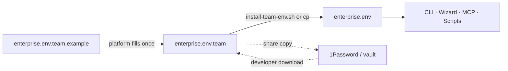

# Team environment setup

**Who this is for:** Platform team, FinOps, and engineering leads who distribute Golden Path config to developers  
**Developer quick start:** [Developer onboarding](#developer-onboarding) below

Golden Path needs org-specific values (billing, GCP projects, GitHub org). Most product engineers **should not** look up billing account IDs. This guide describes how the platform team maintains one canonical file and shares it safely.

---

## The idea in one sentence

> **Platform owns `enterprise.env.team`; developers copy it to `enterprise.env`; neither file goes in git.**

---

## Files at a glance

| File | In git? | Who creates it | Purpose |
|------|---------|----------------|---------|
| `enterprise.env.example` | Yes | Golden Path upstream | Public placeholders for solo use |
| `enterprise.env.team.example` | Yes | Golden Path upstream | Platform template with record-keeping headers |
| **`enterprise.env.team`** | **No** | **Platform / FinOps** | **Canonical org config** — master copy, shared out of band |
| **`enterprise.env`** | **No** | **Each developer** | **Active config** — CLI, wizard, MCP, and scripts read this |



---

## Who fills what

| Role | Responsibility | Typical fields |
|------|----------------|----------------|
| **FinOps / GCP admin** | Billing linkage | `PARENT_PROJECT_ID`, `BILLING_ACCOUNT_ID` |
| **Platform / DevOps** | Projects, GitHub, safety | `GCP_*_PROJECT`, `GITHUB_ORG`, `PROTECTED_PROJECTS`, `GOLDENPATH_VERSION` |
| **Product engineer** | None of the above | Receives file; runs `gcloud` / `gh` login only |

---

## Platform team setup (first time)

### 1. Create the team file

From the repo root:

```bash
cp config/enterprise.env.team.example config/enterprise.env.team
$EDITOR config/enterprise.env.team
```

Fill every section. Update the **Platform record** comment block at the top:

- Organization name  
- Maintainer contact  
- Last updated date  
- Where the file is shared (vault name, wiki page)  
- Bootstrap status (`not started` → `dev bootstrapped` → `dev+prod bootstrapped`)

### 2. Verify locally

```bash
./config/install-team-env.sh
```

This copies `enterprise.env.team` → `enterprise.env` so you can run bootstrap or `shop` on your machine.

### 3. Bootstrap GCP (platform — once per org)

Only platform needs billing access for this step:

```bash
./scripts/standup-teardown-env.sh --yes    # sandbox, optional
# or terraform apply in platform/bootstrap/ for shared dev/prod
```

Update the record block when bootstrap completes.

### 4. Share with the organization (not git)

Pick one channel and document it in the file header:

| Channel | Good for |
|---------|----------|
| **1Password / Bitwarden** shared vault | Most teams |
| **GCP Secret Manager** + download script | GCP-centric orgs |
| **IT-managed shared drive** | Enterprise standard |
| **Onboarding ticket attachment** | Ad hoc |

**Never** commit `enterprise.env.team` or `enterprise.env`. Both are in `.gitignore`.

---

## Developer onboarding

Send engineers this checklist (customize org name and vault link):

```
Golden Path — developer setup

1. Clone the goldenpath repo
2. Download enterprise.env.team from <vault link / #platform-team>
3. Save it as:  config/enterprise.env.team
4. Run:         ./config/install-team-env.sh
   (or:         cp config/enterprise.env.team config/enterprise.env)
5. Authenticate:
     gcloud auth login
     gcloud auth application-default login
     gh auth login
6. Scaffold:
     shop new my-service --template nextjs --output ..

You do NOT need billing access. Questions → #platform-team
```

### Optional per-machine overrides

| Tool | Extra file | When |
|------|------------|------|
| CLI | `.goldenpath-cli.local.json` | `shop config init` overrides |
| Wizard | `.goldenpath-setup.local.json` | Wizard menu state |

Do **not** mix CLI and wizard config files. Org defaults still come from `enterprise.env`.

---

## When values change

| Event | Action |
|-------|--------|
| New GCP project | Platform edits `enterprise.env.team`, updates record date, re-shares |
| Version pin bump (`GOLDENPATH_VERSION`) | Platform updates team file; notify teams to re-install |
| New engineer | Send current `enterprise.env.team`; they run `install-team-env.sh` |
| Engineer laptop refresh | Same — copy team file again |

Platform keeps **one master** (`enterprise.env.team`). Developers refresh `enterprise.env` from it when notified.

---

## Required variables (reference)

These must be set in `enterprise.env` (sourced from the team file):

| Variable | Purpose |
|----------|---------|
| `PARENT_PROJECT_ID` | Billing anchor — Golden Path never deploys here |
| `BILLING_ACCOUNT_ID` | GCP billing account ID |
| `GITHUB_ORG` | GitHub org for service repos and WIF |

Bootstrap also requires `ARTIFACT_REGISTRY_REPO` (see `enterprise.env.team.example`).

Full variable list: [README.md](./README.md#optional-variables).

---

## Solo use (no platform team yet)

If you are evaluating Golden Path alone:

```bash
cp config/enterprise.env.example config/enterprise.env
$EDITOR config/enterprise.env
```

Use `enterprise.env.team` only when a platform team owns distribution.

---

## Security notes

- `enterprise.env` holds **project IDs and org names**, not API tokens.  
- Authentication stays in **`gcloud`** and **`gh`** — never put tokens in env files.  
- `PROTECTED_PROJECTS` prevents teardown scripts from deleting production.  
- Treat the team file as **internal** — share on a need-to-know basis.

---

## Quick commands

```bash
# Platform: create master config
cp config/enterprise.env.team.example config/enterprise.env.team

# Anyone: install active config from team master
./config/install-team-env.sh

# Override path (advanced)
export GOLDENPATH_CONFIG=/path/to/custom.env
```

---

## Related docs

- [README.md](./README.md) — full variable reference and loader behavior  
- [enterprise.env.team.example](./enterprise.env.team.example) — committed template  
- [docs/getting-started/01-start-here.md](../docs/getting-started/01-start-here.md) — first-time platform bootstrap  
- [docs/environments/sandbox-env.md](../docs/environments/sandbox-env.md) — personal sandbox projects

---

© 2026 Varanabox. All rights reserved.