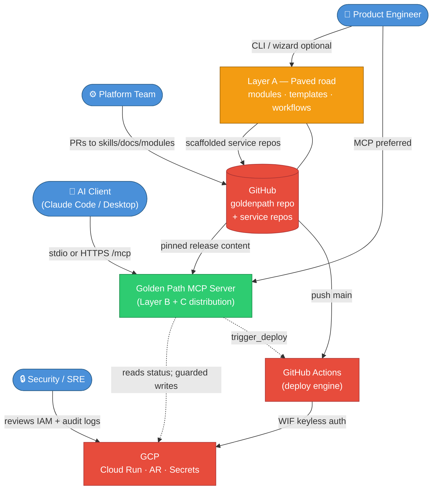
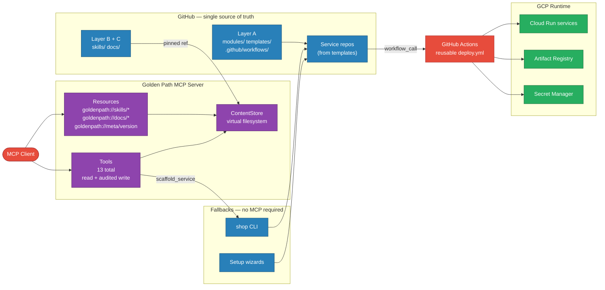
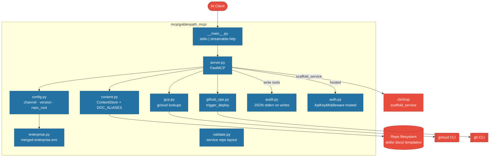
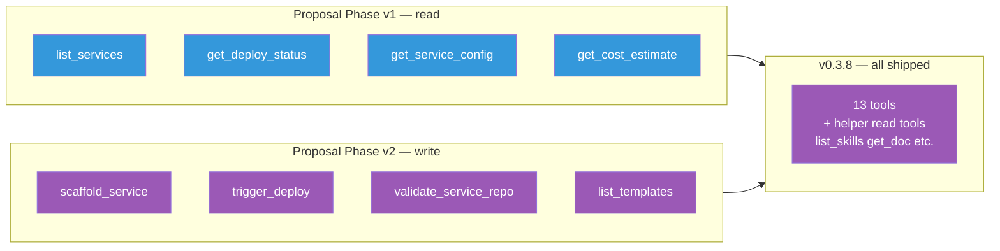
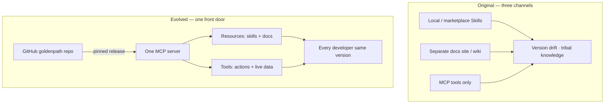
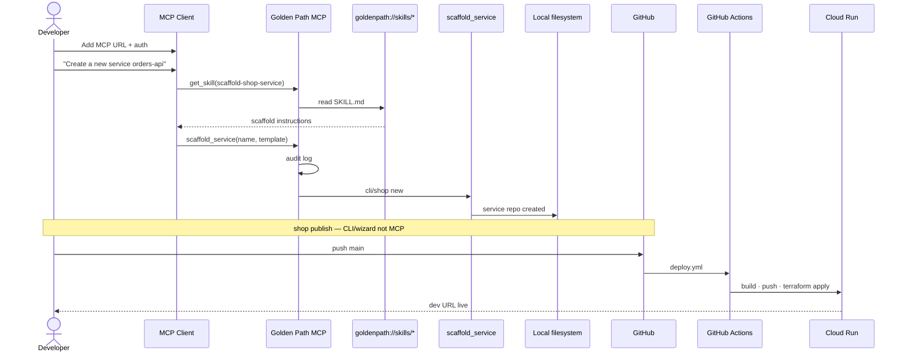
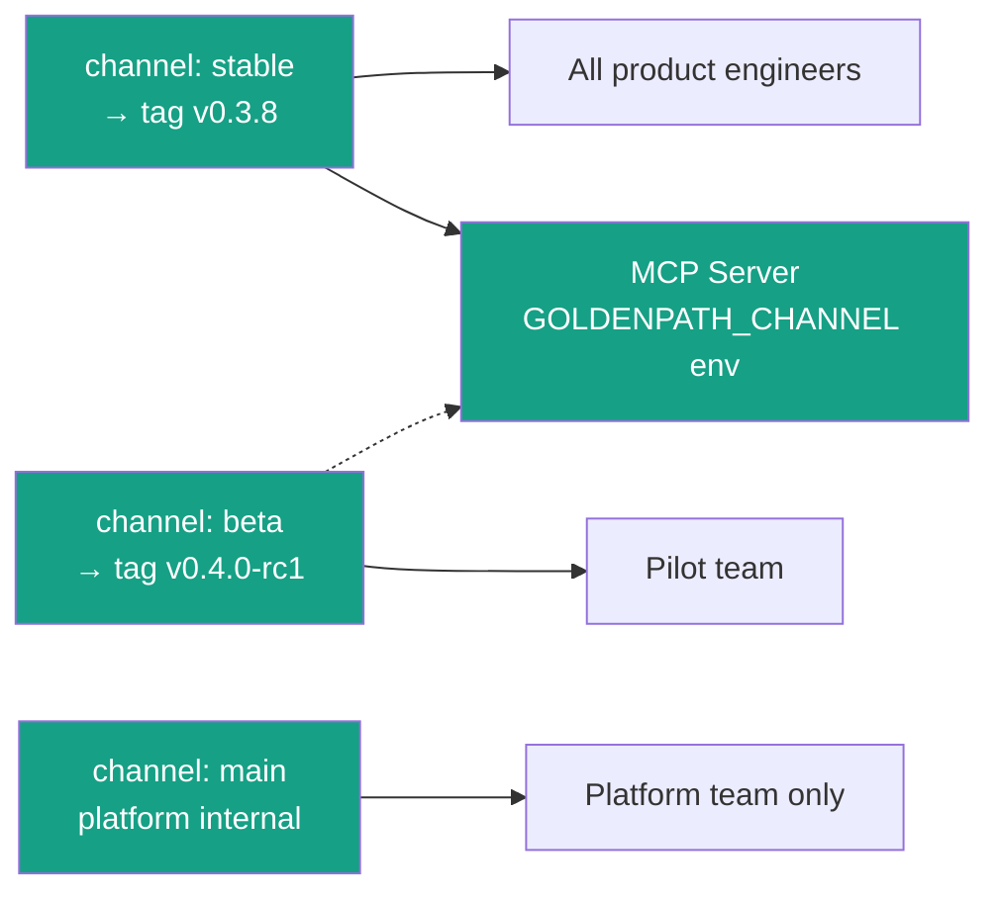
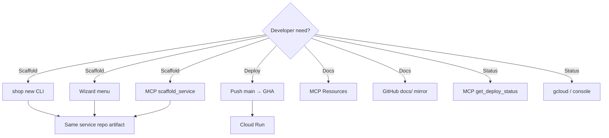

# Golden Path MCP Evolution — Architecture Document

> **Source:** [golden-path-mcp-evolution-proposal.md](./golden-path-mcp-evolution-proposal.md) (stakeholder proposal, 2026-06-15)  
> **Generated:** 2026-06-24 | **Implementation reference:** v0.3.8 (`goldenpath` repo)  
> **Audience:** Platform / DevEx, engineering leads, security, SRE, executives  
>
> **Render diagrams:** Paste any `mermaid` code block into [Mermaid Live Editor](https://mermaid.live/) or view in GitHub.

---

## Overview

The MCP evolution proposal reframes Golden Path from a **three-channel distribution model** (local skills + separate docs + MCP tools) into a **single MCP front door** that serves read-only knowledge (Resources) and live platform actions (Tools) from one pinned GitHub release — while **Layer A** (Terraform modules, service templates, reusable CI/CD) remains unchanged.

In plain terms: developers still deploy through **GitHub Actions → GCP Cloud Run**. MCP does not replace that path. It ensures every engineer and AI client reads the **same version** of skills, docs, and tool contracts — eliminating local skill drift and multi-channel confusion.

**v0.3.8 status:** The evolved model is **largely implemented**. Layer A is shipped; MCP serves 3 Resources and 13 Tools; CLI and wizard remain first-class fallbacks. Gaps vs the proposal: hosted auth uses **API key** today (SSO/OIDC deferred to org reverse proxy); release channels are **metadata-first** (content pinned at image build for hosted, filesystem for local stdio).

**Design rule (unchanged):**

```
MCP  = front door (guidance + orchestration)
CI   = deploy engine (runs on every push)
GCP  = runtime (Cloud Run, secrets, observability)
```

---

## Diagram 1 — System Context

*Who interacts with the evolved Golden Path, and what external systems are involved?*



**What you're looking at:** Four personas connect to one platform story. **Platform team** maintains `goldenpath` on GitHub (Layer A artifacts plus skills/docs). **MCP** distributes Layer B (knowledge + tools) and Layer C (discoverability) from a pinned release. **Developers and AI clients** consume read-only Resources and call Tools. **Production deploys** still flow: service repo → GitHub Actions → GCP. MCP assists; it does not gate CI.

**Alt-text:** System context showing engineers and AI clients connecting to MCP, GitHub hosting the goldenpath repo, and service repos deploying via GitHub Actions to GCP.

---

## Diagram 2 — Containers

*Major deployable pieces in the evolved model and how they connect.*



**What you're looking at:** GitHub holds everything authoritative. **Layer A** produces **service repos**. **MCP** reads `skills/` and `docs/` through `ContentStore` and exposes them as Resources, plus Tools for GCP/GitHub/scaffold actions. **CLI and wizards** remain parallel onboarding paths (proposal: "1 primary MCP + optional CLI"). **GitHub Actions** is the only production deploy engine.

**Proposal vs v0.3.8:**

| Proposal container | Implementation |
|------------------|----------------|
| Hosted MCP + SSO | Cloud Run + `MCP_API_KEY`; SSO via org proxy (future) |
| Pinned git ref → MCP | Local: `GOLDENPATH_ROOT` clone; Hosted: Docker image bundle |
| `scaffold-service` skill URI | `scaffold-shop-service` (legacy Shop naming) |

---

## Diagram 3 — Components

*Internals of the MCP distribution layer (Layer B + C).*

### 3a. MCP server components



### 3b. Resource URI map (proposal → implementation)

| Proposal URI | v0.3.8 URI | On-disk path |
|--------------|------------|--------------|
| `goldenpath://skills/{name}/SKILL.md` | ✅ Same | `skills/{name}/SKILL.md` |
| `goldenpath://docs/{path}` | ✅ Same | `docs/{path}` (with aliases) |
| `goldenpath://meta/version` | ✅ Same | `config` channel + version |
| `goldenpath://skills/{name}/*` | ⚠️ Partial | Bundled refs via `get_skill`; no full tree Resource |

### 3c. Tools — proposal phases vs shipped



**What you're looking at:** The proposal phased read tools before writes. **v0.3.8 shipped both phases together**, plus helper tools (`list_skills`, `get_doc`, `list_docs`) for clients with weak Resource support — exactly as the proposal suggested as optional.

**Intentionally not MCP tools** (bootstrap, `shop publish`, teardown): CLI/wizard only — preserves CI-independent critical path.

---

## Diagram 4 — Code Hierarchies & Sequence Flows

### 4a. Distribution model — before vs after (proposal core thesis)



### 4b. Fresh-laptop onboarding sequence (evolved plan)



**Gap note:** Proposal Phase 2 exit criterion says **MCP-only** laptop can scaffold **and deploy**. Today **`shop publish`** (GitHub repo + WIF + verify) is outside MCP — developer still needs CLI or wizard for full publish, or manual `git push` after repo creation.

### 4c. Version channel architecture (proposal)



**v0.3.8 reality:** `GOLDENPATH_CHANNEL` and `get_version` expose channel metadata. Switching channels to different git content dynamically on hosted MCP requires **redeploying the MCP image** with updated bundle — not hot-swapping refs at runtime as the proposal diagram implies.

### 4d. Critical path independence (fallbacks)



---

## Full Hierarchy Tree

```
goldenpath/  (GitHub — admin writes via PR)
│
├── Layer A — Paved road (unchanged by proposal)
│   ├── platform/bootstrap/     # WIF, IAM, Artifact Registry
│   ├── modules/                # cloud-run, secrets, identity, AR, observability
│   ├── templates/              # 6 service scaffolds + catalog.json
│   └── .github/workflows/
│       └── deploy.yml          # Reusable workflow (workflow_call only)
│
├── Layer B + C — MCP distribution (evolved)
│   ├── skills/                 # 6 SKILL.md files → MCP Resources
│   ├── docs/                   # Human + MCP docs → MCP Resources
│   └── mcp/
│       ├── goldenpath_mcp/
│       │   ├── server.py       # 3 Resources + 13 Tools
│       │   ├── content.py      # Virtual FS (ContentStore)
│       │   ├── config.py       # channel, version, repo_root
│       │   ├── auth.py         # API key (hosted)
│       │   └── audit.py        # Write-tool audit
│       ├── Dockerfile          # Hosted bundle
│       └── infra/              # Cloud Run Terraform
│
├── Fallbacks (proposal §288–297)
│   ├── cli/shop                # scaffold, publish, verify, doctor
│   └── scripts/goldenpath-setup*.sh  # Wizard backends
│
└── Service repos (output of Layer A)
    ├── src/                    # Application code
    ├── infra/                  # Calls goldenpath modules @ GOLDENPATH_VERSION
    └── .github/workflows/deploy.yml  # Calls reusable workflow
```

---

## Recommendations

| # | Priority | Recommendation | Rationale |
|---|----------|----------------|-----------|
| 1 | **High** | Implement **dynamic channel resolution** for hosted MCP (fetch tagged release at startup or sidecar sync) | Closes gap between proposal "pinned ref" and image-baked content |
| 2 | **High** | Document **SSO pattern** explicitly (API key today + OIDC reverse proxy recipe) | Proposal resolves §9 #6 as SSO; implementation uses API key |
| 3 | **High** | Add **static docs mirror** (GitHub Pages or internal site) | Proposal fallback; reduces MCP availability risk |
| 4 | **Medium** | Align skill URIs in proposal diagram with actual names (`scaffold-shop-service`) | Reduces stakeholder confusion |
| 5 | **Medium** | **Audit log → alerting dashboard** (architecture.md rec #4) | Proposal promises audit on writes; needs platform visibility |
| 6 | **Medium** | Clarify Phase 2 exit criterion: **MCP + shop publish** vs MCP-only | Honest adoption metric |
| 7 | **Low** | `goldenpath://skills/{name}/*` full tree Resources | Proposal mentions bundled skill assets |

---

## Proposal alignment summary

| Proposal claim | Architecture verdict |
|----------------|---------------------|
| Layer A unchanged | ✅ Correct — still source of truth for infra and CI |
| One MCP front door for B + C | ✅ Implemented — Resources + Tools on one server |
| CI independent of MCP | ✅ Correct — push → GHA → GCP works without MCP |
| SSO on hosted MCP | ⚠️ Partial — API key shipped; SSO is org-layer |
| Pinned release enforcement | ⚠️ Partial — version pins exist; channel hot-swap limited on hosted |
| Eliminates local skill drift | ✅ For MCP users — stdio still reads local clone (expected) |
| Resolves §6, §7, partially §5 | ✅ Distribution decisions closed in evolved model |
| Backstage deferred | ✅ Consistent with proposal |

---

## Render instructions

All diagrams use [Mermaid.js](https://mermaid.js.org/) and render natively in:

- **GitHub** — this `.md` file
- **Mermaid Live Editor** — [mermaid.live](https://mermaid.live/)
- **Obsidian** — with Mermaid plugin
- **VS Code** — Markdown Preview Mermaid Support extension

For executive slides, export diagrams from Mermaid Live as PNG/SVG and place in `docs/executive-briefing/images/`.

---

## Related documents

- [golden-path-mcp-evolution-proposal.md](./golden-path-mcp-evolution-proposal.md) — stakeholder proposal (source)
- [../platform/architecture.md](../platform/architecture.md) — full platform architecture (implementation-wide)
- [../platform/golden-path.md](../platform/golden-path.md) — living platform guide
- [../../mcp/guide.md](../../mcp/guide.md) — MCP what it is / isn't
- [../../mcp/README.md](../../mcp/README.md) — MCP tools reference

---

© 2026 Varanabox. All rights reserved.
