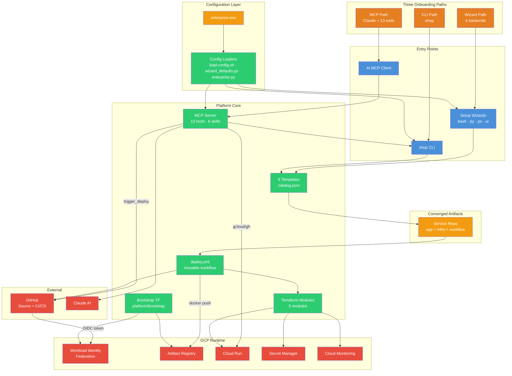
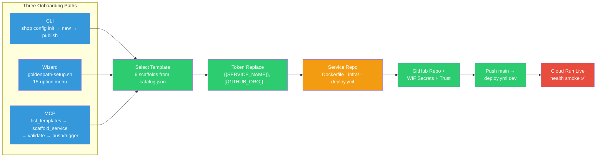
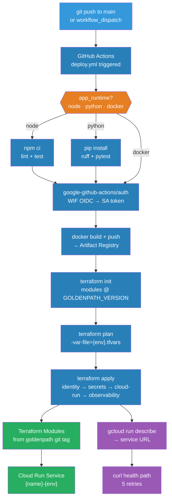
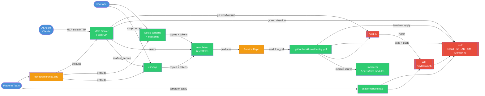

# Golden Path — App Knowledge Graph

**Platform version:** v0.3.8  
**Audience:** Platform engineers, architects, AI agents, executive technical briefings  
**Purpose:** Machine- and human-readable map of Golden Path components, flows, and relationships.

---

## Knowledge Base Overview

Golden Path is an enterprise-configurable paved road for building and deploying containerized services to Google Cloud Platform. This knowledge graph encodes the **v0.3.8** platform as a structured graph: configuration (`config/enterprise.env`) drives all paths; **platform core** (bootstrap, modules, templates, workflows) produces service artifacts; **runtime** (Cloud Run, Artifact Registry, Secret Manager, WIF) hosts deployed services. Three onboarding paths — **CLI** (`cli/shop`), **wizard** (four backends), and **MCP** (`mcp/goldenpath_mcp`, 13 tools, 6 skills) — converge on identical outputs: a scaffolded service repo and deployment via the reusable `.github/workflows/deploy.yml`. The graph below is the canonical reference for onboarding agents, generating architecture diagrams, gap analysis, and upgrade planning.

---

## Full JSON Knowledge Graph

```json
{
  "metadata": {
    "platform": "goldenpath",
    "version": "v0.3.8",
    "generated": "2026-06-24",
    "node_types": [
      "UIComponent",
      "BackendService",
      "Endpoint",
      "DataModel",
      "UserFlow",
      "ExternalService",
      "Process"
    ]
  },
  "nodes": [
    {
      "id": "ui-enterprise-config-form",
      "type": "UIComponent",
      "name": "Enterprise Config Editor",
      "description": "Developer edits config/enterprise.env (copied from enterprise.env.example)",
      "path": "config/enterprise.env",
      "properties": { "gitignored": true, "drives": "all paths" }
    },
    {
      "id": "ui-shop-cli",
      "type": "UIComponent",
      "name": "shop CLI",
      "description": "Bash CLI: list, config, new, publish, verify, doctor",
      "path": "cli/shop",
      "properties": { "config_file": ".goldenpath-cli.local.json" }
    },
    {
      "id": "ui-wizard-bash",
      "type": "UIComponent",
      "name": "Bash Setup Wizard",
      "description": "15-option interactive menu (goldenpath-setup-bash.sh)",
      "path": "scripts/goldenpath-setup-bash.sh"
    },
    {
      "id": "ui-wizard-python",
      "type": "UIComponent",
      "name": "Python Setup Wizard",
      "description": "15-option interactive menu (goldenpath-setup-py.sh)",
      "path": "scripts/goldenpath-setup-py.sh"
    },
    {
      "id": "ui-wizard-powershell",
      "type": "UIComponent",
      "name": "PowerShell Setup Wizard",
      "description": "15-option interactive menu with Pester-tested modules",
      "path": "scripts/goldenpath-setup-ps.sh"
    },
    {
      "id": "ui-wizard-streamlit",
      "type": "UIComponent",
      "name": "Streamlit Setup UI",
      "description": "Browser-based wizard (goldenpath-setup-ui.sh)",
      "path": "scripts/goldenpath-setup-ui.sh"
    },
    {
      "id": "ui-wizard-launcher",
      "type": "UIComponent",
      "name": "Unified Wizard Launcher",
      "description": "Auto-selects pwsh or bash backend",
      "path": "scripts/goldenpath-setup.sh"
    },
    {
      "id": "ui-mcp-client",
      "type": "UIComponent",
      "name": "AI MCP Client",
      "description": "Claude Desktop / Claude Code consuming stdio or hosted HTTP MCP",
      "properties": { "transports": ["stdio", "streamable-http", "sse"] }
    },
    {
      "id": "ui-github-actions",
      "type": "UIComponent",
      "name": "GitHub Actions Deploy UI",
      "description": "Workflow run logs, environment gates, WIF OIDC exchange visibility",
      "path": ".github/workflows/deploy.yml"
    },

    {
      "id": "svc-mcp-server",
      "type": "BackendService",
      "name": "Golden Path MCP Server",
      "description": "FastMCP server: 13 tools, 3 resources, API-key auth for hosted mode",
      "path": "mcp/goldenpath_mcp/",
      "properties": { "tools": 13, "resources": 3, "skills_served": 6 }
    },
    {
      "id": "svc-shop-cli",
      "type": "BackendService",
      "name": "shop CLI Engine",
      "description": "Scaffold, token replacement, git init, publish orchestration",
      "path": "cli/shop"
    },
    {
      "id": "svc-wizard-ops",
      "type": "BackendService",
      "name": "Wizard Operations Layer",
      "description": "Shared ops: bootstrap, scaffold, publish, verify, MCP config",
      "path": "scripts/setup/goldenpath_ops.py"
    },
    {
      "id": "svc-bootstrap-tf",
      "type": "BackendService",
      "name": "Bootstrap Terraform",
      "description": "One-time GCP setup: APIs, WIF, Artifact Registry, github-actions SA",
      "path": "platform/bootstrap/"
    },
    {
      "id": "svc-service-infra",
      "type": "BackendService",
      "name": "Per-Service Terraform",
      "description": "Composes identity, secrets, cloud-run, observability modules",
      "path": "templates/*/infra/main.tf"
    },
    {
      "id": "svc-deploy-workflow",
      "type": "BackendService",
      "name": "Reusable Deploy Workflow",
      "description": "workflow_call: test → WIF auth → docker build → terraform apply → smoke",
      "path": ".github/workflows/deploy.yml"
    },
    {
      "id": "svc-mcp-hosting",
      "type": "BackendService",
      "name": "Hosted MCP Infrastructure",
      "description": "Optional Cloud Run deployment for streamable-http MCP",
      "path": "mcp/infra/"
    },
    {
      "id": "svc-config-loaders",
      "type": "BackendService",
      "name": "Enterprise Config Loaders",
      "description": "load-config.sh, wizard_defaults.py, enterprise.py merge example + local env",
      "path": "scripts/lib/load-config.sh"
    },

    {
      "id": "ep-mcp-list-templates",
      "type": "Endpoint",
      "name": "list_templates",
      "description": "Returns templates/catalog.json metadata",
      "service": "svc-mcp-server",
      "method": "MCP_TOOL",
      "access": "read"
    },
    {
      "id": "ep-mcp-scaffold",
      "type": "Endpoint",
      "name": "scaffold_service",
      "description": "Audited write: invokes shop new with template tokens",
      "service": "svc-mcp-server",
      "method": "MCP_TOOL",
      "access": "write"
    },
    {
      "id": "ep-mcp-validate",
      "type": "Endpoint",
      "name": "validate_service_repo",
      "description": "Validates scaffolded repo structure and required files",
      "service": "svc-mcp-server",
      "method": "MCP_TOOL",
      "access": "read"
    },
    {
      "id": "ep-mcp-trigger-deploy",
      "type": "Endpoint",
      "name": "trigger_deploy",
      "description": "Audited write: dispatches deploy workflow via gh CLI (confirm=true)",
      "service": "svc-mcp-server",
      "method": "MCP_TOOL",
      "access": "write"
    },
    {
      "id": "ep-mcp-deploy-status",
      "type": "Endpoint",
      "name": "get_deploy_status",
      "description": "gcloud run services describe for readiness and URL",
      "service": "svc-mcp-server",
      "method": "MCP_TOOL",
      "access": "read"
    },
    {
      "id": "ep-mcp-list-services",
      "type": "Endpoint",
      "name": "list_services",
      "description": "Lists Cloud Run services in project/region",
      "service": "svc-mcp-server",
      "method": "MCP_TOOL",
      "access": "read"
    },
    {
      "id": "ep-mcp-get-skill",
      "type": "Endpoint",
      "name": "get_skill",
      "description": "Returns goldenpath://skills/{name}/SKILL.md content",
      "service": "svc-mcp-server",
      "method": "MCP_RESOURCE",
      "access": "read"
    },
    {
      "id": "ep-mcp-get-doc",
      "type": "Endpoint",
      "name": "get_doc",
      "description": "Returns goldenpath://docs/{path} markdown content",
      "service": "svc-mcp-server",
      "method": "MCP_RESOURCE",
      "access": "read"
    },
    {
      "id": "ep-shop-new",
      "type": "Endpoint",
      "name": "shop new",
      "description": "Scaffold service from template with {{TOKEN}} replacement",
      "service": "svc-shop-cli",
      "method": "CLI",
      "access": "write"
    },
    {
      "id": "ep-shop-publish",
      "type": "Endpoint",
      "name": "shop publish",
      "description": "Create GitHub repo, WIF trust, push main, watch deploy, verify health",
      "service": "svc-shop-cli",
      "method": "CLI",
      "access": "write"
    },
    {
      "id": "ep-health-nextjs",
      "type": "Endpoint",
      "name": "Next.js Health",
      "path": "/api/health",
      "template": "nextjs",
      "port": 3000
    },
    {
      "id": "ep-health-fastapi",
      "type": "Endpoint",
      "name": "FastAPI Health",
      "path": "/api/health",
      "template": "fastapi",
      "port": 8000
    },
    {
      "id": "ep-health-spa",
      "type": "Endpoint",
      "name": "SPA Health",
      "path": "/health",
      "template": "react-spa|svelte-spa",
      "port": 8080
    },
    {
      "id": "ep-deploy-workflow-call",
      "type": "Endpoint",
      "name": "workflow_call deploy",
      "description": "Service repos invoke reusable deploy.yml with required inputs",
      "service": "svc-deploy-workflow",
      "method": "GITHUB_ACTIONS"
    },

    {
      "id": "dm-enterprise-env",
      "type": "DataModel",
      "name": "enterprise.env",
      "description": "Org-specific config: billing, projects, GitHub org, region, version tag",
      "path": "config/enterprise.env",
      "fields": ["PARENT_PROJECT_ID", "GCP_DEV_PROJECT", "GCP_PROD_PROJECT", "GITHUB_ORG", "GOLDENPATH_VERSION", "ARTIFACT_REGISTRY_REPO"]
    },
    {
      "id": "dm-catalog",
      "type": "DataModel",
      "name": "Template Catalog",
      "description": "Six scaffolds with runtime, port, health path metadata",
      "path": "templates/catalog.json",
      "templates": ["nextjs", "fastapi", "streamlit", "express", "react-spa", "svelte-spa"]
    },
    {
      "id": "dm-cli-config",
      "type": "DataModel",
      "name": "CLI Local Config",
      "description": "Per-developer CLI settings (separate from wizard config)",
      "path": ".goldenpath-cli.local.json"
    },
    {
      "id": "dm-wizard-config",
      "type": "DataModel",
      "name": "Wizard Local Config",
      "description": "Per-developer wizard settings (separate from CLI config)",
      "path": ".goldenpath-setup.local.json"
    },
    {
      "id": "dm-service-repo",
      "type": "DataModel",
      "name": "Service Repository",
      "description": "Scaffolded app + infra/ + .github/workflows/deploy.yml",
      "structure": ["Dockerfile", "infra/main.tf", "infra/dev.tfvars", "infra/prod.tfvars", "src/", "tests/"]
    },
    {
      "id": "dm-bootstrap-state",
      "type": "DataModel",
      "name": "Bootstrap Terraform State",
      "description": "Local state by default; tfstate_bucket_name variable for GCS migration",
      "path": "platform/bootstrap/terraform.tfstate"
    },
    {
      "id": "dm-audit-log",
      "type": "DataModel",
      "name": "MCP Audit Events",
      "description": "JSON audit records for scaffold_service and trigger_deploy to stderr",
      "path": "mcp/goldenpath_mcp/audit.py",
      "events": ["scaffold_service", "trigger_deploy"]
    },
    {
      "id": "dm-tfvars",
      "type": "DataModel",
      "name": "Environment tfvars",
      "description": "dev.tfvars and prod.tfvars per service; environment drives allow_unauthenticated",
      "path": "templates/*/infra/{dev,prod}.tfvars"
    },

    {
      "id": "flow-cli-onboarding",
      "type": "UserFlow",
      "name": "CLI Onboarding Path",
      "steps": ["shop config init", "shop new --output ..", "shop publish", "verify health"]
    },
    {
      "id": "flow-wizard-onboarding",
      "type": "UserFlow",
      "name": "Wizard Onboarding Path",
      "steps": ["goldenpath-setup.sh", "menu bootstrap/scaffold/publish", "verify deployment"]
    },
    {
      "id": "flow-mcp-onboarding",
      "type": "UserFlow",
      "name": "MCP Onboarding Path",
      "steps": ["list_templates", "scaffold_service", "validate_service_repo", "git push or trigger_deploy", "get_deploy_status"]
    },
    {
      "id": "flow-platform-bootstrap",
      "type": "UserFlow",
      "name": "Platform Team Bootstrap",
      "steps": ["copy enterprise.env", "terraform apply bootstrap OR standup-teardown-env.sh", "verify WIF + AR"]
    },
    {
      "id": "flow-sandbox-teardown",
      "type": "UserFlow",
      "name": "Sandbox Teardown",
      "steps": ["teardown-personal-test.sh", "optional --delete-project with PROTECTED_PROJECTS guard"]
    },

    {
      "id": "ext-github",
      "type": "ExternalService",
      "name": "GitHub",
      "description": "Source control, CI/CD runner, OIDC token issuer for WIF",
      "integrations": ["workflow_call", "gh CLI", "repo secrets"]
    },
    {
      "id": "ext-gcp-wif",
      "type": "ExternalService",
      "name": "GCP Workload Identity Federation",
      "description": "Keyless GitHub Actions → GCP SA token exchange",
      "path": "platform/bootstrap/wif.tf"
    },
    {
      "id": "ext-gcp-cloud-run",
      "type": "ExternalService",
      "name": "GCP Cloud Run",
      "description": "Containerized service runtime with scale-to-zero defaults",
      "module": "modules/cloud-run"
    },
    {
      "id": "ext-gcp-artifact-registry",
      "type": "ExternalService",
      "name": "GCP Artifact Registry",
      "description": "Docker image registry; enforced by cloud-run precondition",
      "module": "modules/artifact-registry"
    },
    {
      "id": "ext-gcp-secret-manager",
      "type": "ExternalService",
      "name": "GCP Secret Manager",
      "description": "Application secrets with runtime SA accessor IAM",
      "module": "modules/secrets"
    },
    {
      "id": "ext-gcp-monitoring",
      "type": "ExternalService",
      "name": "GCP Cloud Monitoring",
      "description": "Dashboards and 5xx alert policies per service",
      "module": "modules/observability"
    },
    {
      "id": "ext-claude",
      "type": "ExternalService",
      "name": "Claude AI",
      "description": "Primary MCP client for scaffold, validation, deploy assistance"
    },

    {
      "id": "proc-bootstrap",
      "type": "Process",
      "name": "GCP Bootstrap Process",
      "description": "Enable APIs, create AR repos, github-actions SA, WIF pool + bindings",
      "owner": "Platform Team",
      "frequency": "once per environment"
    },
    {
      "id": "proc-scaffold",
      "type": "Process",
      "name": "Service Scaffold Process",
      "description": "Copy template, replace tokens, git init, produce service repo",
      "owner": "Developer / AI Agent"
    },
    {
      "id": "proc-cicd-deploy",
      "type": "Process",
      "name": "CI/CD Deploy Pipeline",
      "description": "Push → GHA → WIF → build → terraform apply → smoke check",
      "owner": "GitHub Actions"
    },
    {
      "id": "proc-wif-trust",
      "type": "Process",
      "name": "WIF Repo Trust Grant",
      "description": "Grant OIDC trust for new service repo to exchange tokens",
      "path": "scripts/lib/wif-trust-repo.sh"
    },
    {
      "id": "proc-token-replace",
      "type": "Process",
      "name": "Scaffold Token Replacement",
      "description": "Replace {{SERVICE_NAME}}, {{GITHUB_ORG}}, {{GCP_DEV_PROJECT}}, etc.",
      "path": "scripts/lib/scaffold-tokens.sh"
    },
    {
      "id": "proc-mcp-audit",
      "type": "Process",
      "name": "MCP Write Audit",
      "description": "Log JSON audit event before scaffold_service and trigger_deploy execute",
      "path": "mcp/goldenpath_mcp/audit.py"
    },
    {
      "id": "proc-standup-sandbox",
      "type": "Process",
      "name": "Sandbox Standup",
      "description": "Create isolated project, bootstrap with personal_test=true",
      "path": "scripts/standup-teardown-env.sh"
    }
  ],
  "edges": [
    { "from": "dm-enterprise-env", "to": "svc-config-loaders", "relation": "loaded_by" },
    { "from": "svc-config-loaders", "to": "svc-shop-cli", "relation": "provides_defaults" },
    { "from": "svc-config-loaders", "to": "svc-wizard-ops", "relation": "provides_defaults" },
    { "from": "svc-config-loaders", "to": "svc-mcp-server", "relation": "provides_defaults" },
    { "from": "svc-config-loaders", "to": "scripts/standup-teardown-env.sh", "relation": "provides_defaults" },

    { "from": "ui-shop-cli", "to": "svc-shop-cli", "relation": "invokes" },
    { "from": "ui-wizard-launcher", "to": "ui-wizard-bash", "relation": "may_delegate" },
    { "from": "ui-wizard-launcher", "to": "ui-wizard-powershell", "relation": "may_delegate" },
    { "from": "ui-wizard-bash", "to": "svc-wizard-ops", "relation": "invokes" },
    { "from": "ui-wizard-python", "to": "svc-wizard-ops", "relation": "invokes" },
    { "from": "ui-wizard-powershell", "to": "svc-wizard-ops", "relation": "invokes" },
    { "from": "ui-wizard-streamlit", "to": "svc-wizard-ops", "relation": "invokes" },
    { "from": "ui-mcp-client", "to": "svc-mcp-server", "relation": "connects_via_mcp" },

    { "from": "flow-cli-onboarding", "to": "ui-shop-cli", "relation": "uses" },
    { "from": "flow-wizard-onboarding", "to": "ui-wizard-launcher", "relation": "uses" },
    { "from": "flow-mcp-onboarding", "to": "ui-mcp-client", "relation": "uses" },

    { "from": "ep-shop-new", "to": "proc-scaffold", "relation": "triggers" },
    { "from": "ep-mcp-scaffold", "to": "ep-shop-new", "relation": "delegates_to" },
    { "from": "proc-scaffold", "to": "dm-catalog", "relation": "reads" },
    { "from": "proc-scaffold", "to": "proc-token-replace", "relation": "includes" },
    { "from": "proc-scaffold", "to": "dm-service-repo", "relation": "produces" },

    { "from": "ep-shop-publish", "to": "proc-wif-trust", "relation": "triggers" },
    { "from": "ep-shop-publish", "to": "ext-github", "relation": "creates_repo_and_pushes" },
    { "from": "ep-mcp-trigger-deploy", "to": "ext-github", "relation": "dispatches_workflow" },
    { "from": "ep-mcp-trigger-deploy", "to": "proc-mcp-audit", "relation": "audited_by" },
    { "from": "ep-mcp-scaffold", "to": "proc-mcp-audit", "relation": "audited_by" },
    { "from": "proc-mcp-audit", "to": "dm-audit-log", "relation": "writes" },

    { "from": "flow-platform-bootstrap", "to": "proc-bootstrap", "relation": "executes" },
    { "from": "proc-bootstrap", "to": "svc-bootstrap-tf", "relation": "implemented_by" },
    { "from": "proc-bootstrap", "to": "ext-gcp-wif", "relation": "creates" },
    { "from": "proc-bootstrap", "to": "ext-gcp-artifact-registry", "relation": "creates" },
    { "from": "proc-bootstrap", "to": "dm-bootstrap-state", "relation": "persists_to" },

    { "from": "dm-service-repo", "to": "ep-deploy-workflow-call", "relation": "contains" },
    { "from": "ep-deploy-workflow-call", "to": "proc-cicd-deploy", "relation": "triggers" },
    { "from": "proc-cicd-deploy", "to": "ext-github", "relation": "runs_on" },
    { "from": "proc-cicd-deploy", "to": "ext-gcp-wif", "relation": "authenticates_via" },
    { "from": "proc-cicd-deploy", "to": "ext-gcp-artifact-registry", "relation": "pushes_image" },
    { "from": "proc-cicd-deploy", "to": "svc-service-infra", "relation": "terraform_apply" },
    { "from": "svc-service-infra", "to": "ext-gcp-cloud-run", "relation": "deploys" },
    { "from": "svc-service-infra", "to": "ext-gcp-secret-manager", "relation": "provisions" },
    { "from": "svc-service-infra", "to": "ext-gcp-monitoring", "relation": "provisions" },

    { "from": "svc-deploy-workflow", "to": "modules/cloud-run", "relation": "sources_module" },
    { "from": "svc-deploy-workflow", "to": "modules/secrets", "relation": "sources_module" },
    { "from": "svc-deploy-workflow", "to": "modules/service-identity", "relation": "sources_module" },
    { "from": "svc-deploy-workflow", "to": "modules/observability", "relation": "sources_module" },
    { "from": "svc-deploy-workflow", "to": "modules/artifact-registry", "relation": "sources_module" },

    { "from": "ep-mcp-deploy-status", "to": "ext-gcp-cloud-run", "relation": "queries_via_gcloud" },
    { "from": "ep-mcp-list-services", "to": "ext-gcp-cloud-run", "relation": "queries_via_gcloud" },
    { "from": "svc-mcp-server", "to": "ext-claude", "relation": "serves" },

    { "from": "flow-cli-onboarding", "to": "dm-service-repo", "relation": "produces" },
    { "from": "flow-wizard-onboarding", "to": "dm-service-repo", "relation": "produces" },
    { "from": "flow-mcp-onboarding", "to": "dm-service-repo", "relation": "produces" },
    { "from": "dm-service-repo", "to": "proc-cicd-deploy", "relation": "deployed_via" },

    { "from": "proc-standup-sandbox", "to": "proc-bootstrap", "relation": "wraps" },
    { "from": "flow-sandbox-teardown", "to": "proc-standup-sandbox", "relation": "reverses" },

    { "from": "dm-tfvars", "to": "ext-gcp-cloud-run", "relation": "configures" },
    { "from": "dm-enterprise-env", "to": "dm-tfvars", "relation": "informs_defaults" }
  ]
}
```

---

## Mermaid: Full App Knowledge Graph



---

## Mermaid: Key Process Flows

### Scaffold-to-Deploy (Path Convergence)



### CI/CD Deploy Pipeline



---

## Mermaid: Component Interaction Map



---

## Markmap-Style Mind Map Hierarchy

> Paste into [Markmap](https://markmap.js.org/) or any nested-outline viewer.

```markdown
# Golden Path Platform (v0.3.8)
## Configuration Spine
### config/enterprise.env
#### Billing: PARENT_PROJECT_ID, BILLING_ACCOUNT_ID
#### Projects: GCP_DEV, GCP_PROD, GCP_SANDBOX
#### GitHub: GITHUB_ORG, PLATFORM_REPO, GOLDENPATH_VERSION
#### Safety: PROTECTED_PROJECTS, ALLOWED_TEARDOWN_PROJECTS
### Config Loaders
#### load-config.sh (bash scripts)
#### wizard_defaults.py (wizards + CLI)
#### enterprise.py (MCP Python)
## Platform Core
### Bootstrap (platform/bootstrap)
#### APIs (11 services × N projects)
#### Workload Identity Federation (wif.tf)
#### Artifact Registry (dev + prod)
#### github-actions Service Account + IAM
### Terraform Modules (modules/)
#### service-identity → runtime SA
#### secrets → Secret Manager + IAM
#### cloud-run → Cloud Run v2 + probes + AR precondition
#### observability → dashboard + 5xx alert
#### artifact-registry → Docker registry
### Templates (6 scaffolds)
#### nextjs (default, node, :3000, /api/health)
#### fastapi (python, :8000, /api/health)
#### streamlit (python, :8501, /_stcore/health)
#### express (node, :3000, /api/health)
#### react-spa (docker/nginx, :8080, /health)
#### svelte-spa (docker/nginx, :8080, /health)
### Shared Artifacts (templates/_shared/)
#### infra/main.tf composition
#### workflow-deploy.yml snippet
#### tfvars dev/prod snippets
### CI/CD
#### .github/workflows/deploy.yml (reusable)
#### Service repo caller pins @GOLDENPATH_VERSION
#### WIF secrets: GCP_WIF_PROVIDER, GCP_WIF_SERVICE_ACCOUNT
## Onboarding Paths (converge on same artifacts)
### CLI Path
#### shop config init → .goldenpath-cli.local.json
#### shop new --output ..
#### shop publish (public repo + WIF + verify)
#### shop verify / shop doctor
### Wizard Path
#### goldenpath-setup.sh (auto backend)
#### Backends: bash, python, powershell, streamlit
#### .goldenpath-setup.local.json (do not mix with CLI config)
#### 15-option menu: bootstrap, scaffold, publish, MCP config, …
### MCP Path
#### mcp/goldenpath_mcp (FastMCP)
#### 13 tools (10 read, 3 write with audit)
#### 6 skills via goldenpath://skills/*
#### 3 resources: skills, docs, meta/version
#### Transports: stdio (local), streamable-http (hosted Cloud Run)
#### API key auth for hosted mode (MCP_API_KEY)
## Runtime (GCP)
### Cloud Run (scale-to-zero, health probes)
### Artifact Registry (exclusive image source)
### Secret Manager (runtime accessor IAM)
### Cloud Monitoring (per-service dashboard + alerts)
### WIF (keyless GitHub → GCP, no SA keys)
## Supporting Processes
### Scaffold Token Replacement (scaffold-tokens.sh)
### WIF Repo Trust (wif-trust-repo.sh)
### Sandbox Standup/Teardown (standup-teardown-env.sh)
### MCP Audit Log (audit.py → stderr JSON)
### Post-Deploy Verify (verify-deployment.sh)
## Documentation & Skills
### docs/ (served via goldenpath://docs/*)
### skills/ (6 SKILL.md playbooks)
#### scaffold-shop-service
#### deploy-to-shop-gcp
#### shop-terraform-conventions
#### shop-observability
#### goldenpath-setup-wizard
#### test-coverage-gap-analysis
```

---

## How to Use & Extend

### For humans

1. **Onboarding** — Start with the mind map to orient; follow a `UserFlow` node (CLI, wizard, or MCP) for step-by-step journeys.
2. **Architecture reviews** — Use the Full App Knowledge Graph Mermaid diagram in executive briefings; drill into Component Interaction Map for integration discussions.
3. **Security reviews** — Trace edges through WIF, audit log, and `allow_unauthenticated` tfvars behavior.
4. **New service planning** — Pick a template from `dm-catalog`; confirm health endpoint and runtime align with deploy workflow inputs.

### For AI agents

1. **Parse the JSON graph** — Load nodes by `type` to scope tool calls (e.g., only `Endpoint` nodes with `access: write` require audit awareness).
2. **Traverse edges** — Follow `relation` fields to build execution plans (scaffold → validate → publish → deploy status).
3. **Validate against codebase** — Cross-check `path` properties against live repo files; graph version should match `GOLDENPATH_VERSION`.

### Extending the graph

| Change | Action |
|--------|--------|
| New template | Add `DataModel` node to catalog; add health `Endpoint`; link to `proc-scaffold` |
| New MCP tool | Add `Endpoint` node; wire to `svc-mcp-server`; add audit edge if write |
| New module | Add `BackendService` under modules; update `svc-service-infra` edges |
| New onboarding path | Add `UserFlow` + `UIComponent`; ensure convergence edge to `dm-service-repo` |
| Version bump | Update `metadata.version`; regenerate Mermaid if structure changes |

**Maintenance rule:** Any PR that adds templates, tools, or paths should update this file in the same release tag.

---

## Why This is a Gold Mine

- **Single source of truth** — Replaces scattered wiki pages with a versioned, queryable graph tied to `v0.3.8` file paths.
- **AI-native onboarding** — MCP agents can ingest the JSON graph to plan scaffold/deploy sequences without hallucinating repo layout.
- **Path convergence visibility** — Proves CLI, wizard, and MCP produce identical artifacts — critical for enterprise rollout confidence.
- **Security traceability** — Every write path (shop publish, MCP scaffold/trigger) maps to audit, WIF, and IAM edges.
- **Upgrade planning input** — Gaps (local TF state, mutable git tags, missing prod gates) surface as missing or weak edges in the graph.
- **Executive storytelling** — Mermaid diagrams translate directly into briefing slides without redrawing architecture.
- **Test contract alignment** — Node `path` properties map to integration test targets in `tests/`.
- **Reduced time-to-first-deploy** — New engineers traverse one mind map instead of 15 markdown files.
- **Cross-team vocabulary** — Shared node types (Process, ExternalService) bridge DevEx, SRE, and security language.
- **Extensible without rewrites** — JSON + Mermaid pattern scales to Phase 3 features (portal, Backstage) as new node types.

---

© 2026 Varanabox. All rights reserved.
