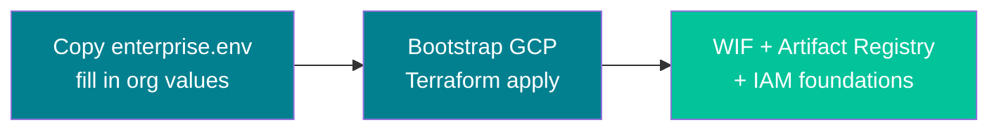
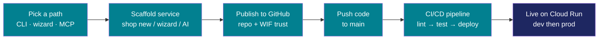
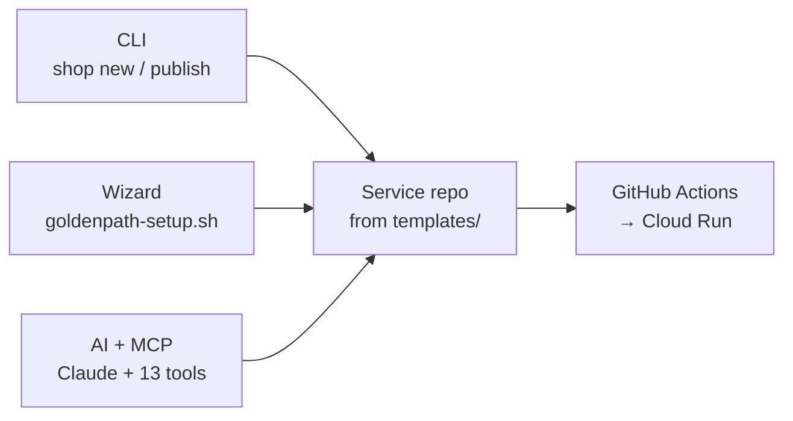
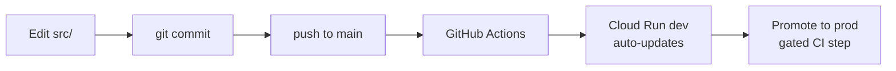
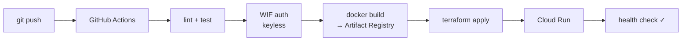
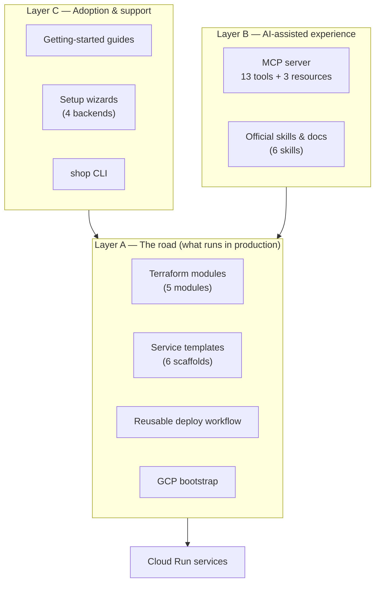
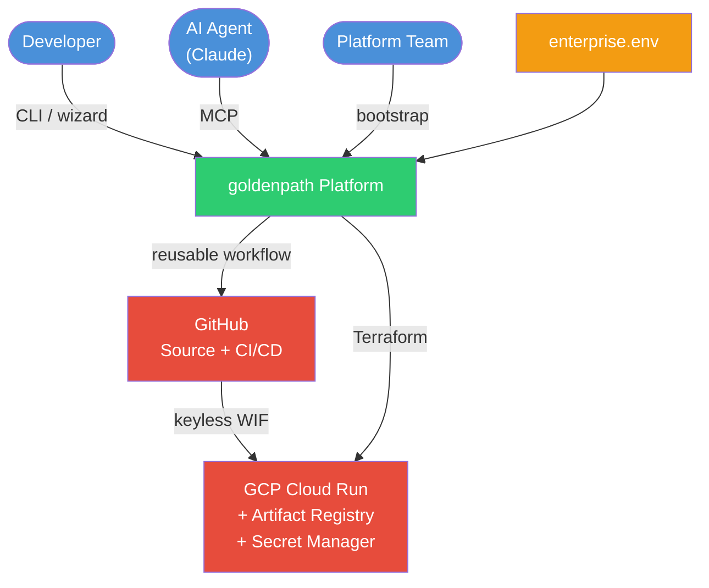

# Golden Path — App Overview

**Version:** v0.3.7 · **Audience:** Anyone new to the platform — executives, product engineers, and non-technical stakeholders

---

## 1. App Overview

**Golden Path** is a paved road for shipping containerized services to Google Cloud. Think of it like a **factory assembly line for cloud apps**: the conveyor belt, quality checks, and safety rails are built once. Each new product rolls off the line with the same structure, security, and deployment process — developers focus on the product, not on reinventing infrastructure every time.

**What it is:** A **platform repository** (`goldenpath`) — not an application. It holds shared Terraform modules, CI/CD workflows, six service templates, a command-line tool (`shop`), setup wizards, and an AI assistant connector (MCP server). When you run `shop new`, Golden Path creates a **separate service repo** where your actual app lives.

**What it is not:** A mandate to migrate legacy systems, a replacement for human judgment on production changes, or a hard dependency on AI. CI/CD deploys work even when MCP is unavailable.

**Who uses it:**

| Persona | What they get |
|---------|---------------|
| **Product engineer** | Scaffold → write code in `src/` → auto-deploy to Cloud Run |
| **Platform / SRE** | One versioned road to support; recognizable repo shape every time |
| **Security** | Keyless auth, Secret Manager, least-privilege IAM — built into templates |
| **Executive sponsor** | Faster time-to-deploy with a standard, auditable risk posture |

**The design rule:**

```
MCP  = front door (guidance + orchestration)
CI   = deploy engine (runs on every push)
GCP  = runtime (Cloud Run, secrets, observability)
```

---

## 2. Key User Flows

### Flow A — First-time setup (platform team, once per organization)



1. Copy `config/enterprise.env.example` → `config/enterprise.env` and fill in billing, GCP project IDs, GitHub org, and region.
2. Run bootstrap Terraform (`platform/bootstrap/`) or the sandbox standup script.
3. GCP is ready: Workload Identity Federation (keyless GitHub auth), Artifact Registry, and IAM roles — no long-lived service account keys.

---

### Flow B — New service (developer)



1. **Choose an onboarding path** — CLI (`shop`), wizard (`goldenpath-setup.sh`), or AI (Claude + MCP).
2. **Scaffold** — Pick a template (Next.js, FastAPI, Streamlit, Express, React SPA, or Svelte SPA). One command produces a complete service repo.
3. **Publish** — Service repo goes to GitHub; WIF trust is wired so CI can deploy without stored keys.
4. **Develop & push** — Edit application code under `src/`. Merge to `main` triggers the pipeline.
5. **CI/CD** — GitHub Actions: lint → test → build Docker image → push to Artifact Registry → Terraform apply → health check.
6. **Runtime** — Service runs on Cloud Run with logging, monitoring, and secrets from Secret Manager.

---

### Flow C — Three onboarding paths (all converge on the same result)



| Path | Best for | Entry point |
|------|----------|-------------|
| **CLI** | Terminal-first engineers | `shop config init` → `shop new` → `shop publish` |
| **Wizard** | Guided setup, less CLI | `./scripts/goldenpath-setup.sh` (bash, Python, PowerShell, or Streamlit UI) |
| **MCP** | AI-native workflows | Connect Claude to `mcp/goldenpath_mcp`; use official skills |

> **Note:** Pick one path per team. CLI and wizard use different local config files (`.goldenpath-cli.local.json` vs `.goldenpath-setup.local.json`).

---

### Flow D — Daily development loop



---

## 3. Common Tasks Breakdown

### Scaffold a new service

**Goal:** Generate a complete, deploy-ready service repo from a template.

| Step | CLI | Wizard | MCP |
|------|-----|--------|-----|
| Configure | `shop config init --github-org ORG --gcp-dev PROJECT` | Menu option 1 | Auto from `enterprise.env` |
| List templates | `shop list` | Menu option 4 | `list_templates` tool |
| Create repo | `shop new my-service --template nextjs --output ..` | Menu option 5 | `scaffold_service` tool |

**What you get:**

```
my-service/
├── src/                 ← developers spend 95% of time here
├── Dockerfile
├── infra/               ← Terraform calling shared modules
├── .github/workflows/   ← calls goldenpath deploy.yml
└── README.md
```

**Acceptance test:** Scaffold and deploy to **dev** with **zero manual edits**.

---

### Deploy a service

**Goal:** Get code from git to a running Cloud Run service.

| Step | Action |
|------|--------|
| 1. Publish (first time) | `shop publish ../my-service` — creates GitHub repo, sets WIF secrets, pushes `main` |
| 2. Daily deploys | Merge to `main` → GitHub Actions runs automatically |
| 3. Verify | `shop verify ../my-service` — health check against live URL |
| 4. Promote to prod | `gh workflow run deploy.yml -f environment=prod` or GitHub Actions UI |

**Deploy pipeline:**



---

### Check status

**Goal:** Know whether a service is deployed, healthy, and configured correctly.

| Method | Command / action |
|--------|------------------|
| **CLI** | `shop verify ../my-service` or `shop doctor ../my-service` |
| **Wizard** | Menu option 9 (diagnose) |
| **MCP** | `get_deploy_status`, `list_services`, `get_service_config` |
| **GitHub** | Actions tab → latest workflow run |
| **GCP console** | Cloud Run → service URL |

**What `shop doctor` checks:** Branch name (`main`), WIF secrets present, unreplaced `{{tokens}}`, GCP project mismatch between scaffold and bootstrap.

---

## 4. How Everything Connects

### Three layers of the platform



| Layer | What it is | Who maintains it |
|-------|------------|------------------|
| **A — Paved road** | Modules, templates, workflows, bootstrap | Platform team via GitHub |
| **B — MCP** | Skills, docs, 13 tools for AI clients | Platform team; read-only for devs |
| **C — Onboarding** | CLI, wizards, docs | Platform team |

---

### System context — who touches what



**Key connections:**

- **`enterprise.env`** — The spine. All scripts, CLI, wizards, and MCP read org-specific values from here. Nothing is hardcoded.
- **`goldenpath` repo** — Platform only. Templates, modules, workflows, MCP server.
- **Service repos** — Your apps. Scaffolded from templates; call `deploy.yml@GOLDENPATH_VERSION`.
- **GitHub Actions** — Deployment engine. Exchanges OIDC token for GCP access via WIF — no stored keys.
- **GCP** — Runtime. Cloud Run (scale-to-zero), Artifact Registry (images), Secret Manager (secrets), Cloud Monitoring (dashboards + alerts).

---

### Security by default

| Control | How Golden Path enforces it |
|---------|----------------------------|
| **No long-lived CI keys** | Workload Identity Federation — GitHub OIDC → GCP |
| **Secrets** | Secret Manager only — never in git |
| **IAM** | Per-service runtime service accounts; least privilege |
| **Infrastructure** | Terraform only — no click-ops in production path |
| **Observability** | Baseline dashboards and 5xx alerts per service |
| **Sandbox safety** | `PROTECTED_PROJECTS` blocks accidental deletion of production projects |

---

## 5. Troubleshooting Tips

### Quick diagnostic

Run this first when something is wrong:

```bash
shop doctor ../my-service
```

Checks: branch name, WIF secrets, unreplaced tokens, project mismatch.

---

### Common issues

| Issue | What to check | Fix |
|-------|---------------|-----|
| **Workflow not triggered** | Default branch must be `main` | Use `shop publish` (sets branch correctly) |
| **Reusable workflow not found** | `goldenpath` repo Actions settings | Enable "accessible from org repos" in GitHub Settings → Actions |
| **OIDC / `startup_failure`** | Caller workflow permissions | Scaffold includes `permissions: id-token: write` — re-scaffold if missing |
| **Workflow failed auth** | WIF secrets on service repo | Re-run `shop publish` or wizard menu 7; confirm bootstrap trusts org repos |
| **Docker push denied (403)** | Artifact Registry IAM | `shop publish` adds `tokenCreator` binding — re-publish if skipped |
| **Health check failed** | Health endpoint path | Match template health path (`shop list` shows paths per template) |
| **Wrong GCP project** | Scaffold project ≠ bootstrap project | `shop doctor`, then re-scaffold with correct project |
| **Unreplaced `{{tokens}}`** | Incomplete scaffold | Re-run `shop new` or `validate_service_repo` (MCP) |
| **Mixed CLI + wizard config** | Two config files on same machine | Pick one path; don't mix `.goldenpath-cli.local.json` and `.goldenpath-setup.local.json` |
| **MCP unavailable** | Hosted MCP down or misconfigured | Fall back to CLI, wizard, or GitHub Actions — deploy path unchanged |

---

### Where to get help

| Resource | Location |
|----------|----------|
| CLI journey | `docs/getting-started/04-journey-cli.md` |
| Wizard guide | `docs/getting-started/07-setup-wizard-usage.md` |
| MCP journey | `docs/getting-started/08-journey-mcp.md` |
| Deploy troubleshooting skill | `goldenpath://skills/deploy-to-shop-gcp/SKILL.md` |
| Architecture diagrams | `docs/platform/architecture.md` |
| Platform support | `#golden-path` (or org-defined channel) |

---

## 6. Glossary

| Term | Plain English |
|------|---------------|
| **Golden Path / paved road** | The supported default way to ship containerized services to GCP |
| **Platform repo** | `goldenpath` — templates, modules, workflows (not your app) |
| **Service repo** | Your application, scaffolded from a template into a separate directory or GitHub repo |
| **Scaffold** | Generate a new service repo from a template (`shop new`, wizard, or MCP) |
| **Bootstrap** | One-time GCP setup: WIF trust, IAM roles, Artifact Registry |
| **Cloud Run** | GCP service that runs containers; scales to zero when idle |
| **Artifact Registry** | Where Docker images are stored after CI builds them |
| **Secret Manager** | GCP service for app secrets — never commit secrets to git |
| **Terraform** | Infrastructure as code — cloud resources defined in version-controlled files |
| **WIF (Workload Identity Federation)** | Keyless authentication from GitHub Actions to GCP — no stored service account keys |
| **MCP (Model Context Protocol)** | Standard protocol connecting AI assistants (Claude) to tools and documentation |
| **enterprise.env** | Org-specific config file (gitignored) — billing, projects, GitHub org, region |
| **GOLDENPATH_VERSION** | Git tag (e.g. `v0.3.7`) that service repos pin for modules and deploy workflow |
| **Layer A / B / C** | A = paved road artifacts; B = MCP server; C = onboarding (CLI, wizards, docs) |
| **shop** | Bash CLI for scaffold, publish, verify, and diagnose |
| **Template** | Pre-built starter project (nextjs, fastapi, streamlit, express, react-spa, svelte-spa) |
| **Off-road** | Supported path for edge cases outside Golden Path — consult platform/security first |

---

© 2026 Varanabox. All rights reserved.