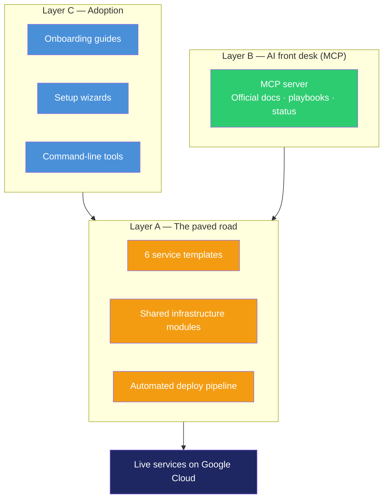
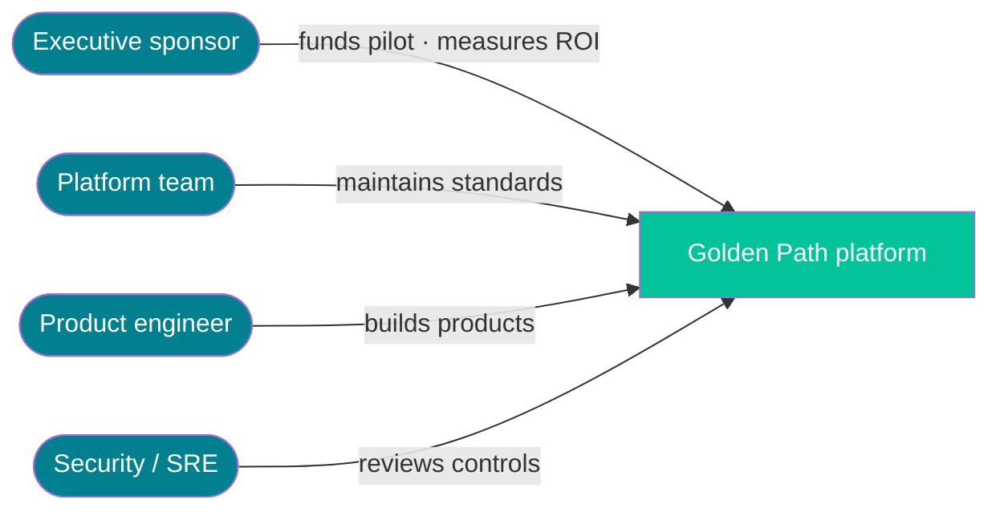
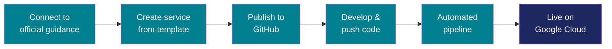

# Golden Path — Architecture for Executives

**Platform version:** v0.3.7 · **Date:** 2026-06-24  
**Audience:** CEOs, VPs, program sponsors, security leaders, and non-technical stakeholders  


---


Golden Path is our organization’s **standard factory line for cloud applications** — plus a **single front desk** where every engineer and AI assistant gets the same official instructions.

| Piece | What it is | Why it matters |
|-------|------------|----------------|
| **Factory line** | Templates, security defaults, and automated deploy pipelines | New services ship faster with less risk |
| **Front desk (MCP)** | One server for official docs, playbooks, and approved actions | No more conflicting wikis or “works on my machine” runbooks |
| **Rule** | The front desk **helps** people; it does **not** replace the factory | Production deploys still work if the help desk is down |

---

## The problem in business terms

| Symptom | Cost to the organization |
|---------|--------------------------|
| Every team invents its own deploy process | Slower delivery, higher incident rate |
| Engineers follow different versions of “the official way” | Inconsistent security and audit posture |
| Knowledge lives in wikis, laptops, and chat | Long onboarding; expensive support load |
| Leadership cannot verify which standard was followed | Compliance and governance gaps |

Golden Path replaces fragmentation with **one paved road** and **one distribution point** for official guidance.

---

## How the system is organized

Think of three layers — from what runs in production to how people learn the process:



### Layer A — The paved road (the factory)

What every new service inherits automatically:

- **Templates** — Pre-built starting points (web apps, APIs, dashboards)
- **Infrastructure modules** — Standard hosting, secrets, identity, and monitoring
- **Deploy pipeline** — Build, test, and release on every code change

**Owner:** Platform / DevOps team, via reviewed changes in GitHub.  
**Benefit:** Predictable cost, security, and support — every service looks familiar.

### Layer B — The AI front desk (MCP)

One server that gives engineers and AI assistants:

| Capability | Business meaning |
|------------|------------------|
| **Official documentation** | Same “start here” guide for everyone |
| **Playbooks (skills)** | Step-by-step instructions the platform team maintains |
| **Status checks** | “Is my service live?” without opening multiple consoles |
| **Guarded actions** | Scaffold or trigger deploy only with confirmation and audit logging |

**Owner:** Platform team authors content; developers consume it **read-only**.  
**Benefit:** One version of truth — no silent local edits to official guidance.

### Layer C — Adoption paths

Three ways to start — all leading to the same result:

| Path | Best for |
|------|----------|
| **AI + MCP** | Teams using Claude or similar assistants |
| **Wizard** | Guided setup without deep terminal skills |
| **CLI** | Terminal-first engineers |

**Benefit:** Flexibility without fragmentation — same templates and pipeline regardless of path.

---

## Who touches the system



| Role | What they care about | What Golden Path delivers |
|------|----------------------|---------------------------|
| **Executive sponsor** | Speed, risk, ROI | Repeatable path; pilot-ready today |
| **Product engineer** | Ship features, not infra | Scaffold → code → auto-deploy |
| **Platform / SRE** | One thing to support | Same repo shape every time |
| **Security** | Auditability, least privilege | Keyless automation; guarded write actions |

---

## From idea to live service

The journey every new service follows:



| Step | What happens | MCP’s role |
|------|--------------|------------|
| 1 | Engineer connects to Golden Path MCP (or uses wizard/CLI) | Preferred front door for docs and playbooks |
| 2 | New service created from an approved template | MCP can trigger; wizard/CLI also work |
| 3 | Service repo on GitHub with automated deploy trust | Today: wizard or CLI (not MCP-only yet) |
| 4–6 | Code merge → build → test → deploy to Cloud Run | **Factory line** — always via GitHub, not MCP |

**Target:** First **dev** environment live in **under one business day**, with **zero manual infrastructure edits** after scaffold.

---

## The design rule (say this in meetings)

```
MCP  =  front desk   (guidance + approved actions)
CI   =  factory line (builds and deploys on every push)
GCP  =  runtime      (where applications run)
```

**If MCP is unavailable:** Engineers still deploy by pushing code to GitHub. The business is not blocked.

---

## Security and governance (executive view)

| Question | Answer |
|----------|--------|
| Who can change the standard? | Platform admins only — through GitHub review |
| Who controls production? | Humans; sensitive actions require explicit confirmation |
| Can the AI get more access than the user? | No — MCP uses the caller’s existing cloud and GitHub permissions |
| Are write actions tracked? | Yes — scaffold and deploy triggers are audit-logged |
| Are passwords stored in repos? | No — automation uses short-lived, keyless identity federation |
| Is migration mandatory? | No — opt-in; existing systems can stay as-is |

**Pilot note:** Hosted MCP uses an API key today. Corporate SSO in front of the server is the recommended enterprise hardening step.

---

## What is built vs what is next

| Capability | Status | Executive takeaway |
|------------|--------|-------------------|
| Paved road (templates, modules, CI) | ✅ Shipped | Safe to pilot new services |
| MCP front desk (docs, playbooks, tools) | ✅ Shipped | One official manual for AI-assisted teams |
| Hosted MCP on Google Cloud | ✅ Shipped | Internal distribution without local file copies |
| One-step onboarding (MCP only) | ⚠️ Partial | Publish step still uses wizard/CLI |
| Corporate SSO on hosted MCP | ⚠️ Planned | API key works for controlled pilots |
| Backup docs website if MCP is down | ⚠️ Planned | GitHub and git clone work today |
| Adoption metrics dashboard | ❌ Not yet | Define pilot KPIs in first 90 days |

**Bottom line:** The architecture is **pilot-ready**. Remaining items are **enterprise polish**, not a rebuild.


---

## What Golden Path is not

| Myth | Reality |
|------|---------|
| “AI runs production by itself” | AI assists within guardrails; humans own production |
| “We must migrate everything” | Opt-in for legacy; paved road targets new services |
| “One size fits every architecture” | Common case first; edge cases go off-road with platform consultation |
| “MCP replaces GitHub or Google Cloud” | MCP is the front desk; GitHub and GCP remain core |

---

## Success metrics (pilot)

| Metric | Target |
|--------|--------|
| Time to first dev deploy | Under one business day |
| Manual infra edits after scaffold | Zero on the common path |
| New services on the template | Majority of pilot team |
| Instruction consistency | Same MCP version for all pilot engineers |

---

## Glossary

| Term | Plain English |
|------|---------------|
| **Golden Path** | The organization’s official, supported way to build and deploy cloud services |
| **MCP** | The connector that lets AI assistants read official docs and run approved platform actions |
| **Paved road** | The default path that is both fastest and meets security standards |
| **Template** | A pre-built starting project (e.g. web app or API) |
| **CI/CD** | Automated build, test, and deploy when code changes |
| **Cloud Run** | Google’s managed service where applications run |
| **Off-road** | A custom approach outside the standard — allowed with different support expectations |

---

© 2026 Varanabox. All rights reserved.