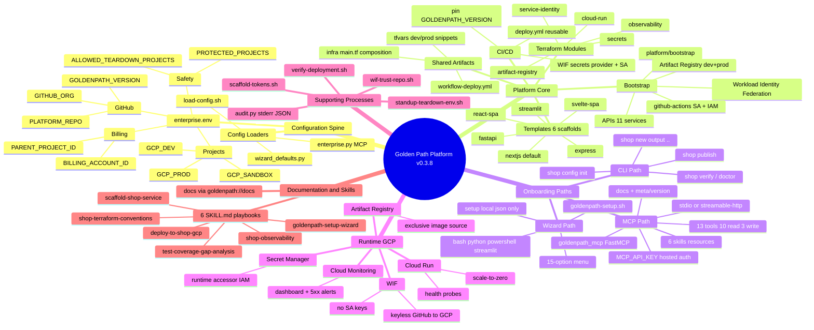
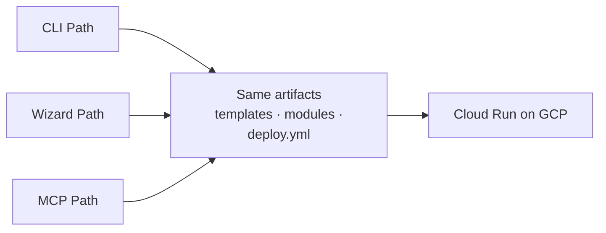

# Golden Path Platform — Mind Map (v0.3.8)

**Audience:** Executives, business stakeholders, technical leads  
**Purpose:** Single-page visual map of the entire platform — configuration, core, onboarding paths, runtime, and support processes  
**Render:** Paste the Mermaid block into [Mermaid Live](https://mermaid.live/) or view in GitHub

---

## Platform mind map



---

## Template quick reference

| Template | Runtime | Port | Health path |
|----------|---------|------|-------------|
| nextjs (default) | node | 3000 | /api/health |
| fastapi | python | 8000 | /api/health |
| streamlit | python | 8501 | /_stcore/health |
| express | node | 3000 | /api/health |
| react-spa | docker/nginx | 8080 | /health |
| svelte-spa | docker/nginx | 8080 | /health |

---

## Onboarding convergence



**Rule:** CLI uses `.goldenpath-cli.local.json` — wizard uses `.goldenpath-setup.local.json`. Do not mix.

---

## MCP tools at a glance

| Category | Count | Examples |
|----------|-------|----------|
| Read | 10 | list_templates, list_services, get_deploy_status, get_skill, get_doc |
| Write audited | 3 | scaffold_service, validate_service_repo, trigger_deploy |

---

## Text outline (source hierarchy)

<details>
<summary>Click to expand full outline</summary>

```
Golden Path Platform (v0.3.8)
├── Configuration Spine
│   ├── config/enterprise.env
│   │   ├── Billing: PARENT_PROJECT_ID, BILLING_ACCOUNT_ID
│   │   ├── Projects: GCP_DEV, GCP_PROD, GCP_SANDBOX
│   │   ├── GitHub: GITHUB_ORG, PLATFORM_REPO, GOLDENPATH_VERSION
│   │   └── Safety: PROTECTED_PROJECTS, ALLOWED_TEARDOWN_PROJECTS
│   └── Config Loaders
│       ├── load-config.sh (bash scripts)
│       ├── wizard_defaults.py (wizards + CLI)
│       └── enterprise.py (MCP Python)
├── Platform Core
│   ├── Bootstrap (platform/bootstrap)
│   │   ├── APIs (11 services × N projects)
│   │   ├── Workload Identity Federation (wif.tf)
│   │   ├── Artifact Registry (dev + prod)
│   │   └── github-actions Service Account + IAM
│   ├── Terraform Modules (modules/)
│   │   ├── service-identity → runtime SA
│   │   ├── secrets → Secret Manager + IAM
│   │   ├── cloud-run → Cloud Run v2 + probes + AR precondition
│   │   ├── observability → dashboard + 5xx alert
│   │   └── artifact-registry → Docker registry
│   ├── Templates (6 scaffolds)
│   │   ├── nextjs (default, node, :3000, /api/health)
│   │   ├── fastapi (python, :8000, /api/health)
│   │   ├── streamlit (python, :8501, /_stcore/health)
│   │   ├── express (node, :3000, /api/health)
│   │   ├── react-spa (docker/nginx, :8080, /health)
│   │   └── svelte-spa (docker/nginx, :8080, /health)
│   ├── Shared Artifacts (templates/_shared/)
│   │   ├── infra/main.tf composition
│   │   ├── workflow-deploy.yml snippet
│   │   └── tfvars dev/prod snippets
│   └── CI/CD
│       ├── .github/workflows/deploy.yml (reusable)
│       ├── Service repo caller pins @GOLDENPATH_VERSION
│       └── WIF secrets: GCP_WIF_PROVIDER, GCP_WIF_SERVICE_ACCOUNT
├── Onboarding Paths (converge on same artifacts)
│   ├── CLI Path
│   │   ├── shop config init → .goldenpath-cli.local.json
│   │   ├── shop new --output ..
│   │   ├── shop publish (public repo + WIF + verify)
│   │   └── shop verify / shop doctor
│   ├── Wizard Path
│   │   ├── goldenpath-setup.sh (auto backend)
│   │   ├── Backends: bash, python, powershell, streamlit
│   │   ├── .goldenpath-setup.local.json (do not mix with CLI config)
│   │   └── 15-option menu: bootstrap, scaffold, publish, MCP config, …
│   └── MCP Path
│       ├── mcp/goldenpath_mcp (FastMCP)
│       ├── 13 tools (10 read, 3 write with audit)
│       ├── 6 skills via goldenpath://skills/*
│       ├── 3 resources: skills, docs, meta/version
│       ├── Transports: stdio (local), streamable-http (hosted Cloud Run)
│       └── API key auth for hosted mode (MCP_API_KEY)
├── Runtime (GCP)
│   ├── Cloud Run (scale-to-zero, health probes)
│   ├── Artifact Registry (exclusive image source)
│   ├── Secret Manager (runtime accessor IAM)
│   ├── Cloud Monitoring (per-service dashboard + alerts)
│   └── WIF (keyless GitHub → GCP, no SA keys)
├── Supporting Processes
│   ├── Scaffold Token Replacement (scaffold-tokens.sh)
│   ├── WIF Repo Trust (wif-trust-repo.sh)
│   ├── Sandbox Standup/Teardown (standup-teardown-env.sh)
│   ├── MCP Audit Log (audit.py → stderr JSON)
│   └── Post-Deploy Verify (verify-deployment.sh)
└── Documentation & Skills
    ├── docs/ (served via goldenpath://docs/*)
    └── skills/ (6 SKILL.md playbooks)
        ├── scaffold-shop-service
        ├── deploy-to-shop-gcp
        ├── shop-terraform-conventions
        ├── shop-observability
        ├── goldenpath-setup-wizard
        └── test-coverage-gap-analysis
```

</details>

---

© 2026 Varanabox. All rights reserved.
