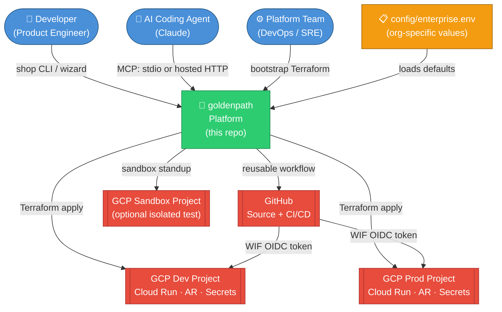
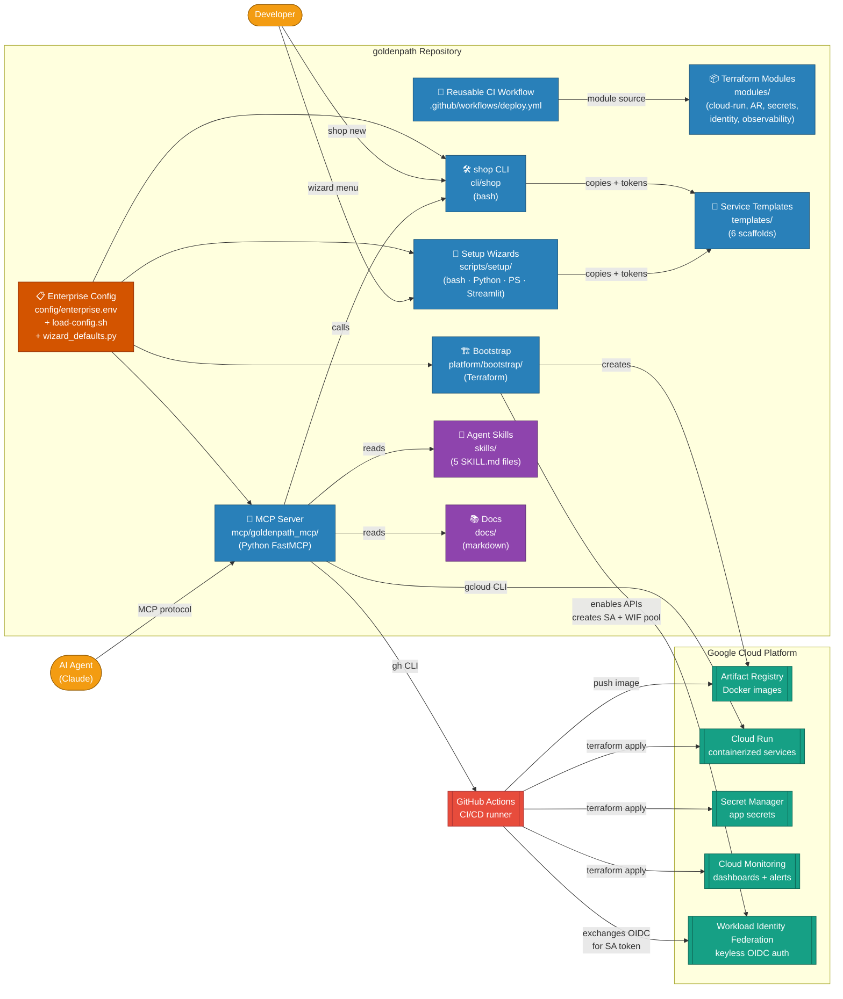
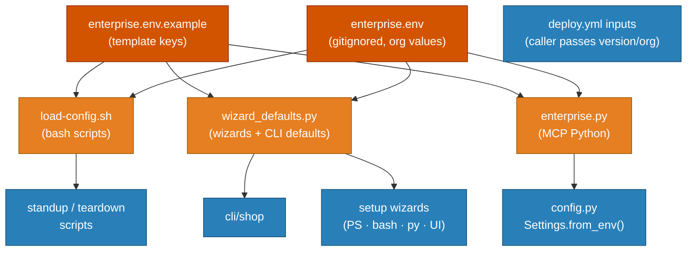
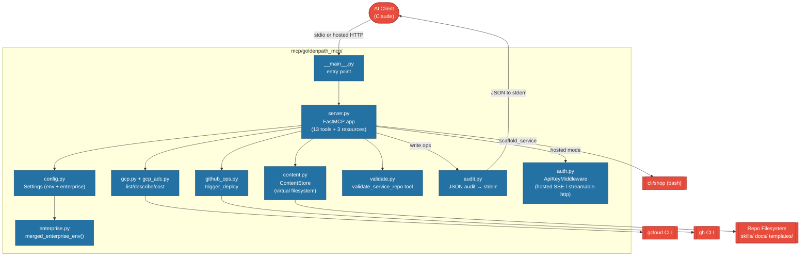
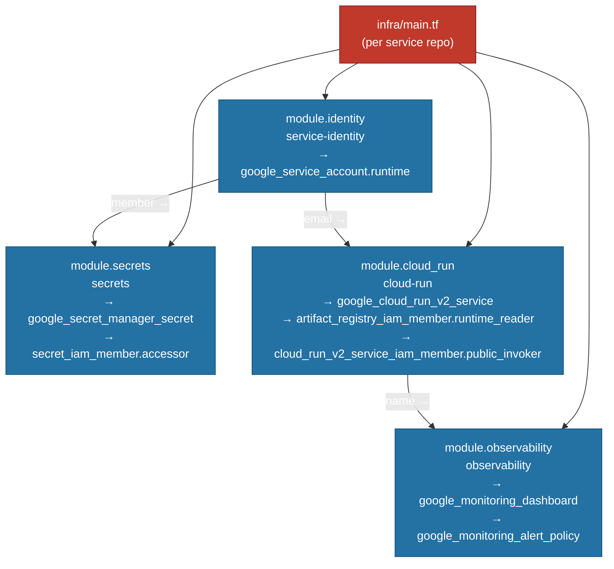
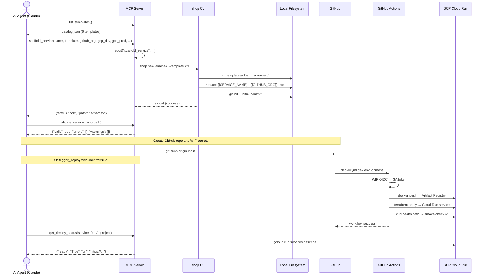
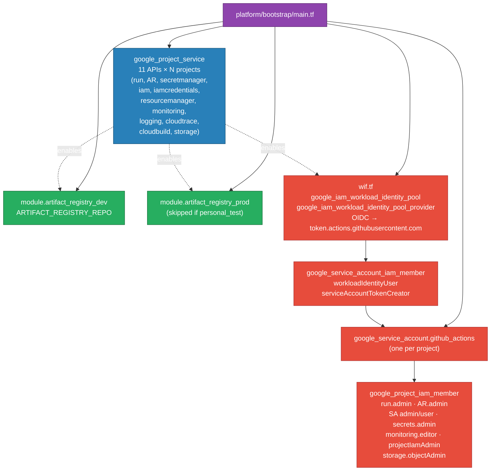
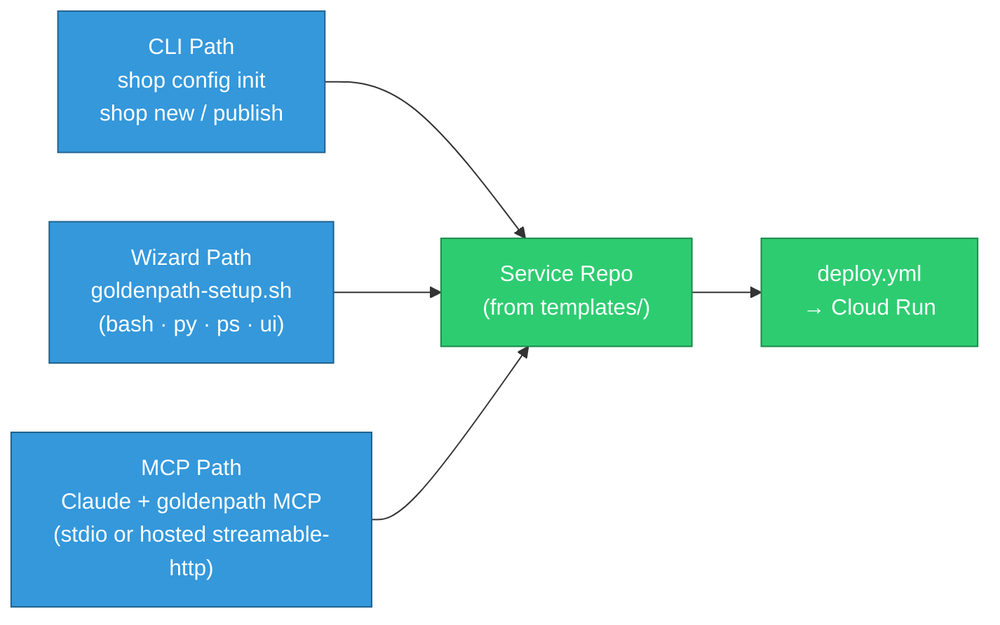

# goldenpath — architecture document

> **Generated:** 2026-06-16 | **Version:** v0.3.8 (Phase 1 + Phase 2, enterprise-agnostic)
>
> **Render diagrams:** Paste any `mermaid` code block into [Mermaid Live Editor](https://mermaid.live/) or view directly in GitHub / Obsidian.

---

## Overview

**goldenpath** is an enterprise-configurable paved road for building and deploying containerized services to Google Cloud Platform. Org-specific values (billing, projects, GitHub org, region, naming) live in `config/enterprise.env` — not in committed scripts — though some legacy `shop-*` skill names and comments remain from the original Shop fork. The platform delivers bootstrap Terraform, reusable modules, six service templates, a bash CLI (`shop`), four setup-wizard backends, a reusable GitHub Actions deploy workflow, and an MCP server that exposes docs, skills, scaffold/deploy tools, and GCP lookups to AI coding assistants (Claude). MCP does not replace bootstrap, wizard, or teardown flows.

Architecturally, the system splits into three layers: **configuration** (enterprise.env drives all scripts, CLI, wizards, and MCP defaults), **platform core** (bootstrap, modules, templates, workflows), and **runtime** (GCP Cloud Run + Artifact Registry + Secret Manager, deployed via keyless Workload Identity Federation). Developers choose one of three onboarding paths — CLI, wizard, or MCP — but all paths converge on the same artifacts: a service repo scaffolded from `templates/` and deployed through the shared `deploy.yml` workflow.

Key properties: keyless GCP authentication via WIF, infrastructure-as-code with version-pinned Terraform modules, scale-to-zero Cloud Run defaults, JSON audit logging on MCP write operations, and API-key protection for hosted MCP transports.

---

## Diagram 1 — System Context

*Who uses the system and what external things does it talk to?*



**What you're looking at:** Three user personas interact with one platform repository. Before anything runs, the enterprise copies `config/enterprise.env.example` → `config/enterprise.env` and fills in billing, projects, GitHub org, and region. The platform team bootstraps dev/prod GCP once (`platform/bootstrap`); developers scaffold services and push to GitHub; AI agents use MCP for scaffold, validation, deploy triggers, and GCP reads. GitHub Actions deploys service repos to Cloud Run using Workload Identity Federation — no service account keys are ever stored. An optional sandbox uses `scripts/standup-teardown-env.sh`, which creates an isolated project and runs bootstrap with `personal_test = true` (single project, no prod AR).

**Alt-text:** System context diagram showing developers, AI agents, and platform engineers connecting to the goldenpath repo, which in turn connects to GitHub and three GCP project tiers (dev, prod, sandbox).

---

## Diagram 2 — Containers

*What are the major deployable/runnable pieces and how do they connect?*



**What you're looking at:** The repo contains eight logical containers plus two content stores. Enterprise config is the spine — `load-config.sh` (bash) and `wizard_defaults.py` (Python) merge `enterprise.env` with the example file so runtime values come from config, not literals in scripts. Onboarding has three entry points (CLI, four wizard backends, MCP) that all produce service repos from the same templates. GitHub Actions is the deployment engine: WIF auth, Docker build, Terraform apply via shared modules. The MCP server is the AI gateway — it serves skills/docs (13 tools, 3 resources) and shells out to `gcloud`, `gh`, and `shop` for live actions.

**Alt-text:** Container diagram showing enterprise config feeding bootstrap, CLI, wizards, and MCP; templates feeding service repos; GitHub Actions deploying to GCP via WIF.

---

## Diagram 3 — Components

*What are the internal components of each major container?*

### 3a. Enterprise configuration layer



### 3b. MCP Server internals



### 3c. Deploy pipeline flow

```mermaid
flowchart LR
    classDef step fill:#2980B9,color:#fff,stroke:#1a5276
    classDef decision fill:#E67E22,color:#fff,stroke:#9a5e00
    classDef infra fill:#27AE60,color:#fff,stroke:#1a6b3a

    Push["git push\nto main"]:::step
    GHATrigger["GitHub Actions\ntriggered"]:::step
    Runtime{{"runtime?\nnode / python / docker"}}:::decision
    NodeStep["npm ci\nlint + test"]:::step
    PythonStep["pip install\nruff + pytest"]:::step
    Auth["google-github-actions/auth\nWIF OIDC exchange"]:::step
    DockerBuild["docker build\n+ push to AR"]:::step
    TFInit["terraform init\n(modules from git tag)"]:::step
    TFPlan["terraform plan\n-var-file={env}.tfvars"]:::step
    TFApply["terraform apply"]:::step
    URLResolve["gcloud run describe\n→ service URL"]:::step
    Smoke["curl health path\n(5 retries)"]:::step

    TFModules["Terraform Modules\n(cloud-run, secrets,\nidentity, observability)"]:::infra
    CloudRun["Cloud Run service\n{name}-{env}"]:::infra

    Push --> GHATrigger
    GHATrigger --> Runtime
    Runtime -->|node| NodeStep
    Runtime -->|python| PythonStep
    Runtime -->|docker| Auth
    NodeStep --> Auth
    PythonStep --> Auth
    Auth --> DockerBuild
    DockerBuild --> TFInit
    TFInit --> TFPlan
    TFPlan --> TFApply
    TFApply --> TFModules
    TFModules --> CloudRun
    TFApply --> URLResolve
    URLResolve --> Smoke
```



**What you're looking at (3a):** Enterprise configuration is a merge of example + local env file, loaded by three small libraries consumed by bash scripts, wizards, CLI, and MCP. Deploy-time values flow from `GITHUB_ORG`, `GCP_DEV_PROJECT`, `GOLDENPATH_VERSION`, `ARTIFACT_REGISTRY_REPO`, etc. Service-repo workflows receive these as caller inputs — they do not read `enterprise.env` directly.

**What you're looking at (3b):** The MCP server declares **13 tools** (10 read, 3 write) and **3 resource** endpoints. `enterprise.py` supplies platform defaults; `auth.py` wraps hosted transports (SSE / streamable-http) with API-key middleware (`MCP_API_KEY` required). Write tools (`scaffold_service`, `trigger_deploy`) audit to stderr before executing. Local stdio mode has no API key gate — it relies on the caller's OS credentials. Hosted `scaffold_service` writes inside the container filesystem only; use local stdio MCP or `shop` CLI for scaffolds on the developer machine.

**What you're looking at (3c):** The reusable `deploy.yml` workflow runs checkout → optional runtime tests (node/python) → WIF auth → Docker build/push → Terraform init/plan/apply → URL resolve → smoke check. Service repos pass all required inputs (project, region, org, version, artifact registry repo). Terraform uses `-var-file="${environment}.tfvars"` (e.g. `dev.tfvars` or `prod.tfvars`). WIF auth is the keyless pivot; modules fetch from the goldenpath git tag pinned in `GOLDENPATH_VERSION`.

---

## Diagram 4 — Code Hierarchies & Sequence Flows

### 4a. Terraform module dependency tree (per service)



### 4b. MCP scaffold sequence (AI Agent → deployed service)



### 4c. Bootstrap Terraform resource hierarchy



### 4d. Onboarding path convergence



**What you're looking at (4a):** Every service's `infra/main.tf` composes four modules in dependency order: identity → secrets → cloud-run → observability.

**What you're looking at (4b):** The AI-driven journey from scaffold to running service. MCP orchestrates `shop`, validation, optional `trigger_deploy` (requires `confirm=true` and `GITHUB_TOKEN`), and GCP reads — the agent or developer still handles `git push` and repo creation unless using `shop publish`. MCP does not call GCP APIs directly; `gcloud`/`gh` run under the caller's credentials.

**What you're looking at (4c):** Bootstrap is a one-time Terraform run establishing GitHub↔GCP trust via WIF. Standard mode provisions dev + prod projects; sandbox standup sets `personal_test = true` and skips prod Artifact Registry. The `github_org` variable scopes which repos can exchange OIDC tokens (`wif.tf` attribute condition).

**What you're looking at (4d):** Three onboarding paths are intentionally separate (different local config files) but converge on identical service-repo and deploy artifacts.

---

## Full Hierarchy Tree

```
goldenpath/
│
├── config/                          # Enterprise configuration (org values in gitignored .env)
│   ├── enterprise.env.example       # Template keys (committed)
│   └── enterprise.env               # Org values (gitignored)
│
├── platform/bootstrap/              # Phase 1 — One-time GCP project setup
│   ├── main.tf                      # API enablement, AR, github-actions SA, IAM roles
│   ├── wif.tf                       # Workload Identity Federation (keyless CI auth)
│   ├── variables.tf                 # dev/prod/sandbox project IDs, github_org, region
│   ├── profiles/                    # Bootstrap profile snippets
│   └── terraform.tfvars             # (gitignored — generated by standup or wizard)
│
├── modules/                         # Phase 1 — Shared Terraform modules (versioned via git tag)
│   ├── artifact-registry/           # Docker registry in a GCP project
│   ├── cloud-run/                   # Cloud Run v2 service + IAM + probes
│   ├── secrets/                     # Secret Manager secrets + accessor IAM
│   ├── service-identity/            # Per-service runtime Service Account
│   └── observability/               # Cloud Monitoring dashboard + 5xx alert
│
├── .github/workflows/
│   ├── deploy.yml                   # Reusable CI workflow (all inputs required from caller)
│   └── deploy-mcp.yml               # Optional hosted MCP deploy to Cloud Run
│
├── templates/                       # Phase 1 — Service scaffolds (6 templates)
│   ├── catalog.json                 # Template metadata (runtime, port, health path)
│   ├── _shared/                     # Shared infra/main.tf + workflow snippet + tfvars
│   ├── nextjs/                      # Next.js App Router (default)
│   ├── fastapi/                     # Python FastAPI
│   ├── streamlit/                   # Python Streamlit
│   ├── express/                     # Node.js Express
│   ├── react-spa/                   # React + Vite + nginx
│   └── svelte-spa/                  # Svelte + Vite + nginx
│       Each contains:
│         Dockerfile · infra/{main,variables,versions,outputs}.tf
│         infra/{dev,prod}.tfvars · .github/workflows/deploy.yml
│         src/ · tests/
│
├── cli/shop                         # Phase 1 — Bash scaffold CLI
│                                    #   shop list · config · new · publish · verify · doctor
│
├── scripts/
│   ├── lib/
│   │   ├── load-config.sh           # Enterprise config loader (bash)
│   │   ├── wizard_defaults.py       # Enterprise config loader (Python)
│   │   ├── scaffold-tokens.sh       # {{TOKEN}} replacement engine
│   │   ├── wif-trust-repo.sh        # Grant WIF trust to a service repo
│   │   └── verify-deployment.sh     # Post-deploy health check
│   ├── setup/                       # Wizard implementations (PS, bash, Python, Streamlit)
│   ├── goldenpath-setup.sh          # Unified wizard launcher (auto backend)
│   ├── goldenpath-setup-{bash,py,ps,ui}.sh
│   ├── standup-teardown-env.sh      # Sandbox standup (reads enterprise.env)
│   └── teardown-personal-test.sh    # Safe teardown with protected-project guard
│
├── skills/                          # Phase 2 — Agent skills (5 SKILL.md files)
│   ├── scaffold-shop-service/
│   ├── deploy-to-shop-gcp/
│   ├── shop-terraform-conventions/
│   ├── shop-observability/
│   └── goldenpath-setup-wizard/
│
├── mcp/goldenpath_mcp/              # Phase 2 — MCP server package (Python, FastMCP)
│   ├── server.py                    # 13 tools + 3 resources
│   ├── config.py                    # Settings.from_env() + enterprise defaults
│   ├── enterprise.py                # merged_enterprise_env() parser
│   ├── content.py                   # ContentStore — virtual goldenpath:// filesystem
│   ├── gcp.py / gcp_adc.py          # GCP helpers via gcloud CLI
│   ├── github_ops.py                # GitHub helpers via gh CLI
│   ├── validate.py                  # Service repo structure validation
│   ├── audit.py                     # JSON audit log → stderr for write tools
│   ├── auth.py                      # API-key middleware for hosted transports
│   └── __main__.py                  # Entry — stdio or SSE / streamable-http
│
├── mcp/Dockerfile                   # Container image for hosted MCP (streamable-http on Cloud Run)
├── mcp/infra/                       # Terraform for hosted MCP (optional)
│
├── tests/
│   ├── goldenpath-setup.tests.ps1   # Pester tests for wizard modules
│   └── Run-SetupWizardTests.ps1
│
└── docs/                            # Documentation (served via MCP goldenpath://docs/)
    ├── getting-started/             # Onboarding journeys (CLI, wizard, MCP)
    ├── platform/                    # Platform architecture, requirements, checklists
    │   └── architecture.md          # This document
    ├── design/                      # Design proposals (e.g. MCP evolution)
    ├── environments/                # sandbox-env.md (standup/teardown)
    └── repository-guide.md          # Repo map
```

---

## Recommendations

### 1. Add Terraform Remote State Backend

`platform/bootstrap/terraform.tfstate` is local by default. For team use, state should live in a GCS bucket (`tfstate_bucket_name` variable exists but is optional). Without remote state, concurrent bootstrap runs can corrupt state. **Priority: High.**

### 2. Pin Module Git References More Tightly

Templates use `@GOLDENPATH_VERSION` for module sources. Git tags are mutable — a force-push silently changes what every service deploys. Document a procedure to pin `ref=<commit-sha>` in production service repos and update via controlled releases.

### 3. Rotate MCP API Keys and Document Hosted Setup

Hosted MCP now enforces `MCP_API_KEY` via `auth.py`, but key rotation and Secret Manager storage for the hosted deployment are not automated. Add a rotation runbook and wire `MCP_API_KEY` into `mcp/infra/` Secret Manager binding. **Priority: Medium.**

### 4. Surface the Audit Log

`audit.py` writes JSON to stderr (captured by Cloud Run logs), but there is no alerting dashboard. Create a log-based metric on `jsonPayload.event` for `scaffold_service` and `trigger_deploy` so platform teams have visibility on AI-driven write actions.

### 5. Add a `prod` tfvars Validation Gate

`terraform plan -var-file=prod.tfvars` has no guard against `allow_unauthenticated = true` in production. Add a `precondition` block in `cloud-run/main.tf` asserting production services cannot be publicly invokable without explicit override.

---

## Render Instructions

All diagrams use [Mermaid.js](https://mermaid.js.org/) syntax and render natively in:

- **GitHub** — any `.md` file renders `mermaid` code blocks automatically
- **Mermaid Live Editor** — paste any block at [mermaid.live](https://mermaid.live/) for interactive editing
- **Obsidian** — natively rendered with the Mermaid plugin
- **VS Code** — use the [Markdown Preview Mermaid Support](https://marketplace.visualstudio.com/items?itemName=bierner.markdown-mermaid) extension
- **Claude** — renders Mermaid diagrams in markdown preview

For PlantUML fallback (if Mermaid subgraph limits are hit), use [PlantUML Online](https://www.plantuml.com/plantuml/uml/) — but all diagrams in this document are Mermaid-native for maximum compatibility.

---

© 2026 Varanabox. All rights reserved.
