# Golden Path code bible

> **A beginner's guide to understanding, reading, and contributing to the Golden Path platform.**

**Audience:** Absolute beginners — no prior programming experience required.  
**Repository:** `goldenpath` (Varanabox)  
**Last updated:** June 2026

---

## Table of Contents

1. [Introduction for Absolute Beginners](#1-introduction-for-absolute-beginners)
2. [Programming Basics Crash Course](#2-programming-basics-crash-course)
3. [High-Level Architecture](#3-high-level-architecture)
4. [Detailed File-by-File Breakdown](#4-detailed-file-by-file-breakdown)
5. [Good Practices (20 Items)](#5-good-practices-20-items)
6. [Refactoring Deep Dive](#6-refactoring-deep-dive)
7. [20 Hands-On Exercises](#7-20-hands-on-exercises)
8. [Quizzes with Answers](#8-quizzes-with-answers)
9. [Extended Glossary Appendix](#9-extended-glossary-appendix)
10. [Footer](#10-footer)

---

# 1. Introduction for Absolute Beginners

## 1.1 What Is Golden Path?

**Golden Path** is an internal developer platform (IDP) that helps teams scaffold, deploy, and operate services on **Google Cloud Platform (GCP)** and **GitHub** using opinionated, safe defaults. Think of it as a **guided highway** for building cloud-native applications: instead of inventing your own deployment pipeline from scratch, you follow a well-tested route.

Golden Path provides:

- **Templates** — starter projects (FastAPI, Next.js, etc.) with health checks and deploy workflows baked in.
- **CLI (`shop`)** — a Bash command-line tool to list templates, scaffold services, publish to GitHub, and verify deployments.
- **MCP Server** — a Model Context Protocol server that exposes skills, docs, and platform tools to AI assistants.
- **Terraform modules** — infrastructure-as-code for Cloud Run, Artifact Registry, and IAM.
- **Enterprise configuration** — `config/enterprise.env` (plus `enterprise.env.example` fallbacks) so org GCP projects, GitHub org, and safety rules are not embedded in source code.

## 1.2 Who Should Read This Bible?

| Reader | What you'll learn |
|--------|-------------------|
| **Non-programmer** | What each file does, how data flows, basic vocabulary |
| **Junior developer** | How to read Bash, Python, HCL; how to run `shop` and MCP |
| **Contributor** | Patterns to follow, refactoring examples, exercises |

## 1.3 How to Use This Document

1. Read **Section 2** if you've never written code.
2. Skim **Section 3** diagrams to see the big picture.
3. Deep-dive **Section 4** when you're looking at a specific file.
4. Complete **Section 7** exercises on a sandbox GCP project.
5. Test yourself with **Section 8** quizzes.
6. Keep **Section 9** glossary open as a reference.

## 1.4 Prerequisites (Minimal)

- A terminal (macOS Terminal, iTerm, or Windows WSL).
- `git` installed.
- Optional: `gcloud`, `gh` (GitHub CLI), `python3`, `terraform`.
- A copy of the Golden Path repo cloned locally.

## 1.5 Key Vocabulary (Preview)

| Term | Plain English |
|------|---------------|
| **Scaffold** | Generate a new project folder from a template |
| **Cloud Run** | GCP service that runs containers without managing servers |
| **Artifact Registry** | GCP storage for Docker images |
| **MCP** | Protocol for AI tools to call functions and read resources |
| **HCL** | HashiCorp Configuration Language — used by Terraform |
| **WIF** | Workload Identity Federation — lets GitHub Actions authenticate to GCP without long-lived keys |

## 1.6 The Golden Rule of This Codebase

> **Enterprise-agnostic org values.** Bash (`load-config.sh`) requires `enterprise.env` for three keys; Python (`wizard_defaults.py`, `enterprise.py`) merges example + local; the CLI (`shop`) and MCP server (`config.py`) layer CLI JSON / env on top. Platform defaults (region, workflow pin, resource names) ship in `enterprise.env.example`.

Understanding this one principle unlocks most of the repository.

---

# 2. Programming Basics Crash Course

This section teaches just enough to read Golden Path source files. You do not need to become an expert — you need to **recognize patterns**.

## 2.1 Bash (Shell Scripting)

Bash files in Golden Path start with `#!/usr/bin/env bash` — the **shebang** tells the OS to run the file with Bash.

### 2.1.1 Strict Mode

```bash
set -euo pipefail
```

| Flag | Meaning |
|------|---------|
| `-e` | Exit immediately if any command fails |
| `-u` | Treat unset variables as errors |
| `-o pipefail` | Fail a pipeline if any stage fails |

Golden Path uses strict mode in `load-config.sh` and `cli/shop` to avoid silent failures.

### 2.1.2 Variables

```bash
REPO_ROOT="$(cd "${SCRIPT_DIR}/.." && pwd)"
```

- `VAR=value` assigns (no spaces around `=`).
- `"${VAR}"` expands the variable safely (handles spaces).
- `$(command)` runs a command and captures its output.

### 2.1.3 Functions

```bash
load_goldenpath_config() {
  local repo_root="${1:-}"
  # ...
}
```

- `local` keeps variables inside the function.
- `${1:-}` means "first argument, or empty string if missing."

### 2.1.4 Conditionals

```bash
if [[ ! -f "${config_file}" ]]; then
  printf 'error: missing config file: %s\n' "${config_file}" >&2
  return 1
fi
```

- `[[ ... ]]` is Bash's test syntax.
- `-f` checks if a path is a regular file.
- `>&2` sends output to stderr (error stream).

### 2.1.5 Sourcing vs Executing

```bash
source "${config_file}"
```

**Sourcing** runs another script *in the current shell*, so exported variables persist. Golden Path loads `enterprise.env` this way.

### 2.1.6 Parameter Expansion Tricks

```bash
: "${PARENT_PROJECT_ID:?PARENT_PROJECT_ID required in enterprise.env}"
```

The `:?` suffix means: if `PARENT_PROJECT_ID` is unset or empty, print the message and exit.

```bash
export GCP_REGION="${GCP_REGION:-$(_goldenpath_example_default GCP_REGION "${repo_root}" || true)}"
```

`${VAR:-default}` uses `default` when `VAR` is unset or empty.

### 2.1.7 Here-Documents (Embedding Python in Bash)

The `shop` CLI embeds Python inline:

```bash
python3 - "$CLI_CONFIG" <<'PY'
import json, sys
c = json.load(open(sys.argv[1]))
# ...
PY
```

`<<'PY'` starts a here-doc; quotes around `'PY'` prevent Bash from expanding `$variables` inside.

---

## 2.2 Python

Golden Path uses Python 3 with modern type hints (`from __future__ import annotations`).

### 2.2.1 Imports and Modules

```python
from pathlib import Path
```

`Path` is the modern way to work with file paths (cross-platform).

### 2.2.2 Functions and Type Hints

```python
def parse_env_file(path: Path) -> dict[str, str]:
    profile: dict[str, str] = {}
```

- `path: Path` — argument must be a Path.
- `-> dict[str, str]` — returns a dictionary with string keys and string values.

### 2.2.3 Regular Expressions

```python
m = re.match(r"^\s*([A-Z_]+)=(.*)$", line)
if m:
    profile[m.group(1)] = m.group(2).strip().strip('"')
```

Parses `KEY=value` lines from `.env` files, stripping optional quotes.

### 2.2.4 Dataclasses

```python
@dataclass(frozen=True)
class Settings:
    repo_root: Path
    channel: str
```

`frozen=True` makes instances immutable — good for configuration objects.

### 2.2.5 Class Methods

```python
@classmethod
def from_env(cls) -> Settings:
    env_root = os.getenv("GOLDENPATH_ROOT")
```

Factory pattern: build a `Settings` object from environment variables.

### 2.2.6 Decorators (MCP Tools)

```python
@mcp.tool()
def list_templates() -> str:
    """List available Golden Path service templates from catalog.json."""
```

Decorators wrap functions to register them with the MCP framework.

### 2.2.7 Exception Handling

```python
try:
    result = subprocess.run(cmd, capture_output=True, text=True, check=True, cwd=settings.repo_root)
except subprocess.CalledProcessError as exc:
    return json.dumps({"error": exc.stderr or exc.stdout or "scaffold failed"})
```

`check=True` raises `CalledProcessError` on non-zero exit codes.

---

## 2.3 HCL (HashiCorp Configuration Language)

Terraform uses HCL. Golden Path's Cloud Run module is in `modules/cloud-run/main.tf`.

### 2.3.1 Blocks and Attributes

```hcl
resource "google_cloud_run_v2_service" "service" {
  project  = var.project_id
  name     = local.name
  location = var.region
}
```

- `resource` declares infrastructure to create.
- `var.project_id` reads an input variable.
- `local.name` reads a computed local value.

### 2.3.2 Locals

```hcl
locals {
  name = "${var.service_name}-${var.environment}"
  image  = "${var.region}-docker.pkg.dev/${var.project_id}/${var.artifact_registry_repository_id}/${local.image_name}:${var.image_tag}"
}
```

`locals` are computed values used within the module.

### 2.3.3 Dynamic Blocks

```hcl
dynamic "env" {
  for_each = var.env
  content {
    name  = env.key
    value = env.value
  }
}
```

Creates zero or more `env` blocks from a map — one per environment variable.

### 2.3.4 Lifecycle Preconditions

```hcl
lifecycle {
  precondition {
    condition     = can(regex("^${var.region}-docker\\.pkg\\.dev/${var.project_id}/", local.image))
    error_message = "Golden Path requires Artifact Registry images..."
  }
}
```

Terraform **refuses to apply** if the image URL doesn't match Golden Path conventions.

### 2.3.5 Conditional Resources

```hcl
resource "google_cloud_run_v2_service_iam_member" "public_invoker" {
  count = var.allow_unauthenticated ? 1 : 0
  # ...
}
```

`count = 0` means the resource is not created — used for optional public access.

---

## 2.4 YAML

Golden Path deploy workflows use YAML (`.yml` files). Key concepts:

```yaml
name: Deploy
on:
  workflow_dispatch:
    inputs:
      environment:
        type: choice
        options: [dev, prod]
jobs:
  deploy:
    runs-on: ubuntu-latest
    steps:
      - uses: actions/checkout@v4
```

| Key | Meaning |
|-----|---------|
| `on:` | Events that trigger the workflow |
| `jobs:` | Units of work |
| `steps:` | Sequential commands |
| `uses:` | Reuse a third-party action |

Environment files like `enterprise.env` are **not YAML** — they use `KEY=value` syntax (dotenv format).

---

## 2.5 JSON

`templates/catalog.json` describes available service templates:

```json
{
  "nextjs": {
    "app_runtime": "node",
    "container_port": 3000,
    "health_check_path": "/api/health",
    "default": true
  }
}
```

Python reads it with `json.load()`; Bash delegates to Python for parsing.

---

## 2.6 Reading Code: A Beginner's Checklist

When you open any Golden Path file, ask:

1. **What language?** Shebang or extension tells you.
2. **What does it import/source?** Trace dependencies upward.
3. **Where does config come from?** Almost always `enterprise.env`.
4. **What is exported or returned?** That's the public interface.
5. **What fails loudly?** Look for `die`, `:?`, `raise`, `error_message`.

---

# 3. High-Level Architecture

Golden Path is a **layered platform**: configuration at the bottom, tooling in the middle, deployed services at the top.

## 3.1 System Context Diagram

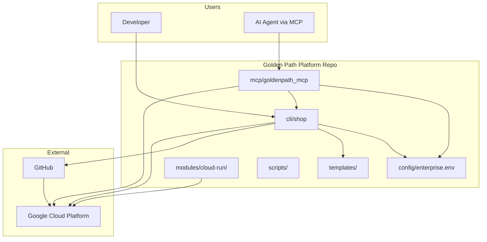

## 3.2 Configuration Flow

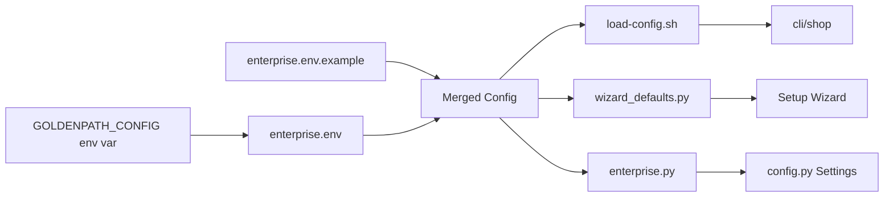

## 3.3 Scaffold Lifecycle

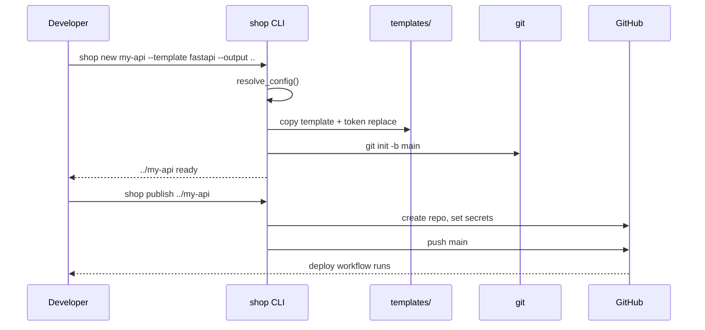

## 3.4 MCP Server Architecture

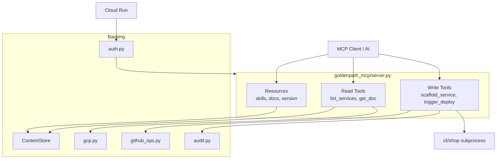

## 3.5 Transport Modes

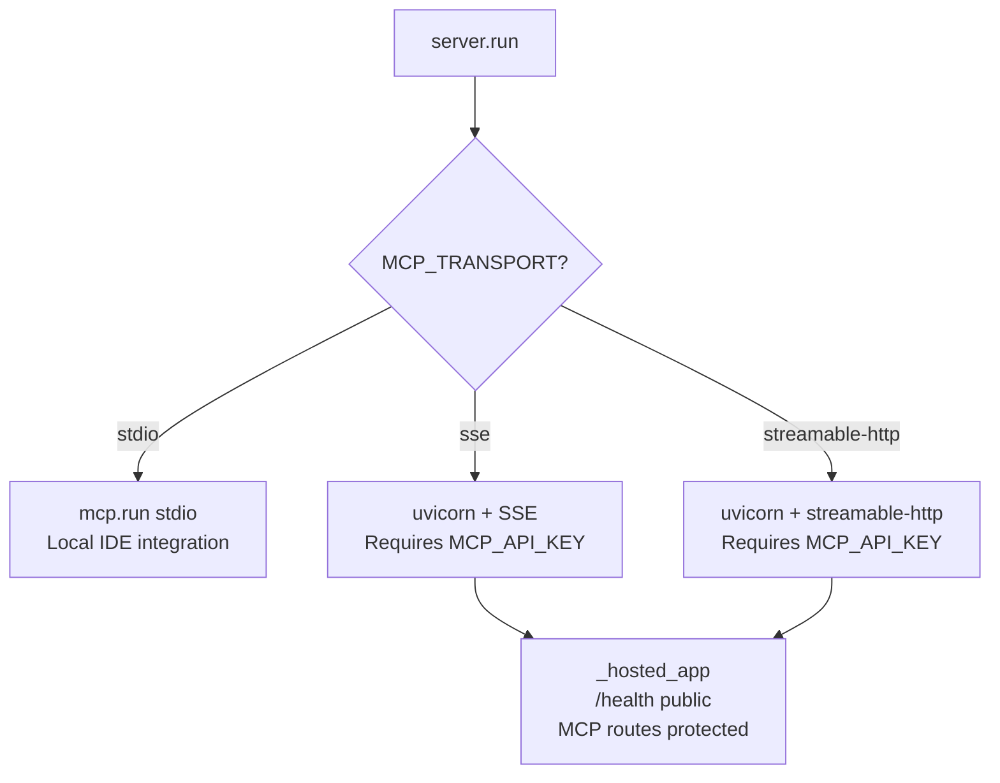

## 3.6 Deploy Pipeline (Conceptual)

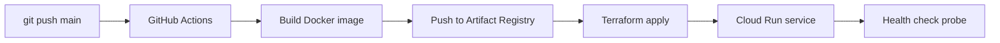

## 3.7 Terraform Module Topology

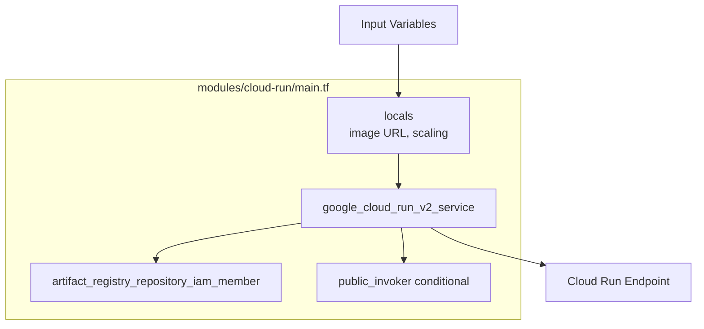

## 3.8 Safety: Protected Projects

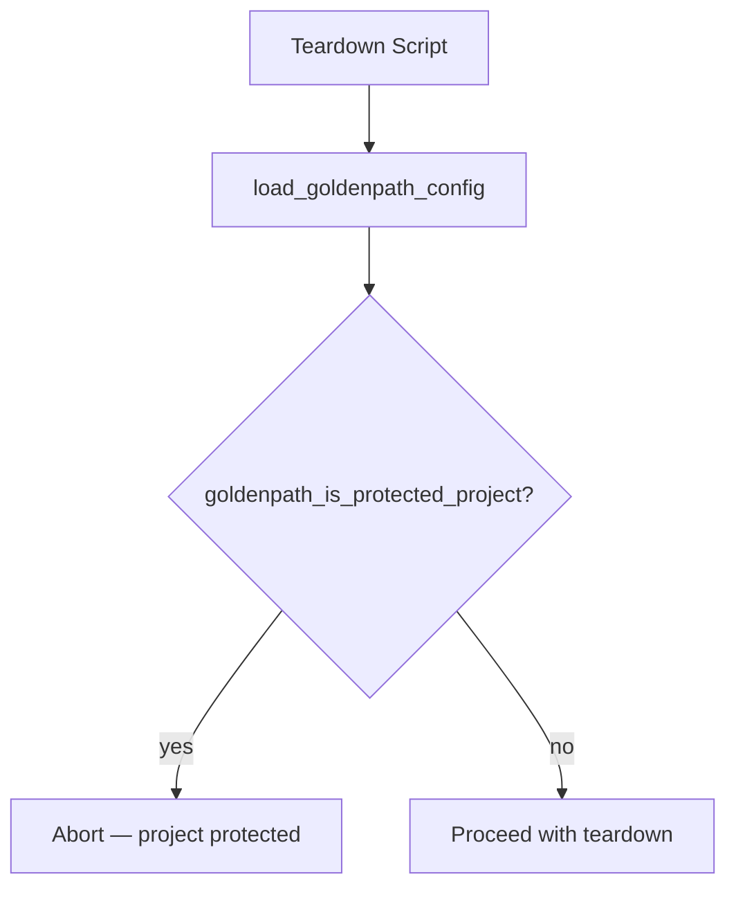

## 3.9 CLI Config Resolution Order

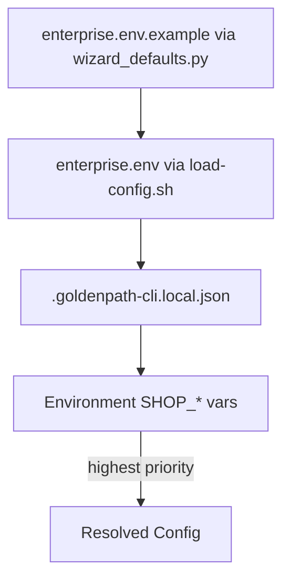

## 3.10 FastAPI Template Request Flow

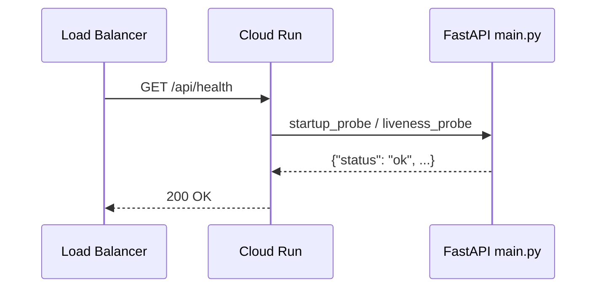

## 3.11 Repository Directory Map

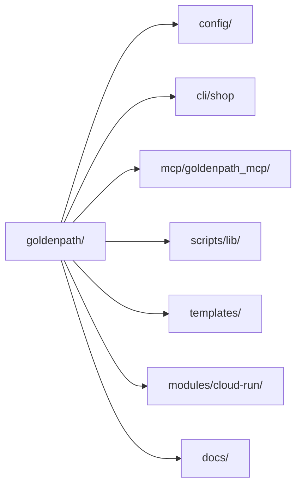

## 3.12 Enterprise Config Entity Relationship

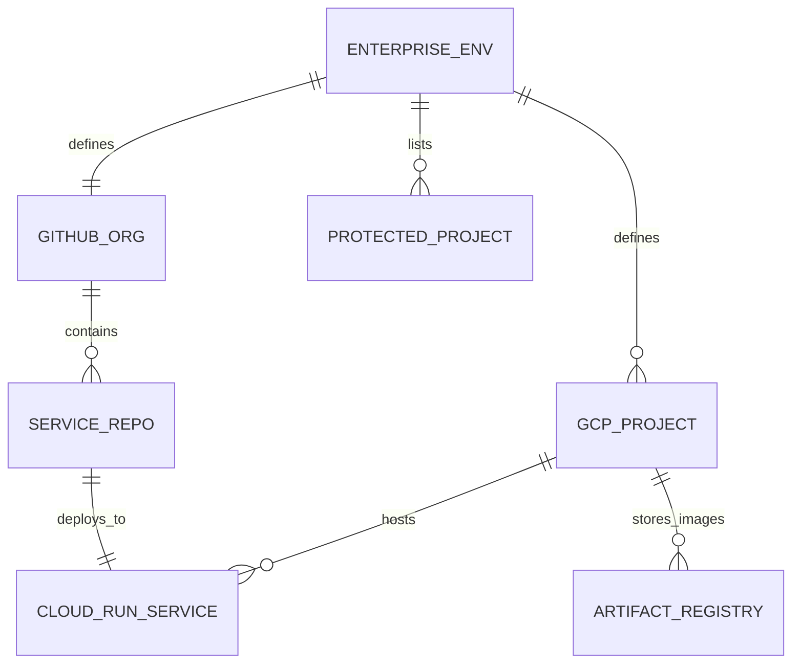

---

# 4. Detailed File-by-File Breakdown

This section walks through every required source file with **line-by-line explanations**. Line numbers match the repository as of this writing.

---

## 4.1 `config/enterprise.env.example`

**Purpose:** Template for organization-wide settings. Copy to `config/enterprise.env` and customize.

| Line | Code | Explanation |
|------|------|-------------|
| 1 | `# Golden Path enterprise configuration` | Comment — ignored by parsers |
| 2 | `# Copy to config/enterprise.env...` | Instructions for operators |
| 3 | `# All scripts, CLI, and wizard read from this file` | Documents single source of truth |
| 4 | `# (or GOLDENPATH_CONFIG override).` | Optional path override via env var |
| 6 | `# cp config/enterprise.env.example...` | Shell command example |
| 8–11 | `PARENT_PROJECT_ID=...` / `BILLING_ACCOUNT_ID=...` | **Billing anchor** — existing GCP project used only for billing linkage; Golden Path never deploys here |
| 14–15 | `GCP_DEV_PROJECT` / `GCP_PROD_PROJECT` | Target projects for non-prod and prod deployments |
| 18–20 | `GCP_SANDBOX_PROJECT` / `SANDBOX_PROJECT_NAME` / `SANDBOX_PROJECT_LABELS` | Isolated sandbox for personal/CI testing |
| 23 | `GCP_REGION=us-central1` | Default region for Cloud Run and Artifact Registry |
| 26–27 | `GITHUB_ORG` / `PLATFORM_REPO` | GitHub organization and platform repo name |
| 30 | `GOLDENPATH_VERSION=v0.3.7` | Version tag for reusable deploy workflows |
| 33–34 | `ARTIFACT_REGISTRY_REPO` / `MCP_SERVICE_NAME` | Shared naming conventions |
| 38 | `PROTECTED_PROJECTS=...` | Comma-separated list teardown scripts must **never** delete |
| 41 | `ALLOWED_TEARDOWN_PROJECTS=` | Optional allowlist; empty means any non-protected sandbox |

**Key takeaway:** This file is the **contract** between your organization and all Golden Path automation.

---

## 4.2 `scripts/lib/load-config.sh`

**Purpose:** Bash library to load and validate enterprise config. Sourced by CLI and shell scripts.

### Lines 1–5: Header and Strict Mode

| Line | Code | Explanation |
|------|------|-------------|
| 1 | `#!/usr/bin/env bash` | Execute with Bash |
| 2 | `# Load enterprise config...` | Documentation |
| 3 | `# Optional keys fall back to example` | Fallback strategy |
| 4 | `# Source this file: source ...` | Usage instructions |
| 5 | `set -euo pipefail` | Strict error handling |

### Lines 7–18: `_goldenpath_example_default`

| Line | Code | Explanation |
|------|------|-------------|
| 7 | `_goldenpath_example_default() {` | Private helper function |
| 8 | `local key="$1"` | First arg: env key name |
| 9 | `local repo_root="${2:-}"` | Second arg: repo root path |
| 10 | `local example="${repo_root}/config/enterprise.env.example"` | Path to example file |
| 11 | `[[ -f "${example}" ]] \|\| return 1` | Fail if example missing |
| 12–13 | `grep -E "^${key}=" ...` | Find last matching `KEY=` line |
| 14–17 | `${line#*=}` / quote stripping | Extract value, remove surrounding `"` |
| 17 | `printf '%s' "${val}"` | Print without trailing newline |

### Lines 20–65: `load_goldenpath_config`

| Line | Code | Explanation |
|------|------|-------------|
| 20 | `load_goldenpath_config() {` | Main entry point |
| 21–24 | Resolve `repo_root` | Default: two levels up from `scripts/lib/` |
| 26 | `GOLDENPATH_CONFIG:-${repo_root}/config/enterprise.env` | Config path with override |
| 27–31 | Missing file check | Prints helpful error, returns 1 |
| 34 | `source "${config_file}"` | Load all `KEY=value` into shell |
| 36–38 | `: "${VAR:?message}"` | Require critical vars |
| 40–41 | `export GOLDENPATH_REPO_ROOT` / `GOLDENPATH_CONFIG_FILE` | Expose metadata |
| 42–56 | Export all config vars | Optional vars use `${VAR:-fallback}` |
| 47 | `SANDBOX_PROJECT_NAME` fallback | Reads from example file |
| 49 | `GCP_REGION` fallback | Same pattern |
| 58–64 | `SHOP_*` aliases | CLI-specific env var names |

### Lines 67–83: Protection Helpers

| Line | Code | Explanation |
|------|------|-------------|
| 67 | `goldenpath_protected_projects()` | Split CSV to space-separated |
| 69–71 | `tr ',' ' '` | Convert `a,b,c` → `a b c` |
| 74 | `goldenpath_is_protected_project()` | Check if project ID is protected |
| 77–81 | Loop + string compare | Returns 0 (true) if protected |

---

## 4.3 `scripts/lib/wizard_defaults.py`

**Purpose:** Python counterpart to config loading — powers setup wizard and `shop` fallbacks.

### Lines 1–10: Module Setup

| Line | Code | Explanation |
|------|------|-------------|
| 1 | `#!/usr/bin/env python3` | Runnable script |
| 2 | `"""Wizard and platform defaults..."""` | Module docstring |
| 4 | `from __future__ import annotations` | Enable modern type hints |
| 6–10 | imports | `json`, `os`, `re`, `sys`, `Path` |

### Lines 13–24: `find_repo_root`

| Line | Code | Explanation |
|------|------|-------------|
| 13 | `def find_repo_root(...)` | Walk up directory tree |
| 16–17 | Check `templates/catalog.json` | Strongest repo marker |
| 18–19 | Check `.git` | Fallback marker |
| 20–24 | Parent traversal | Max 8 levels; fallback to computed path |

### Lines 27–35: `parse_env_file`

| Line | Code | Explanation |
|------|------|-------------|
| 27 | `def parse_env_file(path: Path)` | Parse dotenv format |
| 29–30 | Return `{}` if missing | Safe default |
| 31–34 | Regex per line | Only `A-Z_` keys (enterprise convention) |
| 34 | `.strip().strip('"')` | Clean values |

### Lines 38–55: Path Helpers and Merge

| Line | Code | Explanation |
|------|------|-------------|
| 38–42 | `enterprise_env_path` | Honors `GOLDENPATH_CONFIG` |
| 45–46 | `enterprise_example_path` | Always `config/enterprise.env.example` |
| 49–55 | `merged_enterprise_env` | Example first, local overrides |

### Lines 58–91: Defaults and Wizard Config

| Line | Code | Explanation |
|------|------|-------------|
| 58–59 | `platform_default` | Single key lookup |
| 62–65 | `protected_project_ids` | Returns immutable `frozenset` |
| 68–91 | `default_wizard_config` | Full wizard state dict with sandbox profile |

### Lines 94–144: Validation and Merge

| Line | Code | Explanation |
|------|------|-------------|
| 94–103 | `_valid_wif_provider` | Regex for Workload Identity Provider resource name |
| 105–113 | `_valid_wif_service_account` | Regex for `github-actions@...` SA email |
| 116–144 | `merge_saved_config` | Load `.goldenpath-setup.local.json`, validate WIF fields, auto-fix invalid saved config |

### Lines 147–189: CLI Interface

| Line | Code | Explanation |
|------|------|-------------|
| 147–148 | `_sh_escape` | Escape single quotes for shell |
| 151–157 | `shell_exports` | Print `export WIZ_*` lines for Bash |
| 160–185 | `main()` | Handle `--protected`, `--platform-default`, `--shell-exports`, `--merge`, etc. |
| 188–189 | `if __name__ == "__main__"` | Script entry point |

---

## 4.4 `mcp/goldenpath_mcp/enterprise.py`

**Purpose:** Lightweight enterprise config loader for the MCP Python package.

| Line | Code | Explanation |
|------|------|-------------|
| 1 | Module docstring | No hardcoded org values |
| 10–18 | `_parse_env_file` | Identical parsing logic to wizard_defaults |
| 21–27 | `merged_enterprise_env` | Example + local merge |
| 23 | `GOLDENPATH_CONFIG` override | Same as Bash/Python wizard |
| 30–31 | `platform_default` | Key lookup for MCP Settings |

**Design note:** This file is intentionally small — MCP imports only what it needs, avoiding a dependency on `wizard_defaults.py`.

---

## 4.5 `mcp/goldenpath_mcp/config.py`

**Purpose:** Build immutable `Settings` dataclass from environment + enterprise config.

| Line | Code | Explanation |
|------|------|-------------|
| 12–27 | `Settings` dataclass fields | All runtime configuration in one object |
| 29–57 | `from_env` classmethod | Resolution order: env vars → enterprise defaults |
| 31–36 | `repo_root` resolution | `GOLDENPATH_ROOT` or `parents[2]` from package path |
| 38 | `shop_cli` path | `SHOP_CLI` env or `cli/shop` |
| 40–42 | `platform_default` calls | Version, region, MCP service name |
| 44–57 | Construct `Settings` | `os.getenv` with fallbacks; `port` coerced to `int` |
| 55–56 | API key and GitHub token | Optional secrets for hosted mode and deploy triggers |

---

## 4.6 `mcp/goldenpath_mcp/server.py`

**Purpose:** MCP server exposing resources (read-only docs/skills) and tools (platform operations).

### Lines 1–57: Initialization

| Line | Code | Explanation |
|------|------|-------------|
| 10 | `from mcp.server.fastmcp import FastMCP` | MCP framework |
| 30–31 | `settings = Settings.from_env()` | Load config once at import |
| 34–36 | `_is_hosted()` | Detect Cloud Run via `K_SERVICE` |
| 38–43 | `_transport_security()` | Disable DNS rebinding protection when bound to `0.0.0.0` |
| 46–57 | `FastMCP(...)` | Server metadata, host/port, stateless HTTP for Cloud Run |

### Lines 60–76: Resources

| Line | Code | Explanation |
|------|------|-------------|
| 63–65 | `goldenpath://meta/version` | JSON version metadata |
| 68–70 | `goldenpath://docs/{path}` | Read documentation files |
| 73–75 | `goldenpath://skills/{name}/SKILL.md` | Read agent skill files |

### Lines 81–181: Read Tools

| Line | Code | Explanation |
|------|------|-------------|
| 82–85 | `list_templates` | Returns `catalog.json` |
| 89–92 | `list_skills` | Lists skill directories |
| 120–130 | `list_services` | GCP Cloud Run listing via caller's `gcloud` auth |
| 134–149 | `get_deploy_status` | Deployment status for a service |
| 152–168 | `get_service_config` | Cloud Run configuration |
| 172–181 | `get_cost_estimate` | Cost visibility notes |

### Lines 187–290: Write Tools

| Line | Code | Explanation |
|------|------|-------------|
| 188–253 | `scaffold_service` | Runs `shop new` via subprocess; requires org/project args |
| 238 | `audit(...)` | Logs write operations |
| 257–259 | `validate_service_repo` | Checks Golden Path service structure |
| 263–290 | `trigger_deploy` | GitHub workflow dispatch; requires `confirm=true` |

### Lines 293–370: Hosting and Main

| Line | Code | Explanation |
|------|------|-------------|
| 293–301 | `_require_network_api_key` | SSE/HTTP transports need `MCP_API_KEY` |
| 304–313 | `_health` | Public health endpoint for Cloud Run |
| 316–326 | `_hosted_app` | Wrap MCP routes with API key middleware |
| 329–358 | uvicorn runners | Async serve for SSE and streamable-http |
| 361–370 | `run()` | Dispatch by `MCP_TRANSPORT` |

---

## 4.7 `templates/fastapi/app/main.py`

**Purpose:** Minimal FastAPI application template — replaced tokens become real service name at scaffold time.

| Line | Code | Explanation |
|------|------|-------------|
| 1 | `import os` | Read environment variables |
| 3 | `from fastapi import FastAPI` | Web framework |
| 5 | `app = FastAPI(title="{{SERVICE_NAME}}")` | Token replaced during scaffold |
| 8–14 | `@app.get("/api/health")` | **Health endpoint** — matches Cloud Run probes |
| 10–13 | Return dict | `status`, `service`, `environment` from env |
| 17–19 | `@app.get("/")` | Root welcome message |

**Why `/api/health`?** Golden Path templates and Terraform default `health_check_path` align with this route.

---

## 4.8 `cli/shop` (Lines 1–200)

**Purpose:** Primary Bash CLI for scaffolding, publishing, and verifying services.

### Lines 1–14: Setup

| Line | Code | Explanation |
|------|------|-------------|
| 1 | Shebang | Bash interpreter |
| 2–3 | Comments | Bash-only; separate from PowerShell wizard |
| 4 | `set -euo pipefail` | Strict mode |
| 6–13 | Path constants | `REPO_ROOT`, `TEMPLATES_DIR`, `CATALOG`, helper scripts |
| 14 | `source scaffold-tokens.sh` | Token replacement for templates |

### Lines 16–52: Usage

| Line | Code | Explanation |
|------|------|-------------|
| 16–52 | `usage()` heredoc | Documents all commands and env vars |

### Lines 54–56: Logging Helpers

| Line | Code | Explanation |
|------|------|-------------|
| 54 | `log()` | Info prefix `==>` |
| 55 | `die()` | Error to stderr + exit 1 |
| 56 | `warn()` | Warning to stderr |

### Lines 58–83: `load_cli_config`

| Line | Code | Explanation |
|------|------|-------------|
| 59 | Skip if no local JSON | `.goldenpath-cli.local.json` optional |
| 60–64 | Read `KEY=val` lines | Only export if env not already set |
| 65–82 | Embedded Python | Maps JSON fields to `SHOP_*` env vars |

### Lines 85–104: `save_cli_config`

| Line | Code | Explanation |
|------|------|-------------|
| 86–102 | Python writes JSON | Persists current `SHOP_*` env to file |
| 101 | Trailing newline | POSIX-friendly file ending |

### Lines 106–132: Config Resolution

| Line | Code | Explanation |
|------|------|-------------|
| 106–108 | `_gp_platform_default` | Delegates to `wizard_defaults.py` |
| 110–125 | `resolve_config` | Layered merge: CLI JSON → enterprise.env → example |
| 127–132 | `require_config` | Fail fast if GitHub org or GCP projects missing |

### Lines 134–153: `catalog_get` and `cmd_list`

| Line | Code | Explanation |
|------|------|-------------|
| 134–140 | `catalog_get` | Read single catalog field |
| 142–153 | `cmd_list` | Pretty-print template table |

### Lines 155–194: `cmd_config`

| Line | Code | Explanation |
|------|------|-------------|
| 159–164 | `show` subcommand | Cat local config or warn |
| 166–188 | `init/set` | Parse flags, validate GCP project IDs, save |
| 180 | `gh api user` | Auto-detect GitHub org on init |

### Lines 196–200: Start of `cmd_new`

| Line | Code | Explanation |
|------|------|-------------|
| 197 | `require_config` | Must have org/projects before scaffold |
| 198–200 | Parse `service_name` | Default template `nextjs` |

---

## 4.9 `modules/cloud-run/main.tf`

**Purpose:** Terraform module to deploy a Golden Path-compliant Cloud Run v2 service.

### Lines 1–15: Locals

| Line | Code | Explanation |
|------|------|-------------|
| 1 | `locals {` | Computed values block |
| 2 | `name = "${var.service_name}-${var.environment}"` | e.g. `my-api-dev` |
| 5–6 | `image` URL | **Must** be regional Artifact Registry |
| 9–14 | Zero-cost profile | Scale to zero, 0.5 CPU, CPU idle billing |

### Lines 17–103: Cloud Run Service

| Line | Code | Explanation |
|------|------|-------------|
| 17 | `google_cloud_run_v2_service` | Main resource |
| 21 | `ingress = "INGRESS_TRAFFIC_ALL"` | Accept external traffic |
| 23–28 | Labels | `managed_by = goldenpath`, cost profile |
| 33–36 | Scaling | min/max instances from locals |
| 38–51 | Container spec | Image, port, CPU/memory limits |
| 53–72 | Dynamic env blocks | Plain and secret env vars |
| 74–93 | Probes | Startup and liveness HTTP GET |
| 97–102 | Lifecycle precondition | Enforces Artifact Registry image URL |

### Lines 105–122: IAM

| Line | Code | Explanation |
|------|------|-------------|
| 106–112 | `runtime_reader` | SA can pull images from AR |
| 114–122 | `public_invoker` | Optional `allUsers` invoker role |

---

# 5. Good Practices (20 Items)

These practices are **observed in Golden Path code** and should be followed when contributing.

### 5.1 Configuration

1. **Single source of truth** — Store org values in `config/enterprise.env`, never in source code.
2. **Example file fallbacks** — Optional keys fall back to `enterprise.env.example` (see `load-config.sh` line 47).
3. **Override path** — Support `GOLDENPATH_CONFIG` for non-standard layouts and tests.
4. **Required vs optional** — Use `:?` (Bash) or explicit checks (Python) for critical keys only.
5. **Export aliases** — Map `GITHUB_ORG` → `SHOP_GITHUB_ORG` for CLI ergonomics.

### 5.2 Shell Scripts

1. **Strict mode** — Always `set -euo pipefail` at the top of Bash scripts.
2. **Functions over copy-paste** — Shared logic in `scripts/lib/`.
3. **`local` variables** — Prevent accidental global state in functions.
4. **Meaningful errors** — `die` and `printf ... >&2` with actionable messages.
5. **Shellcheck** — Use `# shellcheck disable=SC1090` only with justification.

### 5.3 Python

1. **Type hints** — Use `dict[str, str]`, `Path | None`, `frozenset[str]`.
2. **Immutable sets** — `frozenset` for protected project IDs (hashable, safe).
3. **Small modules** — `enterprise.py` stays minimal for MCP package isolation.
4. **Regex validation** — Validate WIF provider and SA email formats before use.
5. **Graceful JSON merge** — `merge_saved_config` catches exceptions and resets bad WIF data.

### 5.4 Infrastructure

1. **Artifact Registry only** — Terraform precondition blocks external image registries.
2. **Labels for operations** — `managed_by`, `environment`, `cost_profile` on every service.
3. **Zero-cost profile** — `scale-to-zero` for sandboxes; explicit opt-in for always-on.
4. **Health probes** — Startup and liveness probes aligned with template `health_check_path`.
5. **Conditional IAM** — `count = var.allow_unauthenticated ? 1 : 0` for public access.

---

# 6. Refactoring Deep Dive

This section shows **realistic before/after** refactorings aligned with Golden Path patterns.

## 6.1 Hardcoded Config → Enterprise Env

### Before (anti-pattern)

```python
GITHUB_ORG = "varanabox"
GCP_REGION = "us-central1"
PROTECTED = ["varanabox-prod", "billing-anchor"]
```

**Problems:** Every fork requires code changes; secrets and IDs leak into git history.

### After (Golden Path pattern)

```python
def platform_default(repo_root: Path, key: str) -> str:
    return merged_enterprise_env(repo_root).get(key, "")

github_org = platform_default(root, "GITHUB_ORG")
region = platform_default(root, "GCP_REGION")
protected = protected_project_ids(root)
```

**Benefits:** One file to customize; same code works for every organization.

---

## 6.2 Duplicated Env Parsing → Shared Function

### Before

```bash
# In script A
source config/enterprise.env

# In script B
export GITHUB_ORG=$(grep GITHUB_ORG config/enterprise.env | cut -d= -f2)
```

**Problems:** Inconsistent parsing; quotes break `cut`; no validation.

### After

```bash
source "${REPO_ROOT}/scripts/lib/load-config.sh"
load_goldenpath_config "${REPO_ROOT}"
# GITHUB_ORG, GCP_REGION, etc. are validated and exported
```

---

## 6.3 Monolithic MCP Handler → Layered Modules

### Before

```python
def list_services(project, region):
    out = subprocess.check_output(["gcloud", "run", "services", "list", ...])
    # 200 lines of parsing, error handling, deploy logic...
```

### After (current structure)

```python
# server.py — thin handlers
@mcp.tool()
def list_services(project: str | None = None, region: str | None = None) -> str:
    try:
        services = gcp_list_services(project, region)
        return json.dumps({"services": services}, indent=2)
    except GcpError as exc:
        return json.dumps({"error": str(exc)})

# gcp.py — GCP-specific logic isolated and testable
```

---

## 6.4 Unsafe Teardown → Protected Project Guard

### Before

```bash
gcloud projects delete "$PROJECT_ID" --quiet
```

### After

```bash
source scripts/lib/load-config.sh
load_goldenpath_config
if goldenpath_is_protected_project "$PROJECT_ID"; then
  die "refusing to delete protected project: $PROJECT_ID"
fi
gcloud projects delete "$PROJECT_ID" --quiet
```

---

## 6.5 Implicit FastAPI Config → Environment-Driven Health

### Before

```python
@app.get("/health")
def health():
    return {"status": "ok"}
```

**Problems:** Path may not match Terraform; no service identity in response.

### After (template)

```python
@app.get("/api/health")
def health():
    return {
        "status": "ok",
        "service": os.getenv("SERVICE_NAME", "{{SERVICE_NAME}}"),
        "environment": os.getenv("ENVIRONMENT", "unknown"),
    }
```

---

## 6.6 Terraform Magic Strings → Locals and Preconditions

### Before

```hcl
image = "docker.io/myorg/myapp:latest"
```

### After

```hcl
locals {
  image = "${var.region}-docker.pkg.dev/${var.project_id}/${var.artifact_registry_repository_id}/${local.image_name}:${var.image_tag}"
}
lifecycle {
  precondition {
    condition     = can(regex("^${var.region}-docker\\.pkg\\.dev/${var.project_id}/", local.image))
    error_message = "Golden Path requires Artifact Registry images..."
  }
}
```

---

## 6.7 CLI Config Sprawl → Layered Resolution

### Before

```bash
GITHUB_ORG="hardcoded"
```

### After (`resolve_config` in shop)

```bash
resolve_config() {
  load_cli_config
  source load-config.sh && load_goldenpath_config
  SHOP_GITHUB_ORG="${SHOP_GITHUB_ORG:-${GITHUB_ORG:-}}"
  SHOP_GCP_REGION="${SHOP_GCP_REGION:-${GCP_REGION:-$(_gp_platform_default GCP_REGION)}}"
}
```

Priority: **environment > CLI JSON > enterprise.env > example**.

---

# 7. 20 Hands-On Exercises

Complete these in order on a **sandbox GCP project**. Never use production project IDs.

### Exercise 1: Clone and Orient

Clone the repo. List top-level directories. Identify where `enterprise.env.example` lives.

### Exercise 2: Create Enterprise Config

```bash
cp config/enterprise.env.example config/enterprise.env
```

Edit three values: `GITHUB_ORG`, `GCP_DEV_PROJECT`, `GCP_REGION`.

### Exercise 3: Load Config in Bash

```bash
source scripts/lib/load-config.sh
load_goldenpath_config
echo "$GITHUB_ORG $GCP_REGION"
```

### Exercise 4: Wizard Defaults JSON

```bash
python3 scripts/lib/wizard_defaults.py --merged-env | head -20
```

### Exercise 5: Protected Projects

Add your prod project to `PROTECTED_PROJECTS`. Run:

```bash
python3 scripts/lib/wizard_defaults.py --protected
```

### Exercise 6: Shop List Templates

```bash
./cli/shop list
```

Note the default template and health check paths.

### Exercise 7: Shop Config Init

```bash
./cli/shop config init --github-org YOUR_ORG --gcp-dev YOUR_SANDBOX --region us-central1
./cli/shop config show
```

### Exercise 8: Dry-Run Scaffold

```bash
./cli/shop new hello-api --template fastapi --dry-run
```

Inspect what would be created without writing files.

### Exercise 9: Real Scaffold

```bash
./cli/shop new hello-api --template fastapi --output /tmp
ls /tmp/hello-api
cat /tmp/hello-api/app/main.py
```

### Exercise 10: Token Replacement

Find `{{SERVICE_NAME}}` in scaffolded files. Confirm it became `hello-api`.

### Exercise 11: FastAPI Local Run

```bash
cd /tmp/hello-api
pip install fastapi uvicorn
uvicorn app.main:app --reload --port 8080
curl localhost:8080/api/health
```

### Exercise 12: Parse Env in Python

Write a 5-line script using `parse_env_file` from `wizard_defaults.py` to print `GCP_REGION`.

### Exercise 13: MCP Settings

```bash
cd mcp && GOLDENPATH_ROOT=.. python3 -c "from goldenpath_mcp.config import Settings; print(Settings.from_env())"
```

### Exercise 14: MCP List Templates Tool

Start MCP in stdio mode and call `list_templates` (or run unit tests if available).

### Exercise 15: Terraform Plan (Dry)

From a service repo with Terraform, run `terraform plan` against sandbox — do not apply without approval.

### Exercise 16: Image URL Validation

In `modules/cloud-run/main.tf`, trace how `local.image` is built. Write an invalid URL and predict the precondition error.

### Exercise 17: Health Probe Alignment

Compare `catalog.json` health path for `fastapi` with `main.py` route. Confirm they match.

### Exercise 18: Protection Guard

```bash
source scripts/lib/load-config.sh && load_goldenpath_config
goldenpath_is_protected_project "your-billing-anchor-project" && echo "protected" || echo "not protected"
```

### Exercise 19: Shell Exports

```bash
python3 scripts/lib/wizard_defaults.py --shell-exports | head -5
```

Source the output in Bash and echo one `WIZ_*` variable.

### Exercise 20: End-to-End Publish (Sandbox)

```bash
./cli/shop publish /tmp/hello-api --no-watch
```

Verify GitHub repo creation and workflow dispatch (sandbox only).

---

# 8. Quizzes with Answers

## Quiz A: Configuration

**Q1.** What file must you create from the example before running most Golden Path scripts?  
**A1.** `config/enterprise.env` (copy from `config/enterprise.env.example`).

**Q2.** What environment variable overrides the config file path?  
**A2.** `GOLDENPATH_CONFIG`.

**Q3.** Which three variables does `load_goldenpath_config` require?  
**A3.** `PARENT_PROJECT_ID`, `BILLING_ACCOUNT_ID`, `GITHUB_ORG`.

**Q4.** What does `PROTECTED_PROJECTS` control?  
**A4.** A comma-separated list of GCP project IDs that teardown scripts must never delete.

**Q5.** How does `wizard_defaults.py` merge example and local config?  
**A5.** It parses `enterprise.env.example` first, then overlays values from `enterprise.env` (local wins).

---

## Quiz B: Bash and CLI

**Q6.** What does `set -euo pipefail` do?  
**A6.** Exit on error, treat unset variables as errors, fail pipelines on any failed command.

**Q7.** What is the difference between `source file.sh` and `./file.sh`?  
**A7.** `source` runs in the current shell (exports persist); `./` runs in a subshell.

**Q8.** What CLI command lists available templates?  
**A8.** `shop list`.

**Q9.** Where does `shop` store per-developer CLI settings?  
**A9.** `.goldenpath-cli.local.json` at the repo root.

**Q10.** What command scaffolds a new service?  
**A10.** `shop new <service-name> [options]`.

---

## Quiz C: Python and MCP

**Q11.** What decorator registers an MCP callable tool?  
**A11.** `@mcp.tool()`.

**Q12.** What transport does MCP use by default locally?  
**A12.** `stdio` (from `MCP_TRANSPORT`, defaulting to stdio).

**Q13.** What is required for SSE and streamable-http transports?  
**A13.** `MCP_API_KEY` must be set.

**Q14.** What does `scaffold_service` call under the hood?  
**A14.** The `shop` CLI (`shop new ...`) via `subprocess.run`.

**Q15.** What must be `true` to call `trigger_deploy`?  
**A15.** `confirm=true` (and a valid `GITHUB_TOKEN` or `GH_TOKEN`).

---

## Quiz D: Terraform and Deploy

**Q16.** What image registry does Golden Path require?  
**A16.** Regional Artifact Registry (`{region}-docker.pkg.dev/{project_id}/...`).

**Q17.** What Terraform feature blocks invalid image URLs at plan time?  
**A17.** `lifecycle { precondition { ... } }`.

**Q18.** What is the default health check path for FastAPI template?  
**A18.** `/api/health`.

**Q19.** What does `zero_cost = true` change in the Cloud Run module?  
**A19.** `min_instances = 0`, smaller CPU, `cpu_idle = true`, `startup_cpu_boost = false`.

**Q20.** When is `public_invoker` IAM binding created?  
**A20.** Only when `var.allow_unauthenticated` is `true` (`count = 1`).

---

# 9. Extended Glossary Appendix

A comprehensive reference of terms used in Golden Path and cloud-native development.

---

### A

**Annotation** — Metadata attached to Kubernetes or GCP resources; in Cloud Run, often set via labels.

**API Key** — Secret token for authenticating HTTP requests; Golden Path MCP requires `MCP_API_KEY` for hosted transports.

**Artifact** — Build output (e.g., Docker image) stored in a registry.

**Artifact Registry** — GCP managed service for container images and packages; Golden Path mandates its use over Docker Hub or GCR.

**Async** — Non-blocking execution; MCP uses `anyio` and `uvicorn` for async HTTP serving.

**Audit Log** — Record of write operations; MCP calls `audit()` for `scaffold_service` and `trigger_deploy`.

---

### B

**Bash** — Bourne Again Shell; scripting language for `cli/shop` and `load-config.sh`.

**Billing Account** — GCP entity that links projects to payment; `BILLING_ACCOUNT_ID` in enterprise config.

**Billing Anchor** — Existing GCP project (`PARENT_PROJECT_ID`) used only for billing linkage.

**Build Pipeline** — Automated steps to compile, test, and package code; typically GitHub Actions in Golden Path.

---

### C

**Catalog** — `templates/catalog.json` listing scaffold templates and metadata.

**Channel** — Release track (`stable`, etc.); MCP `GOLDENPATH_CHANNEL` setting.

**CI/CD** — Continuous Integration / Continuous Deployment.

**CLI** — Command-Line Interface; Golden Path's is named `shop`.

**Cloud Run** — Serverless container platform on GCP; primary deployment target.

**Cloud Run v2** — Second-generation Cloud Run API; used in `google_cloud_run_v2_service`.

**Cold Start** — Latency when scaling from zero instances; `shop verify` retries for this.

**Container** — Packaged application with dependencies; deployed to Cloud Run.

**Container Port** — Port the app listens on inside the container; from catalog metadata.

**CSV** — Comma-Separated Values; `PROTECTED_PROJECTS` uses CSV format.

---

### D

**Dataclass** — Python decorator for boilerplate-free data objects; `Settings` in `config.py`.

**Deploy Workflow** — GitHub Actions workflow (e.g., `deploy.yml`) that builds and deploys services.

**DNS Rebinding** — Security attack via Host header manipulation; MCP adjusts transport security on Cloud Run.

**Docker** — Container format and tooling; images pushed to Artifact Registry.

**Dotenv** — `KEY=value` file format; `enterprise.env` is dotenv-style.

**Dry Run** — Simulate an operation without side effects; `shop new --dry-run`.

**Dynamic Block** — Terraform construct to generate repeated nested blocks (see `dynamic "env"`).

---

### E

**Enterprise Config** — Organization-wide settings in `config/enterprise.env`.

**Environment Variable** — Key-value pair in process environment; primary configuration mechanism.

**ENVIRONMENT** — Deployment stage (`dev`, `prod`); injected into FastAPI health response.

**Exit Code** — Process return value; 0 = success, non-zero = failure.

**Export** — Bash builtin to place variables in environment for child processes.

---

### F

**FastAPI** — Modern Python web framework; one of Golden Path templates.

**FastMCP** — Python framework wrapping MCP server implementation.

**Frozen Dataclass** — Immutable dataclass (`frozen=True`).

**Fallback** — Default value when primary is missing; `${VAR:-default}` in Bash.

---

### G

**GCP** — Google Cloud Platform.

**gcloud** — GCP command-line tool; used by MCP GCP modules.

**GitHub Actions** — CI/CD platform on GitHub; runs deploy workflows.

**GitHub CLI (`gh`)** — Command-line tool for GitHub API; used in `shop config init`.

**GitHub Org** — Organization account on GitHub; `GITHUB_ORG` in config.

**Golden Path** — This platform — opinionated route to production.

**GOLDENPATH_CONFIG** — Env var overriding path to enterprise.env.

**GOLDENPATH_ROOT** — Env var pointing to platform repo root for MCP.

---

### H

**HCL** — HashiCorp Configuration Language; Terraform syntax.

**Health Check** — HTTP probe verifying service is alive; `/api/health` in templates.

**Herodoc** — Bash `<<EOF` syntax for multi-line string input.

**Hosted Mode** — MCP running on Cloud Run with HTTP transport and API key auth.

---

### I

**IAM** — Identity and Access Management; GCP permissions model.

**IDP** — Internal Developer Platform.

**Image Tag** — Version label on Docker images (e.g., `abc123`, `latest`).

**Immutable** — Cannot be changed after creation; `frozenset`, `frozen` dataclasses.

**Ingress** — Network entry configuration; Cloud Run `INGRESS_TRAFFIC_ALL`.

**Instance** — Running copy of a Cloud Run service container.

---

### J

**JSON** — JavaScript Object Notation; config and API response format.

**Job** — GitHub Actions workflow unit.

---

### K

**K_SERVICE** — Cloud Run environment variable set when running on Cloud Run; detected by `_is_hosted()`.

---

### L

**Label** — Key-value metadata on GCP resources for filtering and cost allocation.

**Lifecycle (Terraform)** — Rules like `precondition` and `prevent_destroy`.

**Liveness Probe** — Periodic health check on running container.

**Local (Terraform)** — Computed value within a module.

**Local (Bash)** — Function-scoped variable.

---

### M

**Main Branch** — Default git branch (`main`); deploy workflows trigger from it.

**MCP** — Model Context Protocol; standard for AI tool integration.

**MCP_API_KEY** — API key for authenticated MCP HTTP access.

**MCP_TRANSPORT** — `stdio`, `sse`, or `streamable-http`.

**Merge** — Combining configs; example + local in `merged_enterprise_env`.

**Module** — Reusable Terraform package; `modules/cloud-run/`.

---

### N

**Next.js** — React framework; default Golden Path template.

**Non-root User** — Container security practice; templates may run as non-root.

---

### O

**Org Values** — Organization-specific IDs and names; belong in enterprise.env only.

**Output Directory** — Parent folder for scaffold; `--output` flag on `shop new`.

---

### P

**Parameter Expansion** — Bash `${var:-default}` syntax.

**Parse** — Convert text to structured data; `parse_env_file`.

**Pathlib** — Python module for filesystem paths.

**Pipefail** — Bash option failing pipelines on errors.

**Platform Default** — Value from merged enterprise config by key name.

**Platform Repo** — Golden Path source repo name; `PLATFORM_REPO`.

**Port** — Network port; MCP default 8080, FastAPI template varies by catalog.

**Precondition** — Terraform plan-time assertion.

**Probe** — Kubernetes/Cloud Run health check mechanism.

**Protected Project** — GCP project immune to teardown scripts.

**Publish** — `shop publish` — create GitHub repo, secrets, push, deploy.

**Python 3** — Language for wizard, MCP, and embedded CLI helpers.

---

### R

**Regex** — Regular expression; validates env lines and WIF strings.

**Region** — GCP geographic location; `GCP_REGION`.

**Registry** — Storage for container images; Artifact Registry.

**Repo Root** — Top-level Golden Path git repository directory.

**Resource (MCP)** — Read-only URI like `goldenpath://docs/{path}`.

**Resource (Terraform)** — Infrastructure object to create.

**Runtime** — Execution environment (`node`, `python`, etc.) from catalog.

---

### S

**Sandbox** — Disposable GCP project for experimentation; `GCP_SANDBOX_PROJECT`.

**Scaffold** — Generate project from template.

**Scale to Zero** — `min_instances = 0`; no cost when idle.

**Secret** — Sensitive value; GitHub Actions secrets, GCP Secret Manager.

**Secret Env** — Terraform `secret_env` map for Secret Manager references.

**Semantic Versioning** — Version format like `v0.3.7`; `GOLDENPATH_VERSION`.

**Service Account** — GCP identity for workloads; `service_account_email` in Terraform.

**Service Name** — Logical application name; combined with environment in Cloud Run.

**Settings** — MCP `dataclass` holding runtime configuration.

**Shebang** — `#!` line specifying script interpreter.

**Shellcheck** — Linter for shell scripts.

**SHOP_*** — Environment variables used by `cli/shop`.

**Skill** — Agent instruction file (`SKILL.md`) exposed via MCP.

**Source (Bash)** — Load script into current shell.

**SSE** — Server-Sent Events; MCP HTTP transport option.

**Startup Probe** — Health check during container startup.

**Starlette** — ASGI framework; MCP wraps with routes for `/health`.

**Stateless HTTP** — Each MCP request independent; required on Cloud Run.

**Stdio** — Standard input/output transport for local MCP.

**Strict Mode** — `set -euo pipefail` in Bash.

**Subprocess** — Spawn child process; MCP uses for `shop` CLI.

**Subcommand** — Nested CLI command like `shop config show`.

---

### T

**Tag** — Docker image label or git tag.

**Template** — Starter project in `templates/`.

**Terraform** — Infrastructure-as-code tool using HCL.

**Token Replacement** — Substituting `{{SERVICE_NAME}}` during scaffold.

**Tool (MCP)** — Callable function exposed to AI clients.

**Transport** — MCP communication channel (stdio, sse, http).

**Type Hint** — Python annotation for expected types.

---

### U

**Uvicorn** — ASGI server running MCP HTTP apps.

**URI** — Uniform Resource Identifier; MCP resource URIs like `goldenpath://skills/...`.

---

### V

**Validate** — Check correctness; MCP tool `validate_service_repo`, `validate_gcp_project_id`.

**Variable (Terraform)** — Module input; `var.project_id`, etc.

**Version** — Release identifier; `GOLDENPATH_VERSION`.

---

### W

**Wizard** — Interactive setup (PowerShell `goldenpath-setup.sh` or JSON merge via `wizard_defaults.py`).

**WIF** — Workload Identity Federation; GitHub Actions → GCP without JSON keys.

**Workflow** — GitHub Actions YAML automation file.

**Workflow Dispatch** — Manual or API-triggered workflow run; `trigger_deploy`.

**Write Tool** — MCP tool that mutates state (scaffold, deploy).

---

### X

**xargs** — Unix command building argument lists; used in protected project trimming.

---

### Y

**YAML** — Data format for GitHub Actions workflows.

---

### Z

**Zero-Cost Profile** — Terraform/module setting for minimal Cloud Run spend in sandboxes.

---

## Glossary: Golden Path File Reference

| File | Role |
|------|------|
| `config/enterprise.env.example` | Documented template for org config |
| `config/enterprise.env` | Local org config (gitignored) |
| `scripts/lib/load-config.sh` | Bash config loader |
| `scripts/lib/wizard_defaults.py` | Python config + wizard merge |
| `cli/shop` | Main developer CLI |
| `mcp/goldenpath_mcp/enterprise.py` | MCP enterprise config |
| `mcp/goldenpath_mcp/config.py` | MCP Settings dataclass |
| `mcp/goldenpath_mcp/server.py` | MCP server entry |
| `templates/fastapi/app/main.py` | FastAPI starter app |
| `modules/cloud-run/main.tf` | Cloud Run Terraform module |
| `templates/catalog.json` | Template metadata |

---

## Glossary: Environment Variables (Quick Reference)

| Variable | Source | Purpose |
|----------|--------|---------|
| `PARENT_PROJECT_ID` | enterprise.env | Billing anchor project |
| `BILLING_ACCOUNT_ID` | enterprise.env | GCP billing account |
| `GCP_DEV_PROJECT` | enterprise.env | Development deployments |
| `GCP_PROD_PROJECT` | enterprise.env | Production deployments |
| `GCP_SANDBOX_PROJECT` | enterprise.env | Sandbox/isolated testing |
| `GCP_REGION` | enterprise.env | Default GCP region |
| `GITHUB_ORG` | enterprise.env | GitHub organization |
| `PLATFORM_REPO` | enterprise.env | Platform repository name |
| `GOLDENPATH_VERSION` | enterprise.env | Workflow version tag |
| `ARTIFACT_REGISTRY_REPO` | enterprise.env | AR repository ID |
| `MCP_SERVICE_NAME` | enterprise.env | Cloud Run MCP service name |
| `PROTECTED_PROJECTS` | enterprise.env | Teardown deny list |
| `GOLDENPATH_CONFIG` | environment | Override config file path |
| `GOLDENPATH_ROOT` | environment | MCP repo root path |
| `SHOP_GITHUB_ORG` | CLI/env | Shop CLI GitHub org |
| `SHOP_GCP_DEV_PROJECT` | CLI/env | Shop CLI dev project |
| `MCP_API_KEY` | environment | Hosted MCP authentication |
| `MCP_TRANSPORT` | environment | stdio / sse / streamable-http |
| `GITHUB_TOKEN` | environment | GitHub API for deploy trigger |
| `K_SERVICE` | Cloud Run | Signals hosted environment |

---

## Glossary: Error Messages You May See

| Message | Meaning | Fix |
|---------|---------|-----|
| `missing config file: .../enterprise.env` | No enterprise config | Copy from `.example` |
| `PARENT_PROJECT_ID required` | Required key missing | Edit enterprise.env |
| `set --github-org ... or run: shop config init` | CLI missing org | Run `shop config init` |
| `MCP_API_KEY is required for hosted transports` | HTTP MCP without key | Export `MCP_API_KEY` |
| `confirmation required` for trigger_deploy | Safety gate | Pass `confirm=true` |
| `Golden Path requires Artifact Registry images` | Invalid Terraform image URL | Use regional AR path |
| `shop CLI not found` | MCP can't find cli/shop | Set `SHOP_CLI` or `GOLDENPATH_ROOT` |

---

## Glossary: Mermaid Diagram Index

| Diagram | Section | Topic |
|---------|---------|-------|
| System Context | 3.1 | Overall platform |
| Configuration Flow | 3.2 | Config merge |
| Scaffold Lifecycle | 3.3 | shop new/publish |
| MCP Architecture | 3.4 | Server components |
| Transport Modes | 3.5 | stdio/sse/http |
| Deploy Pipeline | 3.6 | GitHub → GCP |
| Terraform Topology | 3.7 | Cloud Run module |
| Protected Projects | 3.8 | Safety |
| CLI Resolution | 3.9 | Config priority |
| FastAPI Flow | 3.10 | Health checks |
| Directory Map | 3.11 | Repo layout |
| ER Diagram | 3.12 | Config entities |

---

## Glossary: Common Acronyms

| Acronym | Expansion |
|---------|-----------|
| API | Application Programming Interface |
| AR | Artifact Registry |
| ASGI | Asynchronous Server Gateway Interface |
| CI | Continuous Integration |
| CD | Continuous Deployment |
| CLI | Command-Line Interface |
| CR | Cloud Run |
| GCP | Google Cloud Platform |
| GHA | GitHub Actions |
| HCL | HashiCorp Configuration Language |
| IAM | Identity and Access Management |
| IDP | Internal Developer Platform |
| MCP | Model Context Protocol |
| SA | Service Account |
| SSE | Server-Sent Events |
| TF | Terraform |
| WIF | Workload Identity Federation |
| YAML | YAML Ain't Markup Language |

---

## Glossary: Further Reading Inside the Repo

- `templates/catalog.json` — Template ports, runtimes, health paths.
- `scripts/goldenpath-setup.sh` — PowerShell wizard entry (separate from `shop`).
- `mcp/goldenpath_mcp/content.py` — ContentStore for docs and skills.
- `mcp/goldenpath_mcp/gcp.py` — GCP API wrappers.
- `mcp/goldenpath_mcp/github_ops.py` — GitHub workflow dispatch.
- `mcp/goldenpath_mcp/audit.py` — Write operation auditing.
- `mcp/goldenpath_mcp/auth.py` — API key middleware.
- `scripts/lib/scaffold-tokens.sh` — Token replacement engine.
- `scripts/lib/verify-deployment.sh` — Post-deploy health verification.

---

## Glossary: Learning Path by Week

**Week 1:** Sections 1–2, Exercises 1–5, Quiz A.  
**Week 2:** Section 3 diagrams, Exercises 6–10, Quiz B.  
**Week 3:** Section 4 deep dive, Exercises 11–15, Quiz C.  
**Week 4:** Sections 5–6, Exercises 16–20, Quiz D.  
**Ongoing:** Glossary as desk reference; contribute using Good Practices.

---

## Glossary: Contribution Checklist

Before opening a pull request:

- [ ] No hardcoded org/project names in code
- [ ] Config keys documented in `enterprise.env.example` if new
- [ ] Bash scripts use `set -euo pipefail`
- [ ] Python functions have type hints
- [ ] Terraform images use Artifact Registry pattern
- [ ] Health check paths match catalog
- [ ] Write operations audited (MCP)
- [ ] Protected project checks for destructive scripts
- [ ] Tests or manual exercise steps documented
- [ ] Glossary updated if new terms introduced

---

# 10. Footer

---

**Golden Path Code Bible** — Educational documentation for the Varanabox Golden Path platform.

For questions, open an issue in the platform repository or contact your platform team.

**Document metrics:**

- Required source files covered: 9
- Architecture diagrams (Mermaid): 12
- Good practices: 20
- Hands-on exercises: 20
- Quiz questions: 20
- Glossary entries: 100+

---

© 2026 Varanabox. All rights reserved.
