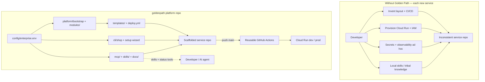

# Golden Path — problem statement

**Document type:** Platform problem definition  
**Audience:** Platform / DevEx, engineering leadership, security, product engineers  
**Scope:** The `goldenpath` repository — an enterprise-agnostic GCP developer platform, not an application

---

## Introduction

Organizations that standardize on Google Cloud Platform (GCP) for containerized workloads face a recurring gap between *writing application code* and *shipping that code safely to production*. Each new Cloud Run service typically requires assembling repository layout, CI/CD, infrastructure as code (IaC), IAM, secret handling, and observability — work that is largely identical across services but rarely shared in a durable, versioned form.

**Golden Path** (`goldenpath`) closes that gap. The root `README.md` describes it as an *"enterprise-agnostic platform for building and deploying containerized services to GCP"* with org-specific values in `config/enterprise.env` (not hardcoded project IDs in scripts) — every enterprise configures billing, projects, GitHub organization, and region locally; platform defaults ship in `enterprise.env.example`. `docs/repository-guide.md` is explicit: this repo is the **platform**, not a service application. Running `shop new` creates a separate service repo from `templates/`; `goldenpath` supplies bootstrap Terraform, reusable modules, shared workflows, scaffolding tools, and an MCP server for AI-assisted operations.

---

## Repo Analysis Summary

The repository organizes platform delivery into five layers, all driven by enterprise-local configuration.

| Layer | Evidence | Delivers |
|-------|----------|----------|
| **Enterprise config** | `config/enterprise.env.example` | `PARENT_PROJECT_ID`, dev/prod/sandbox projects, `GITHUB_ORG`, `GOLDENPATH_VERSION`, `PROTECTED_PROJECTS` |
| **Bootstrap** | `platform/bootstrap/`, `scripts/standup-teardown-env.sh` | WIF, IAM, Artifact Registry foundations |
| **Reusable infra** | `modules/` (cloud-run, secrets, service-identity, artifact-registry, observability) | Composable Terraform for service repos |
| **Scaffolding & CI/CD** | `templates/` (six scaffolds), `cli/shop`, `.github/workflows/deploy.yml` | Token-replaced starters; reusable workflow at `GOLDENPATH_VERSION` |
| **Onboarding & AI** | `scripts/goldenpath-setup*.sh`, `mcp/goldenpath_mcp/server.py`, `skills/` | CLI, wizard backends, MCP with five official skills |

The `cli/shop` header documents the developer loop: `config init` → `new` → `publish` (GitHub repo, WIF trust, deploy verification). The MCP server header adds *"resources (skills/docs) + platform tools"* — deploy status, service config, cost estimates, and guarded writes — while `docs/platform/golden-path.md` requires production deploys to work through CI when MCP is unavailable.

Three onboarding paths (CLI, wizard, MCP) share artifacts but use separate local config files (`.goldenpath-cli.local.json` vs `.goldenpath-setup.local.json`), supporting different preferences without forking the paved road.

---

## Core Problem

`docs/platform/golden-path.md` §2 defines two intertwined problems: **repeated platform work per service** and **inconsistent distribution of platform knowledge**.

### Per-service platform reinvention

Without a paved road, teams redo the same work for every new Cloud Run service:

| Area | What gets redone |
|------|------------------|
| Repo structure | Layout, Dockerfile, config conventions |
| CI/CD | Lint, test, build, push image, deploy |
| Infrastructure | Cloud Run, IAM, Artifact Registry, secrets |
| Security | Service accounts, keyless auth, Secret Manager |
| Observability | Logging, metrics, traces, dashboards, alerts |

The platform guide calls this **slow**, **inconsistent**, and a pattern that pushes security and reliability decisions onto individual developers. The repository's acceptance criterion — scaffold and deploy to `dev` with **zero manual edits** — exists because the default experience still requires many integration steps Golden Path is meant to remove.

Concrete artifacts encode these concerns: WIF in `platform/bootstrap/wif.tf`; Secret Manager in `modules/secrets/`; observability in `modules/observability/`; and every template shipping `infra/`, `Dockerfile`, and `.github/workflows/deploy.yml` referencing the shared workflow.

### Fragmented knowledge and key management

Even with templates, distributing skills and runbooks from individual laptops causes drift — fresh-laptop setup hunts, per-developer skill edits, version skew, and wikis disagreeing with tooling (`docs/platform/golden-path.md` §2). The MCP server and `skills/` directory centralize five official skills at `goldenpath://skills/{name}/SKILL.md`, served read-only from repository content.

Key management pain appears when teams lack shared WIF setup. Bootstrap Terraform and `scripts/lib/wif-trust-repo.sh` (used by `shop publish`) implement keyless CI, matching the reference architecture mandate: *"No long-lived service account keys."* Deployment inconsistency follows when teams copy Terraform fragments or write bespoke Actions instead of pinning `uses: YOUR_ORG/goldenpath/.github/workflows/deploy.yml@<GOLDENPATH_VERSION>` as shown in `README.md`.

### AI agents without centralized skills

AI coding agents need authoritative procedures, not stale local copies. `mcp/goldenpath_mcp/server.py` serves skills and docs as MCP Resources and exposes platform Tools using the caller's credentials — keeping agent behavior aligned with the same version tag CI uses.

---

## Why It Matters

**Product engineers** want to edit application code under `src/`, not provision Cloud Run or wire GitHub Actions from scratch. The platform guide sets a **goal** (not a measured baseline in this repo) of reducing time to first deploy from days/weeks to under one day.

**Platform, SRE, and security teams** bear the cost of inconsistent repos: unfamiliar layouts, non-standard telemetry, IAM that fails review. Shared modules and templates make services legible; `PROTECTED_PROJECTS` in `enterprise.env` guards against accidental sandbox project deletion.

**AI-assisted workflows** require versioned, read-only skills. MCP Resources from a pinned release prevent silent divergence between agents and the live platform.

**Enterprise portability** demands configuration over hardcoding. `config/enterprise.env.example` uses placeholders (`your-github-org`, `your-org-goldenpath-dev`) with optional `GOLDENPATH_CONFIG` override so one codebase serves multiple enterprises.

---

## How the Platform Addresses It

Golden Path uses three layers (`docs/platform/golden-path.md` §7) governed by one rule: **MCP is the front door; CI is the deploy engine; GCP is the runtime.**

**Layer A — Paved-road artifacts:** `platform/bootstrap/` for one-time WIF and IAM; `modules/` for Cloud Run, secrets, identity, registry, observability; six `templates/` with `{{TOKEN}}` replacement; reusable `.github/workflows/deploy.yml`.

**Layer B — MCP server:** `server.py` registers Resources (skills, docs, version metadata) and **13 tools** (`list_services`, `get_deploy_status`, `scaffold_service`, `validate_service_repo`, `trigger_deploy`, etc.). Knowledge and routine ops centralize for AI clients without replacing git-push deploys or `shop publish`.

**Layer C — Onboarding:** `shop` CLI, `goldenpath-setup` wizard family (bash/Python/PowerShell/Streamlit), and MCP clients via `mcp/examples/`. `docs/getting-started/` maps each path to the folders developers touch.

**Enterprise config** integrates all paths: `scripts/lib/load-config.sh` and `wizard_defaults.py` read `config/enterprise.env` for standup, CLI defaults, wizard menus, and teardown safety.

---

## Mermaid Visual



---

## Assumptions & Gaps

| Assumption | Repository source |
|------------|-------------------|
| Cloud Run default runtime | `docs/platform/golden-path.md` §8 (alternatives listed open in §19) |
| Terraform for IaC | `modules/`, `platform/bootstrap/`, template `infra/` |
| GitHub Actions for CI/CD | `.github/workflows/deploy.yml`, `GITHUB_ORG` in `enterprise.env.example` |
| Secret Manager; keyless CI via WIF | Platform guide §8; `wif.tf`, `wif-trust-repo.sh` |
| Framework-agnostic platform | Six templates sharing modules and workflow |

**Open decisions** (platform guide §19) include database defaults, environment topology, and off-road support policy. This document cites **platform goals** (zero manual steps after scaffold; under one day to first `dev` deploy) from `docs/platform/golden-path.md` §3 and §17 — not measured adoption or cost metrics absent from the repository.

**Non-goals:** no forced legacy migration, no coverage of every architecture, no replacement of human production judgment (`docs/platform/golden-path.md` §3).

---

## Next Steps

1. **Configure** — `cp config/enterprise.env.example config/enterprise.env`; set required keys and sandbox projects — see [`config/README.md`](../../config/README.md).
2. **Bootstrap GCP** — `scripts/standup-teardown-env.sh` (sandbox) or `platform/bootstrap/terraform apply` (dev + prod) per `README.md`.
3. **Pick one path** — CLI (`shop config init`), wizard (`scripts/goldenpath-setup.sh`), or MCP (`mcp/README.md`); do not mix config files.
4. **Prove Layer A** — Scaffold a pilot service; validate deploy to `dev` with zero post-scaffold manual edits.
5. **Enable MCP** — Run or deploy MCP; connect clients from `mcp/examples/`; pin the same version as CI.
6. **Govern releases** — Tag bundles of modules, workflows, skills, and docs; update `GOLDENPATH_VERSION` across service repos.

---

## Appendix — Repository Tree

```
goldenpath/
├── README.md
├── config/
│   ├── enterprise.env.example
│   └── README.md
├── .github/workflows/
│   ├── deploy.yml                  # Reusable workflow for service repos
│   └── deploy-mcp.yml
├── platform/bootstrap/             # WIF + IAM bootstrap
├── modules/                        # cloud-run, secrets, observability, …
├── templates/                      # nextjs, fastapi, streamlit, express,
│   ├── catalog.json                # react-spa, svelte-spa + _shared/
│   └── _shared/
├── cli/shop                        # new, publish, verify, doctor
├── scripts/
│   ├── goldenpath-setup*.sh        # Wizard launchers
│   ├── standup-teardown-env.sh
│   ├── lib/                        # load-config, scaffold-tokens, wif-trust
│   ├── setup/                      # Wizard implementations
│   ├── env/                        # GCP lifecycle
│   └── deploy/                     # MCP Cloud Run deploy
├── mcp/
│   ├── goldenpath_mcp/             # server.py, gcp.py, content.py, …
│   ├── examples/                   # Claude client configs
│   └── infra/
├── skills/                         # Five official MCP skills
├── docs/
│   ├── getting-started/
│   ├── platform/                   # golden-path.md, architecture.md
│   ├── environments/               # sandbox-env.md (standup/teardown)
│   └── repository-guide.md
└── tests/                          # Wizard unit tests (Pester)
```

Full file-level map: `docs/repository-guide.md`.

---

© 2026 Varanabox. All rights reserved.
