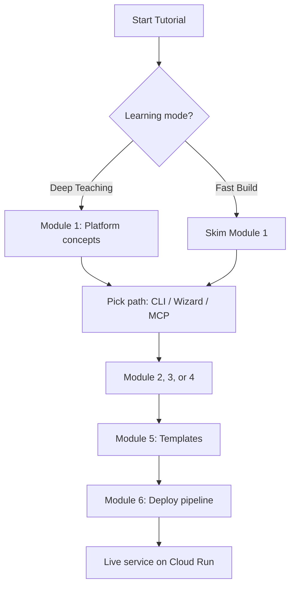
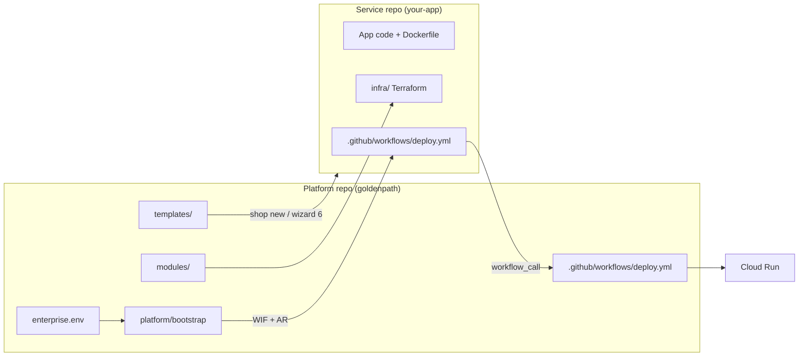
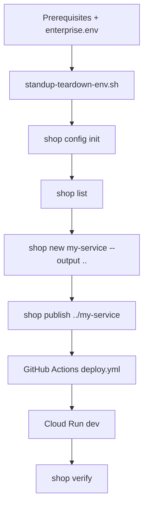
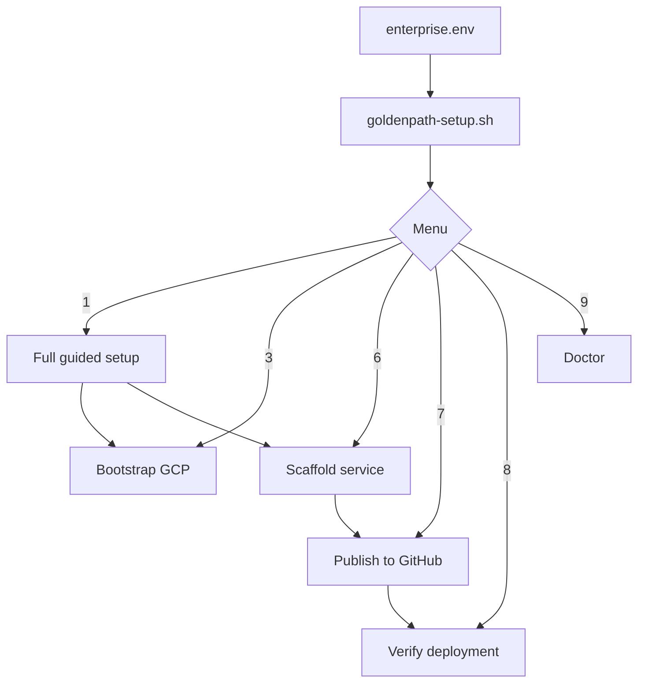
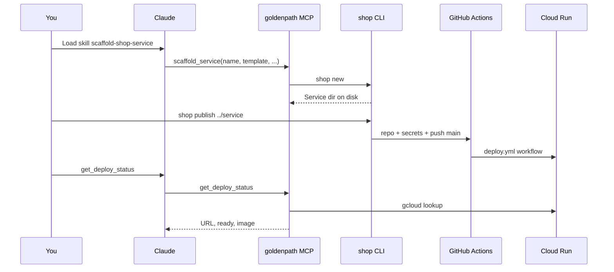
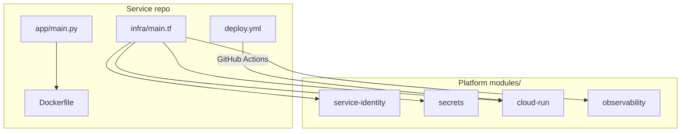
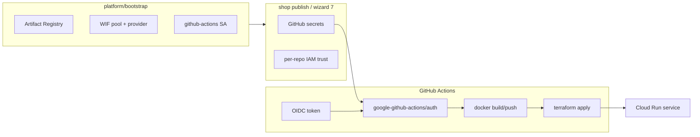
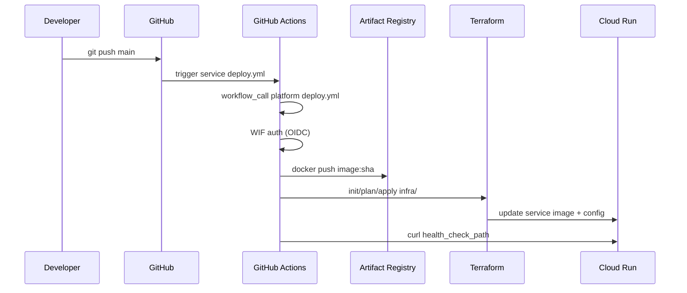
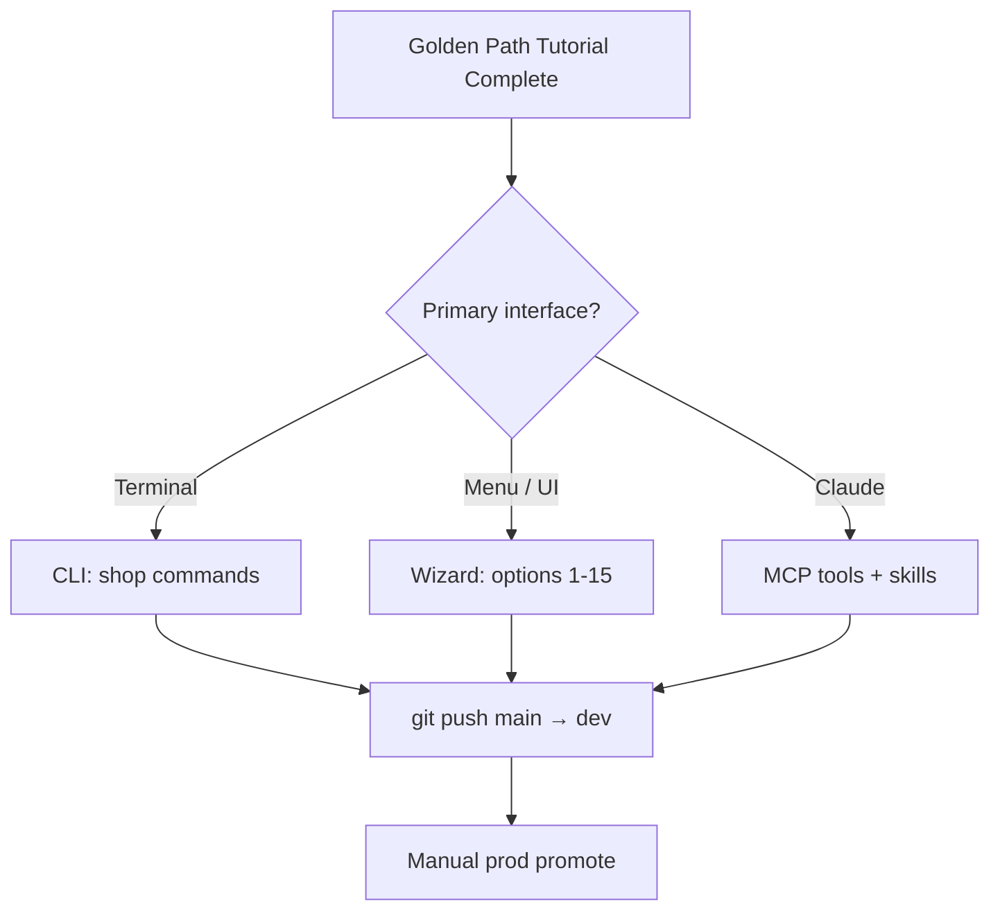

# Golden Path tutorial guide

A self-contained learning document for developers who want to scaffold and deploy containerized services to Google Cloud Run using the Golden Path platform. This guide is **not** a generic app-builder tutorial—it teaches the Golden Path paved road: enterprise configuration, one-time GCP bootstrap, service scaffolding, GitHub publish, and automated deploy via Workload Identity Federation (WIF).

**Related docs:** [getting-started index](../getting-started/readme.md) · [Pick your path](../getting-started/02-pick-your-path.md) · [Repository guide](../repository-guide.md) · [config/README](../../config/README.md)

---

## How to use this guide

Golden Path offers **three onboarding paths** (CLI, Wizard, MCP). You pick **one path** and stay on it—mixing paths causes config drift, wrong GCP projects, and broken WIF trust. This tutorial teaches all three so you can choose wisely, then deep-dive your preferred path.

### Two learning modes

| Mode | Who it's for | How to follow |
|------|--------------|---------------|
| **Deep Teaching** | First-time platform users, architects, team leads | Read Modules 1–6 in order. Complete every quiz and "Try it yourself" exercise. Expect 2–4 hours with a live sandbox. |
| **Fast Build** | Experienced GCP/GitHub users who want a live service quickly | Skim Module 1, then jump to **your** path module (2, 3, or 4). Run the Fast Build checklist at the end of that module. Return to Modules 5–6 when you need to customize templates or debug deploys. |

**Deep Teaching** explains *why* each step exists (enterprise.env, WIF, reusable workflows). **Fast Build** gives you the minimum command sequence to reach a healthy Cloud Run URL.



---

## Prerequisites

Before any module, install and authenticate the following.

### Required tools

| Tool | Purpose | Verify |
|------|---------|--------|
| **gcloud** | GCP auth, project management, deploy verification | `gcloud --version` |
| **gh** | Create repos, set secrets, watch workflows (`shop publish`) | `gh auth status` |
| **terraform** | Platform bootstrap (standup script runs it) | `terraform version` |
| **git** | Version control for service repos | `git --version` |

**Path-specific extras:**

| Path | Also needs |
|------|------------|
| CLI | Nothing beyond the table above |
| Wizard (bash/Python) | Same as CLI |
| Wizard (Streamlit) | `streamlit` (+ `pwsh` for some heavy steps) |
| MCP | Python 3.11+ for local MCP venv |

### Enterprise configuration

Scripts, `shop`, wizard, and MCP read **`config/enterprise.env`** (with fallbacks from `enterprise.env.example`). Org IDs are not embedded in source code.

```bash
cd goldenpath
cp config/enterprise.env.example config/enterprise.env
$EDITOR config/enterprise.env
```

**Required** (bash standup fails without these):

| Variable | Purpose |
|----------|---------|
| `PARENT_PROJECT_ID` | Billing anchor—Golden Path **never** deploys here |
| `BILLING_ACCOUNT_ID` | GCP billing account |
| `GITHUB_ORG` | GitHub organization for service repos and WIF trust |

**Recommended** for sandbox learning:

| Variable | Purpose |
|----------|---------|
| `GCP_SANDBOX_PROJECT` | Isolated test project |
| `GCP_DEV_PROJECT` / `GCP_PROD_PROJECT` | Production-style two-project setup |
| `GCP_REGION` | Region for Cloud Run and Artifact Registry |
| `GOLDENPATH_VERSION` | Git tag for reusable deploy workflows (e.g. `v0.3.8`) |
| `ARTIFACT_REGISTRY_REPO` | Shared Artifact Registry repository ID |
| `PROTECTED_PROJECTS` | Comma-separated IDs teardown scripts must never delete |

Full reference: [`config/README.md`](../../config/README.md). Override path: `export GOLDENPATH_CONFIG=/path/to/custom.env`

### GCP authentication

```bash
gcloud auth login
gcloud auth application-default login
gcloud auth application-default set-quota-project YOUR_GCP_SANDBOX_PROJECT
```

### Prerequisite quiz

1. **True or false:** Golden Path deploys application workloads into `PARENT_PROJECT_ID`.
2. **Which file** do the CLI and wizard both read for org defaults?
3. **Name two tools** required for `shop publish` to succeed.

<details>
<summary>Answers</summary>

1. **False**—`PARENT_PROJECT_ID` is billing-only.
2. `config/enterprise.env` (or `GOLDENPATH_CONFIG` override).
3. `gh` and `gcloud` (terraform is needed for bootstrap, not publish itself).

</details>

---

## Module 1: Understanding the platform

### What is Golden Path?

Golden Path is an **enterprise-agnostic platform** for building and deploying containerized services to GCP Cloud Run. It provides:

- **Templates** — six scaffolds (Next.js, FastAPI, Streamlit, Express, React SPA, Svelte SPA)
- **`shop` CLI** — config, scaffold, publish, verify, doctor
- **Setup wizard** — guided menu (14 options) with bash, Python, PowerShell, or Streamlit backends
- **MCP server** — docs, skills, and GCP lookups inside Claude
- **Reusable GitHub workflow** — `deploy.yml` in the platform repo, called by each service repo
- **Terraform modules** — shared `modules/` consumed by each service's `infra/`

The "golden path" is the **paved road**: bootstrap once, scaffold from a template, publish to GitHub with WIF wired automatically, push to `main`, get a dev deploy. Promote to prod manually when ready.



### Config files: do not mix paths

| Path | Local config file |
|------|-------------------|
| CLI | `.goldenpath-cli.local.json` |
| Wizard | `.goldenpath-setup.local.json` |
| MCP | Claude MCP client config + env vars |

Mixing CLI and wizard config leads to wrong projects, missing WIF bindings, and workflows that never fire (e.g. default branch `master` vs `main`).

### Bootstrap vs daily work

| Phase | What | How often |
|-------|------|-----------|
| **Bootstrap** | Create GCP project(s), enable APIs, Artifact Registry, WIF pools | Once per environment |
| **Scaffold** | Copy template, replace `{{TOKEN}}` placeholders | Per new service |
| **Publish** | GitHub repo + secrets + per-repo IAM + push `main` | Once per service (or re-run if broken) |
| **Daily** | Edit code → `git push main` → auto-deploy dev | Ongoing |

**Try it yourself:** Open `config/enterprise.env.example` and identify which variables map to GitHub, GCP projects, and safety guardrails. Copy to `config/enterprise.env` with your values.

### Module 1 quiz

1. How many service templates does Golden Path ship?
2. What happens if you mix CLI and wizard config files?
3. Where does the reusable deploy workflow live?

<details>
<summary>Answers</summary>

1. Six (`nextjs`, `fastapi`, `streamlit`, `express`, `react-spa`, `svelte-spa`).
2. Project mismatches, missing WIF trust, unreplaced tokens, workflows on wrong branch.
3. `.github/workflows/deploy.yml` in the **platform** repo; service repos call it via `workflow_call`.

</details>

---

## Module 2: CLI path

The CLI path is for terminal power users who want `shop publish` as a single command for GitHub + WIF + deploy.

### Journey overview



### Step-by-step

**1. Add CLI to PATH** (once per shell):

```bash
cd goldenpath
export PATH="$PWD/cli:$PATH"
```

**2. Bootstrap GCP** (one-time):

```bash
./scripts/standup-teardown-env.sh --yes --skip-labels
```

Creates your sandbox project from `enterprise.env`, links billing, runs `terraform apply` in `platform/bootstrap/`.

**3. Initialize CLI config:**

```bash
shop config init --github-org YOUR_ORG --gcp-dev YOUR_GCP_SANDBOX_PROJECT
```

Saves `.goldenpath-cli.local.json`.

**4. List and scaffold:**

```bash
shop list
shop new hello-golden --template fastapi --output ..
```

Creates `../hello-golden/` (outside the platform repo) with app code, `Dockerfile`, `infra/`, and `.github/workflows/deploy.yml` with tokens replaced.

**5. Publish:**

```bash
shop publish ../hello-golden
```

`shop publish` will:

1. Create the GitHub repo with default branch **`main`**
2. Set `GCP_WIF_PROVIDER` and `GCP_WIF_SERVICE_ACCOUNT` secrets
3. Add per-repo WIF IAM trust via `scripts/lib/wif-trust-repo.sh`
4. Push `main` and watch the workflow
5. Verify health

Use `shop new <name> --dry-run` to preview the scaffold path without creating files.

**6. Verify and diagnose:**

```bash
shop verify ../hello-golden
shop doctor ../hello-golden
```

**7. Daily workflow:** edit → commit → `git push main` → dev updates automatically.

**8. Promote to prod** (manual):

```bash
gh workflow run deploy.yml -f environment=prod
```

### CLI cheat sheet

| Task | Command |
|------|---------|
| Init config | `shop config init --github-org ORG --gcp-dev PROJECT` |
| List templates | `shop list` |
| Scaffold | `shop new <name> --template <tpl> --output ..` |
| Publish + deploy | `shop publish ../<name>` |
| Verify | `shop verify ../<name>` |
| Diagnose | `shop doctor ../<name>` |

### Try it yourself (CLI)

1. Run `shop list` and note the default template and health check paths.
2. Scaffold `tutorial-api` with `--template fastapi --output ..`.
3. Run `shop doctor ../tutorial-api` **before** publish—what does it check?
4. *(With live sandbox)* Run `shop publish ../tutorial-api` and curl `/api/health`.

### Fast Build checklist (CLI)

```bash
./scripts/standup-teardown-env.sh --yes --skip-labels
export PATH="$PWD/cli:$PATH"
shop config init --github-org YOUR_ORG --gcp-dev YOUR_GCP_SANDBOX_PROJECT
shop new my-app --template nextjs --output ..
shop publish ../my-app
shop verify ../my-app
```

### Module 2 quiz

1. What is the CLI config file name?
2. Which branch does `shop publish` enforce?
3. Name three things `shop doctor` checks.

<details>
<summary>Answers</summary>

1. `.goldenpath-cli.local.json`
2. `main`
3. Branch name, WIF secrets, unreplaced `{{tokens}}`, project mismatch (any three).

</details>

---

## Module 3: Wizard path

The wizard is for first-time guided setup—especially when you want a menu-driven flow without memorizing CLI flags. **No PowerShell required** on macOS/Linux.

### Backends (same menu, same config)

| Backend | Command |
|---------|---------|
| Auto | `./scripts/goldenpath-setup.sh` |
| Bash | `./scripts/goldenpath-setup-bash.sh` |
| Python | `./scripts/goldenpath-setup-py.sh` |
| PowerShell | `./scripts/goldenpath-setup-ps.sh` |
| Streamlit UI | `./scripts/goldenpath-setup-ui.sh` |

All share menu options **1–15** and save to `.goldenpath-setup.local.json`. Defaults come from `config/enterprise.env` via `scripts/lib/wizard_defaults.py`. Scaffold, publish, doctor, and upgrade pins share `goldenpath_ops.py`.



### Main menu (reference)

| # | Purpose |
|---|---------|
| 1 | Full guided setup (recommended for new users) |
| 2 | Check prerequisites |
| 3 | Bootstrap GCP (standup + terraform) |
| 4 | Show GitHub WIF secrets |
| 5 | Set GitHub WIF secrets on a repo |
| 6 | Scaffold a new service |
| 7 | Publish service to GitHub |
| 8 | Verify deployment (health check) |
| 9 | Doctor — diagnose deploy blockers |
| 10 | Generate Claude MCP config |
| 11 | Show current status |
| 12 | Edit settings |
| 13 | Tear down sandbox |
| 14 | Fresh start (reset wizard state) |

### Step-by-step (recommended flow)

**1. Configure enterprise defaults:**

```bash
cp config/enterprise.env.example config/enterprise.env
$EDITOR config/enterprise.env
```

**2. Start the wizard:**

```bash
./scripts/goldenpath-setup-bash.sh
```

**3. Choose menu 1 (Full guided setup):**

- Pick profile: **Sandbox** (uses `GCP_SANDBOX_PROJECT`), new self-contained sandbox, or custom existing project
- Prerequisites check + `gcloud auth` prompts
- Bootstrap GCP (same standup script as CLI)
- Auto-detect WIF secrets from Terraform state (or gcloud fallback)
- Optionally scaffold first service (menu 6)
- Optionally generate MCP config (menu 10)

**4. Publish and verify:**

- Menu **7** — equivalent to `shop publish` (repo, secrets, WIF trust, deploy watch)
- Menu **8** — health check against Cloud Run URL

**5. Resume anytime:** wizard remembers settings in `.goldenpath-setup.local.json`. Menu **11** shows status.

> **Important:** Wizard scaffold (menu 6) copies templates and replaces tokens—it does **not** call `shop new`. That is fine; stay on the wizard path for publish (menu 7).

### Try it yourself (Wizard)

1. Run menu **2** and confirm all prerequisites pass.
2. Run menu **11** after bootstrap—what WIF values are stored?
3. Scaffold a service via menu **6** with template `streamlit`. What health path does Streamlit use?
4. *(Optional)* Compare wizard menu **7** behavior to `shop publish` in the CLI docs.

### Fast Build checklist (Wizard)

```bash
cp config/enterprise.env.example config/enterprise.env
# edit enterprise.env
./scripts/goldenpath-setup-bash.sh
# Menu 1 → complete guided setup
# Menu 6 → scaffold
# Menu 7 → publish
# Menu 8 → verify
```

### Module 3 quiz

1. What config file does the wizard use?
2. Which menu option bootstraps GCP?
3. Which menu option is equivalent to `shop publish`?

<details>
<summary>Answers</summary>

1. `.goldenpath-setup.local.json`
2. Menu **3** (or included in menu **1** full guided setup)
3. Menu **7**

</details>

---

## Module 4: MCP path with Claude

The MCP path puts Golden Path **docs, skills, and GCP lookups** inside Claude. MCP does **not** replace bootstrap or publish—you still run standup/wizard for GCP and `shop publish` (or wizard menu 7) for GitHub.

### What MCP adds

| Capability | MCP tool / resource |
|------------|---------------------|
| Read docs | `get_doc`, `goldenpath://docs/*` |
| Agent playbooks | `get_skill`, `goldenpath://skills/*` |
| List templates | `list_templates` |
| Scaffold on disk | `scaffold_service` (calls `./cli/shop new`) |
| Deploy status | `get_deploy_status`, `list_services` |
| Prod deploy | `trigger_deploy` (needs `GITHUB_TOKEN`) |



### Step-by-step

**1. Bootstrap GCP** (same as CLI/wizard):

```bash
./scripts/standup-teardown-env.sh --yes --skip-labels
```

**2. Install local MCP:**

```bash
cd goldenpath/mcp
python3 -m venv .venv
source .venv/bin/activate
pip install -r requirements.txt
```

**3. Connect Claude** — edit `mcp/examples/claude-mcp.example.json`:

| Field | Set to |
|-------|--------|
| `command` | `…/goldenpath/mcp/.venv/bin/python` |
| `GOLDENPATH_ROOT` | Absolute path to repo root |
| `GCP_PROJECT` | Your sandbox or dev project |

Or generate config via wizard menu **10** → `mcp/claude-mcp.generated.json`.

**4. Orient in Claude:**

- `goldenpath://docs/getting-started/01-start-here.md`
- Load skill **`scaffold-shop-service`**

**5. Scaffold:**

```
scaffold_service(
  name="hello-golden",
  template="fastapi",
  github_org="YOUR_ORG",
  gcp_dev_project="YOUR_GCP_SANDBOX_PROJECT",
  gcp_prod_project="YOUR_GCP_SANDBOX_PROJECT"
)
```

**6. Publish** (terminal—not an MCP tool):

```bash
export PATH="$PWD/cli:$PATH"
shop publish ../hello-golden
```

**7. Check status in Claude:**

```
get_deploy_status(
  service_name="hello-golden",
  environment="dev",
  project="YOUR_GCP_SANDBOX_PROJECT"
)
```

**8. Troubleshooting:** load skill **`deploy-to-shop-gcp`** for WIF and workflow failures.

### Official MCP skills

| Skill | When to load |
|-------|--------------|
| `goldenpath-setup-wizard` | Full wizard onboarding via AI |
| `scaffold-shop-service` | Creating a new service |
| `deploy-to-shop-gcp` | Publish/deploy failures |
| `shop-terraform-conventions` | Extending `infra/` safely |
| `shop-observability` | Logs, metrics, alerts |

### Local vs hosted MCP

| Capability | Local (stdio) | Cloud Run hosted |
|------------|---------------|------------------|
| Docs / skills | Yes | Yes |
| `scaffold_service` | Writes to your disk | Container FS only—use local for scaffold |
| GCP lookups | Your `gcloud` creds | Runtime service account |

### Try it yourself (MCP)

1. Call `list_templates` and compare output to `shop list`.
2. Load `deploy-to-shop-gcp` and ask Claude what symptoms indicate a missing WIF `tokenCreator` binding.
3. After publish, call `get_deploy_status` and note the health path for your template.
4. *(Optional)* Add `GITHUB_TOKEN` to MCP env and try `trigger_deploy` for prod.

### Fast Build checklist (MCP)

```bash
./scripts/standup-teardown-env.sh --yes --skip-labels
# Install MCP venv + configure Claude (or wizard menu 10)
# In Claude: scaffold_service → shop publish in terminal → get_deploy_status
```

### Module 4 quiz

1. Does MCP include a `publish` tool?
2. What skill should you load for deploy troubleshooting?
3. Why should you use **local** MCP for `scaffold_service`?

<details>
<summary>Answers</summary>

1. No—use `shop publish` or wizard menu 7.
2. `deploy-to-shop-gcp`
3. Hosted MCP writes inside the container filesystem, not your laptop.

</details>

---

## Module 5: How a service template works (FastAPI example)

Templates live in `templates/`. Scaffolding copies a template and replaces `{{TOKEN}}` placeholders (`{{SERVICE_NAME}}`, `{{GITHUB_ORG}}`, `{{GCP_DEV_PROJECT}}`, etc.) via `scripts/lib/scaffold-tokens.sh`.

### Template catalog

From `templates/catalog.json`:

| Template | Runtime | Port | Health path |
|----------|---------|------|-------------|
| `nextjs` (default) | node | 3000 | `/api/health` |
| `fastapi` | python | 8000 | `/api/health` |
| `streamlit` | python | 8501 | `/_stcore/health` |
| `express` | node | 3000 | `/api/health` |
| `react-spa` / `svelte-spa` | docker | 8080 | `/health` |

### FastAPI layout

After `shop new my-api --template fastapi --output ..`:

```
../my-api/
├── app/main.py          # FastAPI app + /api/health
├── Dockerfile           # Container image
├── requirements.txt
├── tests/test_health.py
├── infra/               # Service-specific Terraform
│   ├── main.tf          # Composes platform modules
│   ├── dev.tfvars
│   └── prod.tfvars
└── .github/workflows/deploy.yml   # Calls platform deploy.yml
```

### Application code

The FastAPI template exposes a health endpoint the deploy pipeline smoke-checks:

```python
@app.get("/api/health")
def health():
    return {
        "status": "ok",
        "service": os.getenv("SERVICE_NAME", "{{SERVICE_NAME}}"),
        "environment": os.getenv("ENVIRONMENT", "unknown"),
    }
```

Run locally:

```bash
pip install -r requirements.txt
uvicorn app.main:app --reload --port 8000
curl localhost:8000/api/health
```

### Service workflow

Each scaffold includes a thin `deploy.yml` that delegates to the platform reusable workflow:

```yaml
uses: {{GITHUB_ORG}}/{{PLATFORM_REPO}}/.github/workflows/deploy.yml@{{GOLDENPATH_VERSION}}
with:
  service_name: {{SERVICE_NAME}}
  environment: dev
  gcp_project: {{GCP_DEV_PROJECT}}
  app_runtime: python
  health_check_path: /api/health
secrets:
  GCP_WIF_PROVIDER: ${{ secrets.GCP_WIF_PROVIDER }}
  GCP_WIF_SERVICE_ACCOUNT: ${{ secrets.GCP_WIF_SERVICE_ACCOUNT }}
```

- **Push to `main`** → deploys **dev** automatically
- **`workflow_dispatch` with `environment=prod`** → deploys **prod**

### Service `infra/` (preview)

Service Terraform composes shared platform modules (pinned to `GOLDENPATH_VERSION`):

- `service-identity` — Cloud Run workload service account
- `secrets` — Secret Manager references
- `cloud-run` — Service definition, image, scaling, probes
- `observability` — Logging and monitoring baselines

Module 6 covers how CI applies this stack.



### Try it yourself (Templates)

1. Scaffold `fastapi-demo` and open `infra/main.tf`—list the four modules and their purposes.
2. Find unreplaced tokens (there should be none after scaffold)—run `shop doctor` to confirm.
3. Change the root endpoint message in `app/main.py`, run locally, then push to `main` and confirm dev redeploys.
4. Read `templates/fastapi/README.md` for local dev commands.

### Module 5 quiz

1. What placeholder tokens get replaced at scaffold time?
2. What triggers an automatic **dev** deploy?
3. Which module creates the Cloud Run service resource?

<details>
<summary>Answers</summary>

1. Tokens like `{{SERVICE_NAME}}`, `{{GITHUB_ORG}}`, `{{GCP_DEV_PROJECT}}`, `{{GOLDENPATH_VERSION}}`, etc.
2. Push to branch `main` on the service repo.
3. `cloud-run` module in `infra/main.tf`.

</details>

---

## Module 6: Deploy pipeline (WIF, Terraform modules)

This module connects bootstrap, CI auth, image build, and infrastructure apply into one pipeline.

### Phase 1: Platform bootstrap (`platform/bootstrap/`)

One-time per environment. The standup script or wizard menu 3:

1. Creates the GCP project (sandbox) or uses existing dev/prod projects
2. Enables required APIs (Cloud Run, Artifact Registry, IAM, etc.)
3. Creates Artifact Registry repository (`ARTIFACT_REGISTRY_REPO` from enterprise.env)
4. Provisions **Workload Identity Federation** for GitHub Actions
5. Creates `github-actions@` service accounts per project

**WIF** lets GitHub Actions authenticate to GCP **without service account keys**. Terraform in `platform/bootstrap/wif.tf` defines:

- `google_iam_workload_identity_pool` (`github-pool`)
- `google_iam_workload_identity_pool_provider` (OIDC issuer: `token.actions.githubusercontent.com`)
- Attribute condition trusting repos under your `GITHUB_ORG`

Outputs used at publish time:

| Output | Becomes GitHub secret |
|--------|----------------------|
| `dev_github_wif_provider_name` | `GCP_WIF_PROVIDER` |
| `dev_github_actions_sa_email` | `GCP_WIF_SERVICE_ACCOUNT` |

`shop publish` and wizard menu 7 also run `wif-trust-repo.sh` to add **per-repo** `tokenCreator` IAM bindings—fixing common Artifact Registry 403 errors.



### Phase 2: Reusable workflow (platform `.github/workflows/deploy.yml`)

When a service repo triggers deploy, the reusable workflow:

1. **Test/lint** (Node or Python based on `app_runtime`)
2. **Authenticate** via WIF (`google-github-actions/auth@v2`)
3. **Build and push** Docker image to Artifact Registry (`{region}-docker.pkg.dev/{project}/{repo}/{service}:{sha}`)
4. **Terraform init/plan/apply** in service `infra/` with `{environment}.tfvars`
5. **Smoke check** — `curl` the health endpoint

Prod deploy uses separate WIF secrets (`GCP_WIF_PROVIDER_PROD`, etc.) when dev and prod are different projects.

### Phase 3: Shared Terraform modules (`modules/`)

Service `infra/main.tf` composes:

| Module | Role |
|--------|------|
| `service-identity` | Dedicated GCP SA for the Cloud Run workload |
| `secrets` | Secret Manager bindings |
| `cloud-run` | Service spec, image reference, probes, scaling |
| `observability` | Baseline logs/metrics/alerts |

Modules are fetched from the platform repo at the ref pinned in `GOLDENPATH_VERSION`. Private repos may need `GOLDENPATH_MODULE_TOKEN`.

**Bootstrap** (`platform/bootstrap/`) is separate from **service modules** (`modules/`). Bootstrap wires org-wide CI trust; service modules deploy individual apps.

### End-to-end deploy flow



### Common failures

| Symptom | Likely cause | Fix |
|---------|--------------|-----|
| Workflow never runs | Default branch not `main` | `shop publish` or wizard 7 |
| AR login 403 | Missing per-repo WIF trust | `shop publish` or `wif-trust-repo.sh` |
| Wrong GCP project | Scaffold project ≠ bootstrap project | `shop doctor` or wizard 9, re-scaffold |
| Unreplaced `{{tokens}}` | Manual repo setup | `shop publish` auto-repairs |
| `terraform output` empty | State lost | Wizard menu 4 (gcloud fallback) |

### Try it yourself (Deploy pipeline)

1. After bootstrap, run `cd platform/bootstrap && terraform output dev_github_wif_provider_name`—compare to secrets on your service repo.
2. Watch a deploy log: identify the WIF auth step, image push, and Terraform apply steps.
3. Run `shop verify ./your-service` and match the URL to `gcloud run services list`.
4. Read `modules/README.md` and skill `shop-terraform-conventions` before editing `infra/`.

### Module 6 quiz

1. Why does Golden Path use WIF instead of downloading service account JSON keys?
2. What Git event triggers automatic dev deploy?
3. Name the four modules composed in a typical service `infra/main.tf`.

<details>
<summary>Answers</summary>

1. Short-lived OIDC tokens from GitHub—no long-lived keys in secrets.
2. Push to `main`.
3. `service-identity`, `secrets`, `cloud-run`, `observability`.

</details>

---

## Choosing your path (summary)

| You are… | Use | Config file |
|----------|-----|-------------|
| Terminal-first, scripting | **CLI** — `shop` | `.goldenpath-cli.local.json` |
| First-time, guided menus | **Wizard** — `goldenpath-setup-*.sh` | `.goldenpath-setup.local.json` |
| AI-assisted in Claude | **MCP** + `shop publish` | Claude MCP config |

All paths share: `config/enterprise.env` → bootstrap → scaffold → publish → push `main` → Cloud Run dev.



---

## Next steps

| Goal | Read |
|------|------|
| Shortest CLI deploy | [03-quickstart.md](../getting-started/03-quickstart.md) |
| Full CLI narrative | [04-journey-cli.md](../getting-started/04-journey-cli.md) |
| Wizard menu reference | [07-setup-wizard-usage.md](../getting-started/07-setup-wizard-usage.md) |
| MCP overview (local vs Cloud Run) | [mcp/guide.md](../../mcp/guide.md) |
| MCP server details | [mcp/README.md](../../mcp/README.md) |
| Sandbox teardown | `./scripts/teardown-personal-test.sh --delete-project YOUR_GCP_SANDBOX_PROJECT --yes` |
| Repo file map | [repository-guide.md](../repository-guide.md) |

---

## Final assessment

Complete these to confirm mastery:

1. **Explain** the difference between `PARENT_PROJECT_ID` and `GCP_SANDBOX_PROJECT` in one sentence each.
2. **Demonstrate** bootstrap + scaffold + publish on your chosen path without mixing config files.
3. **Trace** a `git push main` from service repo to Cloud Run URL, naming WIF, Artifact Registry, and Terraform's role.
4. **Diagnose** a failed deploy using `shop doctor`, wizard menu 9, or skill `deploy-to-shop-gcp`.
5. **Teardown** your sandbox safely, confirming `PROTECTED_PROJECTS` prevented accidental deletion of production resources.

---

© 2026 Varanabox. All rights reserved.
