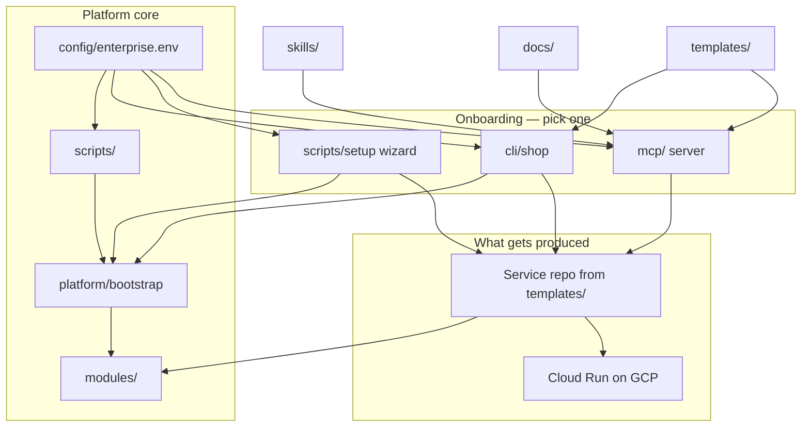
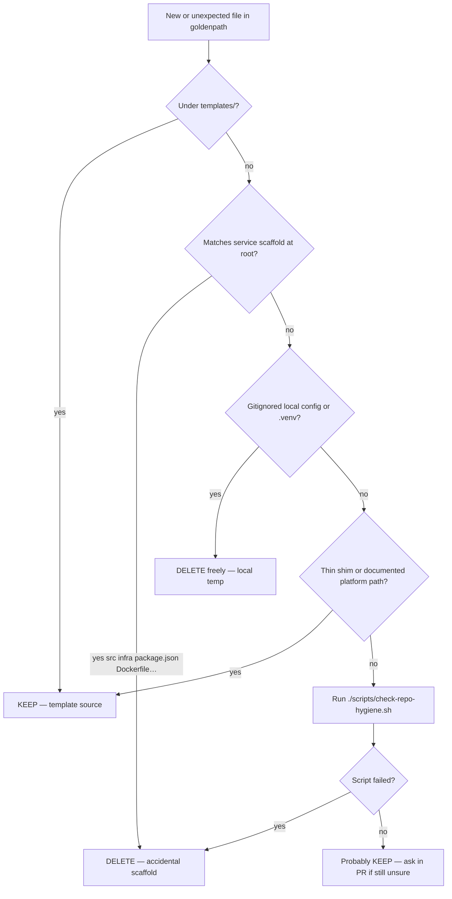

# Repository guide — what every folder and file is for

A map of the **goldenpath** platform repository: what each part does, who uses it, and how it fits into the Golden Path system.

> **Scope:** This document describes the **platform repo** only. When you run `shop new`, a separate **service repo** is created from `templates/` — that repo has its own layout (app code + `infra/` + `.github/workflows/deploy.yml`).

---

## What this application is

Golden Path is an enterprise-agnostic paved road for building and deploying containerized services to GCP. This repo is the **platform** — not your app. It provides:

| Layer | What it delivers |
|-------|------------------|
| **Infrastructure** | Terraform bootstrap (WIF, IAM), reusable modules, sandbox |
| **Scaffolding** | Six service templates + `shop` CLI to copy and customize them |
| **CI/CD** | Reusable GitHub Actions workflow that service repos call |
| **Onboarding** | CLI or setup wizard (bash, Python, PowerShell, Streamlit) — pick one path |
| **AI assist (Phase 2)** | MCP server (13 tools) + 6 skills — docs, scaffold on disk, deploy status; **`shop publish`** or wizard still wires GitHub + deploy |

---

## How the pieces connect



**Enterprise lifecycle** (bootstrap once, long-lived):

1. **Configure** → `cp config/enterprise.env.example config/enterprise.env` ([`config/README.md`](../config/README.md))
2. **Bootstrap** → `platform/bootstrap` with `personal_test = false` (dev + prod projects, WIF, Artifact Registry) — see [`getting-started-platform.md`](./platform/getting-started-platform.md)
3. **Scaffold** → `shop new <name> --output ..` or wizard menu **6** — service repo **outside** this platform repo
4. **Publish** → `shop publish ../<name>` or wizard menu **7** — GitHub repo, WIF secrets, push to `main`, health verify
5. **Deploy** → service repo workflow calls reusable [`.github/workflows/deploy.yml`](../.github/workflows/deploy.yml) from this repo

Enterprises typically **do not** run teardown after bootstrap. Teardown tooling is **sandbox-only** (below).

**Sandbox lifecycle** (disposable `personal_test` project):

1. **Configure** → same `enterprise.env` (often `GCP_SANDBOX_PROJECT`)
2. **Stand up** → `scripts/standup-teardown-env.sh` creates project + applies bootstrap with `personal_test = true`
3. **Scaffold / publish / deploy** → same as enterprise steps 3–5
4. **Tear down** (optional) → `scripts/teardown-personal-test.sh` destroys bootstrap resources; add `--delete-project <id>` to remove the GCP project. Wizard menu **13** is the wizard equivalent. Requires `personal_test = true` in `terraform.tfvars`.

---

## Three paths — what you actually touch

| Path | Primary folders | Config file |
|------|-----------------|-------------|
| **CLI** | `cli/`, `scripts/env/`, `scripts/lib/`, `templates/` | `.goldenpath-cli.local.json` (gitignored) |
| **Wizard / UI** | `scripts/setup/`, `config/` | `.goldenpath-setup.local.json` (gitignored) |
| **MCP** | `mcp/`, `skills/`, `docs/`, `cli/` (for `shop publish`) | `mcp/examples/claude-mcp.example.json` + `config/enterprise.env` defaults |

Do not mix CLI and wizard config files. See [02-pick-your-path.md](./getting-started/02-pick-your-path.md).

---

## Root files

| File | Purpose |
|------|---------|
| [`README.md`](../README.md) | Main entry point — quick starts, layout, links |
| [`.gitignore`](../.gitignore) | Ignores Terraform state, venvs, local config, generated MCP JSON |

### Runtime files (created on your machine, not committed)

| File | Created by | Purpose |
|------|------------|---------|
| `.goldenpath-setup.local.json` | Wizard / Streamlit UI | Per-machine wizard settings |
| `.goldenpath-cli.local.json` | `shop config init` | Per-machine CLI settings |
| `platform/bootstrap/terraform.tfvars` | Standup script or wizard | Active bootstrap values |
| `mcp/.venv/` | MCP setup / wizard | Python virtualenv for MCP server |
| `mcp/claude-mcp.generated.json` | Wizard menu option **10** | Machine-specific Claude MCP config |

---

## `.github/` — CI workflows for this platform repo

| File | Purpose |
|------|---------|
| [`workflows/deploy.yml`](../.github/workflows/deploy.yml) | **Reusable workflow** — service repos call with `uses: YOUR_ORG/goldenpath/.github/workflows/deploy.yml@<GOLDENPATH_VERSION>`. Builds image, pushes to Artifact Registry, deploys Cloud Run. Python services run `ruff` + `pytest` (failures block deploy). **No `push:` trigger on this repo** — must stay `workflow_call` only. |
| [`workflows/tests.yml`](../.github/workflows/tests.yml) | **Tier 1** platform tests — blocks merge on every PR / push to `main`. |
| [`workflows/integration-tests.yml`](../.github/workflows/integration-tests.yml) | **Tier 2** live sandbox `shop publish` → `shop verify` — release gate. |
| [`workflows/deploy-mcp.yml`](../.github/workflows/deploy-mcp.yml) | Deploys the MCP server Docker image to Cloud Run (optional hosted MCP). |
| [`WORKFLOWS.md`](../.github/WORKFLOWS.md) | Workflow rules and service-repo caller pattern |

---

## `cli/` — bash CLI (`shop`)

| File | Purpose |
|------|---------|
| [`shop`](../cli/shop) | Main CLI: `config init`, `new`, `list`, `publish`, `doctor`, `verify`. Orchestrates scaffolding, token replacement, GitHub repo creation (`--public`), WIF trust, deploy watch, and health verification (publish fails if verify fails). |
| [`README.md`](../cli/README.md) | CLI reference and path comparison |

**Depends on:** `scripts/lib/load-config.sh`, `scripts/lib/scaffold-tokens.sh`, `scripts/lib/wif-credentials.sh`, `scripts/lib/wif-trust-repo.sh`, `scripts/lib/verify-deployment.sh`, `templates/catalog.json`, `platform/bootstrap` outputs.

Scaffold **outside** the platform repo: `shop new <name> --output ..` then `shop publish ../<name>`. Default `--output` is `.` (current dir) — scaffolding without `--output ..` from repo root pollutes the platform repo; see [Repo hygiene](#repo-hygiene--what-to-delete-vs-keep).

For **private** service repos, use the wizard publish path (respects platform repo visibility) — `shop publish` always creates a **public** GitHub repo today.

---

## `config/` — enterprise configuration

| File | Purpose |
|------|---------|
| [`README.md`](../config/README.md) | Required vs optional variables, loaders, per-machine JSON files |
| [`enterprise.env.example`](../config/enterprise.env.example) | Committed template — platform defaults (region, workflow pin, `ARTIFACT_REGISTRY_REPO`, `MCP_SERVICE_NAME`) |
| [`enterprise.env`](../config/enterprise.env) | **Local** org profile (gitignored): billing anchor, projects, GitHub org, safety lists |

**Required in `enterprise.env`:** `PARENT_PROJECT_ID`, `BILLING_ACCOUNT_ID`, `GITHUB_ORG` (bash standup enforces these). Other keys fall back to `enterprise.env.example`.

**Used by:** `scripts/lib/load-config.sh`, `scripts/lib/wizard_defaults.py`, `mcp/goldenpath_mcp/enterprise.py`, standup/teardown, `cli/shop`.

**Not credentials** — project IDs and org names only; auth is `gcloud` / `gh`. Never commit `enterprise.env` (gitignored).

---

## `docs/` — all human documentation

| Subfolder | Purpose | Key files |
|-----------|---------|-----------|
| [`getting-started/`](./getting-started/) | Onboarding (01–10, grouped by path) | CLI: 03–04 · Wizard: 05, 07, 06, 09 · MCP: 08 · Scripts: 10 — [index](./getting-started/readme.md) |
| [`platform/`](./platform/) | Platform team reference | `golden-path.md`, `architecture.md`, `getting-started-platform.md`, `phase-0-checklist.md`, `problem-statement.md`, `app-tech-dictionary.md`, `tutorial-guide.md`, `code-bible.md`, `golden-path-gcp-requirements.md` |
| [`environments/`](./environments/) | Sandbox setup | [`sandbox-env.md`](./environments/sandbox-env.md) |
| [`design/`](./design/) | Design proposals | [`golden-path-mcp-evolution-proposal.md`](./design/golden-path-mcp-evolution-proposal.md) |
| [`images/`](./images/) | Doc figures | `golden-path.png`, `04-journey-cli.png`, `06-wizard-powershell-advanced.png`, `architecture.png` |
| [`readme.md`](./readme.md) | Documentation index |
| **`repository-guide.md`** | **This file** — repo file/folder map |

**Also served by MCP** as `goldenpath://docs/{path}` resources.

---

## `mcp/` — MCP server (Phase 2)

Exposes Golden Path skills, docs, and **13 tools** to AI clients (Claude Desktop stdio, optional Cloud Run **streamable-http** at `/mcp`). Bootstrap and `shop publish` are **not** MCP tools — run standup/wizard and `cli/shop` for those steps.

### Top-level

| File | Purpose |
|------|---------|
| [`guide.md`](../mcp/guide.md) | What MCP does and doesn't; local stdio vs Cloud Run |
| [`README.md`](../mcp/README.md) | Run locally, configure clients, deploy to Cloud Run |
| [`requirements.txt`](../mcp/requirements.txt) | Python dependencies |
| [`pyproject.toml`](../mcp/pyproject.toml) | Package metadata |
| [`Dockerfile`](../mcp/Dockerfile) | Container image for hosted MCP |
| [`cloudbuild.yaml`](../mcp/cloudbuild.yaml) | GCP Cloud Build config |
| [`config.example.env`](../mcp/config.example.env) | Example environment variables |

### `mcp/examples/` — client configuration samples

| File | Purpose |
|------|---------|
| `claude-mcp.example.json` | Local stdio MCP in Claude |
| `claude-mcp-remote.example.json` | Remote MCP on Cloud Run |
| `claude-desktop-config.example.json` | Claude Desktop stdio config |

### `mcp/goldenpath_mcp/` — Python package

| File | Purpose |
|------|---------|
| `server.py` | FastMCP app — **13 tools** (10 read, 3 write) + **3 resources** |
| `content.py` | Reads `skills/`, `docs/`, `templates/catalog.json` from disk |
| `config.py` | Settings from environment (`GOLDENPATH_ROOT`, `GCP_PROJECT`, etc.) |
| `enterprise.py` | Merges `enterprise.env.example` + `enterprise.env` for platform defaults |
| `gcp.py` | GCP read tools (list services, deploy status, cost estimates) |
| `gcp_adc.py` | Application Default Credentials helper |
| `github_ops.py` | `trigger_deploy` via GitHub Actions API |
| `validate.py` | `validate_service_repo` tool implementation |
| `auth.py` | `ApiKeyMiddleware` for hosted SSE / streamable-http (`MCP_API_KEY`) |
| `audit.py` | JSON audit logging on write tools (stderr) |
| `__main__.py` | `python -m goldenpath_mcp` entry point |

**Tools (summary):** `list_templates`, `list_skills`, `get_skill`, `list_docs`, `get_doc`, `get_version`, `list_services`, `get_deploy_status`, `get_service_config`, `get_cost_estimate`, `scaffold_service`, `validate_service_repo`, `trigger_deploy`. Full detail: [`mcp/README.md`](../mcp/README.md).

### `mcp/infra/` — Terraform for hosted MCP on Cloud Run

| File | Purpose |
|------|---------|
| `main.tf` | Cloud Run service, Artifact Registry, secrets |
| `variables.tf` / `outputs.tf` | Inputs and outputs |
| `dev.tfvars` | Dev environment values |
| `versions.tf` | Provider versions |

**Deployed by:** `scripts/deploy/deploy-mcp-cloudrun.sh`

---

## `modules/` — shared Terraform modules

See [`modules/README.md`](../modules/README.md) for the module map.

Reusable infrastructure blocks. **Service repos** and **bootstrap** compose these — you rarely edit them when shipping an app.

| Module | Purpose |
|--------|---------|
| [`service-identity/`](../modules/service-identity/) | GCP service account for the workload |
| [`artifact-registry/`](../modules/artifact-registry/) | Docker image repository |
| [`secrets/`](../modules/secrets/) | Secret Manager integration |
| [`cloud-run/`](../modules/cloud-run/) | Cloud Run service (image, scaling, health checks) |
| [`observability/`](../modules/observability/) | Logging, monitoring hooks |

Each module has `main.tf`, `variables.tf`, `outputs.tf`, and usually a `README.md`.

---

## `platform/` — one-time GCP platform bootstrap

See [`platform/README.md`](../platform/README.md) for bootstrap vs service infra.

| Path | Purpose |
|------|---------|
| [`bootstrap/main.tf`](../platform/bootstrap/main.tf) | Creates WIF pool, GitHub OIDC provider, platform IAM |
| [`bootstrap/wif.tf`](../platform/bootstrap/wif.tf) | Workload Identity Federation bindings |
| [`bootstrap/variables.tf`](../platform/bootstrap/variables.tf) | Bootstrap inputs |
| [`bootstrap/outputs.tf`](../platform/bootstrap/outputs.tf) | WIF provider name, service account emails (wired to GitHub secrets) |
| [`platform/bootstrap/terraform.tfvars`](../platform/bootstrap/terraform.tfvars) | Generated at runtime by standup script (gitignored) |
| [`bootstrap/terraform.tfvars.example`](../platform/bootstrap/terraform.tfvars.example) | Template for manual bootstrap |
| [`bootstrap/terraform.tfvars.personal.example`](../platform/bootstrap/terraform.tfvars.personal.example) | Personal test example |
| [`bootstrap/README.md`](../platform/bootstrap/README.md) | Bootstrap instructions |
| [`bootstrap/profiles/sandbox.example.tfvars`](../platform/bootstrap/profiles/sandbox.example.tfvars) | Example sandbox bootstrap profile |

**Applied by:** `scripts/env/standup-teardown-env.sh` (sandbox, `personal_test = true`) or manual `terraform apply` / wizard bootstrap (enterprise, `personal_test = false`).

**Active config:** `platform/bootstrap/terraform.tfvars` (generated locally, gitignored).

**WIF scope:** Bootstrap trusts all repos under `github_org/*` (see `wif.tf` `attribute_condition`) — per-service narrowing via `wif-trust-repo.sh` at publish time.

---

## `scripts/` — automation

See also [`scripts/README.md`](../scripts/README.md).

### Root launchers (thin wrappers — run these)

| Script | Delegates to | Purpose |
|--------|--------------|---------|
| `goldenpath-setup.sh` | `setup/*` (auto backend) | Unified wizard router |
| `goldenpath-setup-{bash,py,ps,ui}.sh` | `setup/*` | Wizard with fixed backend |
| `goldenpath-setup.ps1` | `setup/goldenpath-setup.ps1` | PowerShell shim |
| `goldenpath-setup-ui.sh` | `setup/goldenpath_setup_app.py` | Start Streamlit web UI |
| `check-repo-hygiene.sh` | (self) | Platform layout check; `--explain` for script map |
| `standup-teardown-env.sh` | `env/standup-teardown-env.sh` | Create sandbox + bootstrap |
| `teardown-personal-test.sh` | `env/teardown-personal-test.sh` | Destroy sandbox resources |
| `deploy-mcp-cloudrun.sh` | `deploy/deploy-mcp-cloudrun.sh` | Deploy MCP to Cloud Run |
| `import-mcp-infra-state.sh` | `deploy/import-mcp-infra-state.sh` | Import existing MCP infra into Terraform state |

### `scripts/env/` — GCP project lifecycle

| Script | Purpose |
|--------|---------|
| [`standup-teardown-env.sh`](../scripts/env/standup-teardown-env.sh) | Create isolated GCP project, link billing, `terraform apply` bootstrap |
| [`teardown-personal-test.sh`](../scripts/env/teardown-personal-test.sh) | Sandbox only (`personal_test = true`): `terraform destroy` bootstrap (+ optional `--service-dir`), optionally `--delete-project`. `--yes` skips prompts; does **not** delete the GCP project unless `--delete-project` is passed. |

### `scripts/deploy/` — MCP deployment

| Script | Purpose |
|--------|---------|
| [`deploy-mcp-cloudrun.sh`](../scripts/deploy/deploy-mcp-cloudrun.sh) | Build MCP image, push to AR, deploy Cloud Run |
| [`import-mcp-infra-state.sh`](../scripts/deploy/import-mcp-infra-state.sh) | Import pre-existing MCP resources into Terraform state |

### `scripts/lib/` — shared bash helpers (sourced, not run directly)

| File | Purpose | Used by |
|------|---------|---------|
| [`load-config.sh`](../scripts/lib/load-config.sh) | Load `config/enterprise.env` | `cli/shop`, standup/teardown, deploy scripts |
| [`wizard_defaults.py`](../scripts/lib/wizard_defaults.py) | Merge `enterprise.env.example` + `enterprise.env` | bash/Python wizards, `cli/shop`, `goldenpath_ops.py` |
| [`scaffold-tokens.sh`](../scripts/lib/scaffold-tokens.sh) | Replace `{{TOKENS}}`, `show_deployment_summary` | `cli/shop`, bash wizard ops |
| [`wif-credentials.sh`](../scripts/lib/wif-credentials.sh) | Resolve WIF provider + SA (terraform output or gcloud fallback) | `cli/shop publish` |
| [`wif-trust-repo.sh`](../scripts/lib/wif-trust-repo.sh) | Grant WIF IAM bindings for a GitHub service repo | `cli/shop publish`, wizard publish |
| [`verify-deployment.sh`](../scripts/lib/verify-deployment.sh) | Poll Cloud Run URL + health endpoints | `cli/shop`, wizard verify |
| [`teardown-safety.sh`](../scripts/lib/teardown-safety.sh) | Block deletion of protected / non-allowlisted GCP projects | `teardown-personal-test.sh` (`--delete-project` only; sandbox path) |

### `scripts/setup/` — interactive wizard

| File | Purpose |
|------|---------|
| [`goldenpath-setup.ps1`](../scripts/setup/goldenpath-setup.ps1) | PowerShell menu wizard — bootstrap, scaffold, publish, doctor, MCP config |
| [`goldenpath_setup.sh`](../scripts/setup/goldenpath_setup.sh) | Bash wizard — same menu, no `pwsh` |
| [`goldenpath_setup.py`](../scripts/setup/goldenpath_setup.py) | Python wizard — same menu, no `pwsh` |
| [`goldenpath_setup_ops.sh`](../scripts/setup/goldenpath_setup_ops.sh) | Bash ops — delegates scaffold/publish/doctor to ops CLI |
| [`goldenpath_ops.py`](../scripts/setup/goldenpath_ops.py) | Shared ops — scaffold, publish, doctor, upgrade pins |
| [`goldenpath_ops_cli.py`](../scripts/setup/goldenpath_ops_cli.py) | CLI entry for bash wizard, `shop`, PS upgrade/doctor |
| [`goldenpath_dryrun.py`](../scripts/setup/goldenpath_dryrun.py) | Read-only wizard audit (menu 15 / `--dryrun`) |
| [`goldenpath_setup_app.py`](../scripts/setup/goldenpath_setup_app.py) | Streamlit web UI — guide: [09-streamlit-setup-ui.md](./getting-started/09-streamlit-setup-ui.md) |

### `scripts/setup/modules/` — PowerShell wizard building blocks

| File | Purpose |
|------|---------|
| `Bootstrap.ps1` | GCP bootstrap step |
| `Scaffold.ps1` | Service scaffolding + upgrade pins via ops CLI |
| `Publish.ps1` | GitHub publish + WIF wiring + upgrade pins |
| `Verify.ps1` | Post-deploy verification |
| `OpsCli.ps1` | `Invoke-GoldenPathUpgradePlatformPins` wrapper |

---

## `skills/` — official AI agent instructions (MCP only)

Markdown playbooks served as `goldenpath://skills/{name}/SKILL.md`. **Not used by CLI or wizard directly.**

| Skill | Purpose |
|-------|---------|
| [`goldenpath-setup-wizard/SKILL.md`](../skills/goldenpath-setup-wizard/SKILL.md) | Full wizard onboarding playbook |
| [`scaffold-shop-service/SKILL.md`](../skills/scaffold-shop-service/SKILL.md) | How to pick a template and scaffold |
| [`deploy-to-shop-gcp/SKILL.md`](../skills/deploy-to-shop-gcp/SKILL.md) | Deploy flow and troubleshooting |
| [`shop-terraform-conventions/SKILL.md`](../skills/shop-terraform-conventions/SKILL.md) | Safe Terraform extension rules |
| [`shop-observability/SKILL.md`](../skills/shop-observability/SKILL.md) | Logs, metrics, alerts |
| [`test-coverage-gap-analysis/SKILL.md`](../skills/test-coverage-gap-analysis/SKILL.md) | Platform test pyramid audit; co-tester gap playbook |

See also [`skills/README.md`](../skills/README.md) (six official skills).

---

## `templates/` — service scaffolds (copied by `shop new`)

Six ready-to-deploy service starters. Each becomes its **own Git repo** after scaffolding.

### Platform-level template files

| File | Purpose |
|------|---------|
| [`README.md`](../templates/README.md) | Template catalog overview |
| [`catalog.json`](../templates/catalog.json) | Template metadata (runtime, port, health path, descriptions) — used by `shop`, MCP, wizard |

### `templates/_shared/` — building blocks copied into every template

| File | Purpose |
|------|---------|
| `workflow-deploy.yml` | Base GitHub Actions deploy workflow snippet |
| `infra/main.tf` (etc.) | Shared Terraform patterns |
| `tfvars.dev.snippet` / `tfvars.prod.snippet` | Environment tfvars templates |

### Each template folder (`nextjs`, `fastapi`, `streamlit`, `express`, `react-spa`, `svelte-spa`)

Every template follows the same structure:

| Path (within template) | Purpose |
|------------------------|---------|
| `Dockerfile` | Container build |
| `infra/` | Service-specific Terraform (uses `modules/` from platform repo) |
| `infra/dev.tfvars` / `prod.tfvars` | Environment values |
| `.github/workflows/deploy.yml` | Calls reusable workflow from goldenpath |
| `src/` or `app/` | Application source code |
| `tests/` | Minimal health/smoke tests (copied into service repo, **not** platform tests) |
| `package.json` or `requirements.txt` | Dependencies |
| `README.md` | Template-specific docs |

| Template | Stack | Default health path |
|----------|-------|---------------------|
| `nextjs` | Next.js 14 App Router | `/api/health` |
| `fastapi` | Python FastAPI | `/api/health` |
| `streamlit` | Python Streamlit | `/_stcore/health` |
| `express` | Node.js Express | `/api/health` |
| `react-spa` | React + Vite + nginx | `/health` |
| `svelte-spa` | Svelte + Vite + nginx | `/health` |

**Token placeholders** like `{{SERVICE_NAME}}` and `YOUR_GCP_SANDBOX_PROJECT` are replaced at scaffold time by `scripts/lib/scaffold-tokens.sh`.

---

## `tests/` — platform repo tests (not template tests)

Two-tier **enterprise test pyramid** — see [`tests/README.md`](../tests/README.md).

| Tier | When | Entry point | Gate |
|------|------|-------------|------|
| **1 — Contract** | Every PR | `./tests/run-all-tests.sh` | Blocks merge (`tests.yml`) |
| **2 — Integration** | Release tags | `./tests/run-integration-tests.sh` | Blocks release (`integration-tests.yml`) |

### Tier 1 layout

| Path | Purpose |
|------|---------|
| [`run-all-tests.sh`](../tests/run-all-tests.sh) | Orchestrates bash + pytest + Pester |
| [`bash/run-bash-tests.sh`](../tests/bash/run-bash-tests.sh) | 16 contract test files (`test_shop_*.sh`, `test_wizard_parity.sh`, libs, launchers) |
| [`test_*.py`](../tests/) | pytest — MCP modules, `goldenpath_ops`, validators, `catalog.json` schema |
| [`goldenpath-setup.tests.ps1`](../tests/goldenpath-setup.tests.ps1) | Pester — PowerShell wizard validation/config |
| [`Run-SetupWizardTests.ps1`](../tests/Run-SetupWizardTests.ps1) | Pester runner |
| [`conftest.py`](../tests/conftest.py) | Shared fixtures |
| [`pytest.ini`](../tests/pytest.ini) | Excludes `-m integration` from default runs |
| [`integration/`](../tests/integration/) | Tier 2 live sandbox spine (requires credentials) |

**Tier 1 covers:** scaffold token replacement, `cli/shop` preflight, WIF helpers, verify-deployment mocks, MCP guards, validator parity.

**Tier 1 does not cover:** live GCP bootstrap/teardown, full `shop publish` against GitHub, PowerShell teardown (`Invoke-GoldenPathTeardown`).

**Not the same as** `templates/*/tests/` — those ship with generated service repos and run in the reusable `deploy.yml` Python job.

---

## Quick lookup — “I want to…”

| Goal | Go to |
|------|-------|
| Understand the whole system | `docs/platform/architecture.md`, `docs/platform/golden-path.md` |
| Get started fast | `docs/getting-started/01-start-here.md` |
| Configure enterprise values | `config/enterprise.env` — see [`config/README.md`](../config/README.md) |
| Bootstrap enterprise (dev + prod) | `platform/bootstrap/` + `terraform.tfvars` (`personal_test = false`) |
| Create a sandbox GCP project | `scripts/standup-teardown-env.sh` + `enterprise.env` |
| Scaffold a new service | `shop new <name> --output ..` or wizard menu **6** (outside platform repo) |
| Publish to GitHub and deploy | `shop publish ../<name>` or wizard menu **7** (wizard for private repos) |
| Diagnose deploy blockers | `shop doctor ../<name>` or wizard menu **9** |
| Verify Cloud Run health | `shop verify ../<name>` |
| Run platform tests (Tier 1) | `./tests/run-all-tests.sh` |
| Destroy sandbox resources | `scripts/teardown-personal-test.sh` (sandbox only; `--delete-project` to remove GCP project) |
| Use Golden Path from Claude | `mcp/` + `mcp/examples/claude-mcp.example.json` |
| Change Cloud Run / AR defaults | `modules/cloud-run/`, `modules/artifact-registry/` |
| Change WIF / platform IAM | `platform/bootstrap/` |
| Add a new service template | Copy a template folder, update `templates/catalog.json` |
| Run wizard tests | `tests/Run-SetupWizardTests.ps1` |
| Check for junk / accidental scaffold in platform repo | `scripts/check-repo-hygiene.sh` |

---

## Repo hygiene — what to delete vs keep

**One rule:** `goldenpath` is the **platform** repo. A scaffolded **service** belongs in its own directory or Git repo — never at the root of `goldenpath`.

If you are unsure, run:

```bash
./scripts/check-repo-hygiene.sh
```

The script prints **✗ remove**, **· local temp** (optional cleanup), and **✓ keep** for known-good layout. It exits non-zero when platform junk is present.

### How junk gets here

Usually someone scaffolds **into** the platform repo instead of **next to** it:

| Mistake | Correct |
|---------|---------|
| `shop new my-app` (default `--output .`) inside `goldenpath` | `shop new my-app --output ..` from repo root |
| Wizard scaffold with output = platform repo root | Default parent dir or `../my-app` — see [repo hygiene](#repo-hygiene--what-to-delete-vs-keep) |
| Committing wizard smoke-test output at repo root | Run smoke tests in `/tmp` or a throwaway sibling folder |

### DELETE from platform root (accidental service scaffold)

If any of these appear at the **repo root** (not under `templates/`), they are **junk** — remove them and restore platform files:

| Path | Why it is junk |
|------|----------------|
| `src/` | Service app code — platform has no root `src/` |
| `infra/` | Service Terraform — platform infra is `platform/bootstrap/` and `modules/` |
| `public/` | Service static assets |
| `package.json`, `package-lock.json` | Service Node manifest |
| `Dockerfile`, `next.config.mjs`, `tsconfig.json`, `next-env.d.ts` | Service build config |
| `.dockerignore`, `.eslintrc.json` | Service tooling (when paired with scaffold above) |
| `tests/health.test.mjs` | Service smoke test — platform tests live under `tests/bash/`, `tests/test_*.py`, `tests/*.ps1` |

Also restore these if they were overwritten by a scaffold:

| Path | Should be |
|------|-----------|
| `README.md` | Starts with `# Golden Path (goldenpath)` — not “Shop service scaffolded…” |
| `.github/workflows/deploy.yml` | Reusable `workflow_call` for service repos — not a `push:` deploy caller |

**Quick fix** (after accidental scaffold in platform repo):

```bash
git checkout origin/main -- README.md .github/workflows/deploy.yml
git rm -rf src infra public package.json package-lock.json Dockerfile \
  next.config.mjs next-env.d.ts tsconfig.json .dockerignore .eslintrc.json tests/health.test.mjs
./scripts/check-repo-hygiene.sh
```

### DELETE anytime (local temp — never commit)

These are machine-local; safe to delete. They are gitignored and recreated by setup:

| Path | Recreate |
|------|----------|
| `.goldenpath-cli.local.json` | `shop` / CLI onboarding |
| `.goldenpath-setup.local.json` | Wizard |
| `mcp/claude-mcp.generated.json` | MCP config step |
| `mcp/.venv/` | `cd mcp && python3 -m venv .venv && .venv/bin/pip install -r requirements.txt` |
| `mcp/goldenpath_mcp/__pycache__/` | Runs again on next Python import |
| `platform/bootstrap/terraform.tfvars`, `.terraform/`, `terraform.tfstate` | Re-run bootstrap / terraform |

### KEEP (looks like duplication but is intentional)

| Pattern | Example | Why keep |
|---------|---------|----------|
| Thin root shims | `scripts/standup-teardown-env.sh` → `scripts/env/…` | Stable paths in docs |
| CLI vs wizard | `cli/shop` vs `scripts/setup/*` (bash/Python/PS) | Different onboarding paths and config files |
| Template sources | `templates/nextjs/src/`, `templates/*/infra/` | Copied by `shop new`, not live platform code |
| Platform tests | `tests/` (bash + pytest + Pester) | Not `tests/health.test.mjs` at repo root |

**Do not** delete folders you do not personally use (`mcp/`, `cli/`, wizard, etc.) — other paths and teammates depend on them. “Ignore” ≠ “delete”; see [What you can safely ignore](#what-you-can-safely-ignore).

### Decision flowchart



---

## What you can safely ignore

Depending on your path, large parts of the repo may be irrelevant:

| If you only use… | You can ignore |
|------------------|----------------|
| **CLI** | `mcp/`, `skills/`, `scripts/setup/` |
| **Wizard** | `cli/shop`, `mcp/`, `skills/` (unless configuring MCP in wizard) |
| **MCP** | `scripts/setup/` (unless you prefer wizard for bootstrap) |
| **Platform admin** | `templates/*/src` app code until you add templates |

You should **not** delete folders you don’t use — other team members or paths may depend on them.

---

## Related docs

- [docs/readme.md](./readme.md) — documentation index
- [getting-started/readme.md](./getting-started/readme.md) — onboarding paths (CLI, wizard, MCP)
- [platform/architecture.md](./platform/architecture.md) — system architecture with diagrams
- [scripts/README.md](../scripts/README.md) — script layout
- [config/README.md](../config/README.md) — enterprise config reference
- [cli/README.md](../cli/README.md) — `shop` CLI reference
- [tests/README.md](../tests/README.md) — test suite
- [templates/README.md](../templates/README.md) — template catalog
- [mcp/guide.md](../mcp/guide.md) — MCP overview (local vs Cloud Run)
- [mcp/README.md](../mcp/README.md) — MCP server (13 tools)
- [skills/README.md](../skills/README.md) — official agent skills