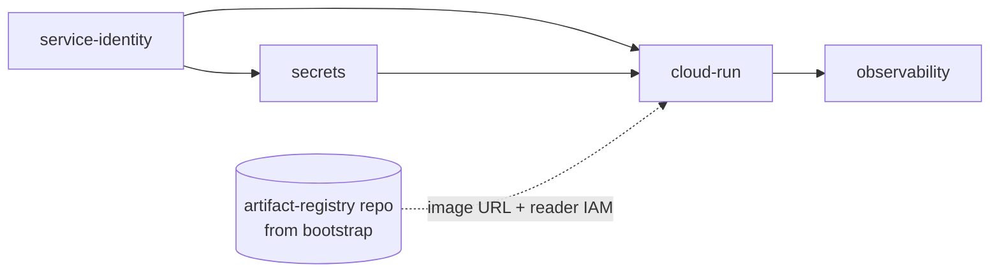

# Shared Terraform modules

Reusable Terraform modules for Golden Path **service infrastructure**. They are **not** applied from the platform repo root — each scaffolded service repo runs `terraform apply` in its own `infra/` directory.

| Consumer | What runs |
|----------|-----------|
| **Service repos** (`templates/*/infra/`) | `service-identity`, `secrets`, `cloud-run`, `observability` |
| **Platform bootstrap** (`platform/bootstrap/`) | `artifact-registry` (shared Docker repo per GCP project) |

**Bootstrap (separate):** `platform/bootstrap/` — one-time WIF, IAM, GitHub OIDC, and **shared** Artifact Registry. Not a substitute for service `infra/`.

**Full map:** [docs/repository-guide.md](../docs/repository-guide.md#modules--shared-terraform-modules)

## Composition (service `infra/`)

Templates copy [`templates/_shared/infra/main.tf`](../templates/_shared/infra/main.tf) (token-replaced at scaffold). Module `source` must be a **literal** git URL — Terraform does not allow variables in `source`.

**Apply order (dependencies):**

1. **`service-identity`** — runtime service account `{service}-{env}-run`
2. **`secrets`** — Secret Manager secrets; `accessor_members` includes `module.identity.member`
3. **`cloud-run`** — Cloud Run v2 service; image from existing AR repo (`var.artifact_registry_repo`); grants SA `artifactregistry.reader`
4. **`observability`** — Monitoring dashboard + 5xx alert; `cloud_run_service_name = module.cloud_run.name`

**Not in service `infra/`:** `artifact-registry` — bootstrap creates `{ARTIFACT_REGISTRY_REPO}` once per project. CI pushes `{region}-docker.pkg.dev/{project}/{repo}/{service}:{sha}`; `cloud-run` deploys that tag.

## Modules

| Module | Applied by | Purpose | Key outputs |
|--------|------------|---------|-------------|
| [`artifact-registry/`](./artifact-registry/) | `platform/bootstrap` | Shared Docker Artifact Registry repository | `repository_id`, `repository_url` |
| [`service-identity/`](./service-identity/) | Service `infra/` | Cloud Run runtime service account | `email`, `name`, `member` |
| [`secrets/`](./secrets/) | Service `infra/` | Secret Manager secrets + accessor IAM | `secret_ids`, `secret_resource_names` |
| [`cloud-run/`](./cloud-run/) | Service `infra/` | Cloud Run v2 (image, scaling, probes, AR reader) | `name`, `uri`, `image`, `location` |
| [`observability/`](./observability/) | Service `infra/` | Cloud Monitoring dashboard + 5xx alert policy | `dashboard_name`, `alert_policy_name` |

Per-module detail: [`artifact-registry/README.md`](./artifact-registry/README.md), [`cloud-run/README.md`](./cloud-run/README.md).

**Observability note:** Does not provision Cloud Logging resources — Cloud Run logs flow to Cloud Logging automatically. Dashboard/alerts use Cloud Monitoring; alert `notification_channels` default empty (wire in platform ops).

## Tfvars and enterprise config

Service `infra/dev.tfvars` / `prod.tfvars` (from [`templates/_shared/tfvars.*.snippet`](../templates/_shared/)) set:

| Variable | Typical source |
|----------|----------------|
| `artifact_registry_repo` | `ARTIFACT_REGISTRY_REPO` in [`config/enterprise.env`](../config/enterprise.env) |
| `goldenpath_version` | `GOLDENPATH_VERSION` |
| `project_id` / `region` | `GCP_DEV_PROJECT` / `GCP_PROD_PROJECT`, `GCP_REGION` |
| `container_port` / `health_check_path` | Template catalog (scaffold tokens) |

`image_tag` is set by CI on each deploy (git SHA), not checked into tfvars long-term.

## Conventions

- Pin module `ref=` to the same tag as the reusable deploy workflow (`GOLDENPATH_VERSION`)
- Extend safely using skill **`shop-terraform-conventions`** — prefer new shared modules in `modules/` over forking internals
- **No external images** — `cloud-run` enforces `{region}-docker.pkg.dev/{project_id}/…` via lifecycle precondition
- `dev` vs `prod`: separate tfvars; `allow_unauthenticated` defaults to `true` only for `dev` in templates

## Related

- [templates/README.md](../templates/README.md) — scaffolds and catalog
- [platform/bootstrap/README.md](../platform/bootstrap/README.md) — WIF + shared Artifact Registry
- [config/README.md](../config/README.md) — `ARTIFACT_REGISTRY_REPO`
- [shop-terraform-conventions skill](../skills/shop-terraform-conventions/SKILL.md)